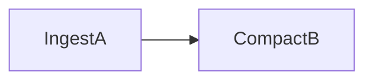
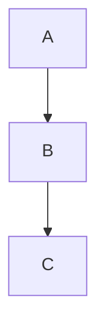

# Design Doc Conventions

## Diagram Rules (MANDATORY)

### NEVER Use ASCII Art
Do NOT use ASCII art for diagrams, graphs, flowcharts, or architecture visuals. ASCII art is not renderable in GitHub/VS Code markdown preview and is hard for agents to parse.

❌ Bad:
```
+--------+     +--------+
| IngestA|---->| CompactB|
+--------+     +--------+
```

✅ Good:


### Diagram Priority Order (STRICT)

1. **`mermaid flowchart`** — Use this FIRST for almost everything
2. **`mermaid sequenceDiagram`** — Use ONLY when flowchart cannot express the content

Always try a flowchart first. Only fall back to sequence diagram if the content is inherently about time-ordered interactions between multiple actors.

### When to Use Each Diagram Type

**Use `flowchart` for:**
- State machines and state transitions
- Data pipelines and processing stages
- Component architecture and relationships
- Decision trees and conditional logic
- Lifecycle diagrams

**Use `sequenceDiagram` for:**
- Protocol handshakes (client↔server request/response)
- Multi-system API call sequences with strict ordering
- Message-passing flows between named actors

### Mermaid Syntax

Always use fenced code blocks:
````

````

All mermaid diagrams must render correctly in:
- GitHub markdown preview
- VS Code with Mermaid extension

## Document Structure

### Required Sections (every design doc must have these)
- **Overview** — one paragraph, what this doc covers and why it exists
- **Diagram** — mermaid diagram (flowchart preferred) near the top
- **Design** — detailed explanation, dense, no filler prose
- **Data Model / Key Hierarchy** — if applicable
- **Error Handling** — how failures are handled
- **Open Questions** — unresolved decisions (remove when resolved)

### Writing Style
- Agent-consumable: every line carries information, no filler
- Dense prose preferred over padded explanations
- Diagrams PRECEDE their prose explanation (diagram first, then text)
- Use markdown tables over prose lists for structured data
- Naming: `NN-short-name.md` (zero-padded number, e.g. `02-meta-store-design.md`)

## Agent Workflow for Design Doc Tasks

For design doc work, **skip the Prometheus → Metis → Momus planning ceremony**.

Use this direct flow instead:
1. Read existing relevant design docs in `design-docs/`
2. Research/synthesize the content
3. Write the doc directly

The planning ceremony (Prometheus → Metis → Momus → /start-work) is for code tasks. Design docs are writing tasks — go straight to writing.
