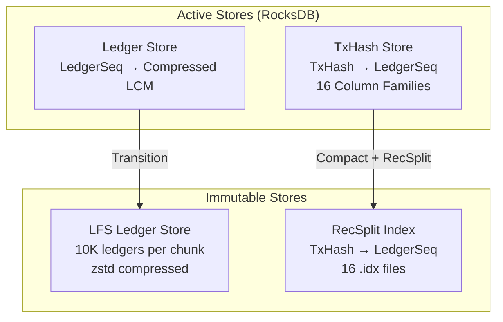
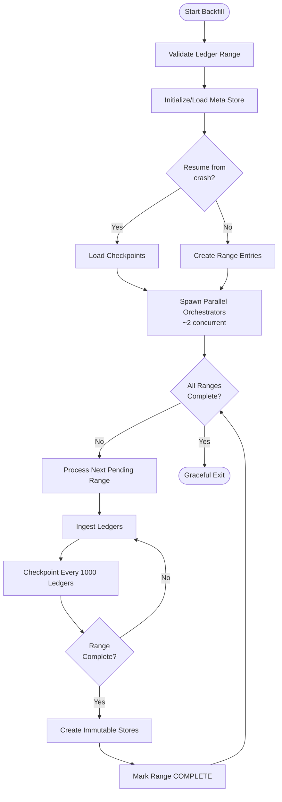
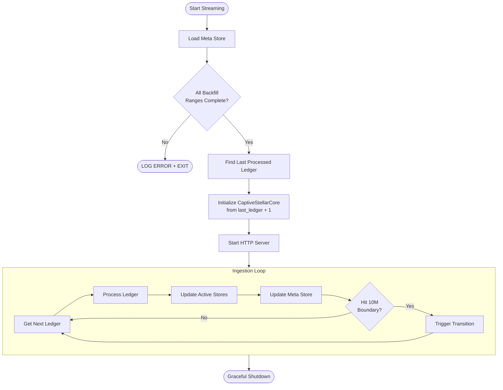
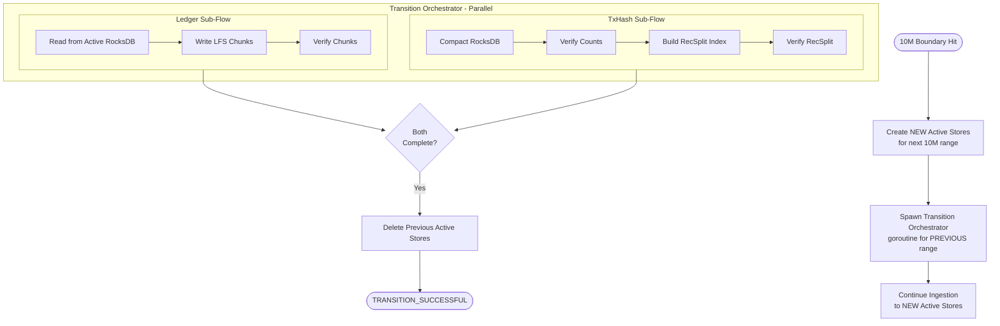

# Stellar Full History RPC Service - Design Document

> **Status**: Ready for Implementation  
> **Created**: 2026-01-28  
> **Last Updated**: 2026-01-28

---

## Table of Contents

1. [Executive Summary](#executive-summary)
2. [Glossary](#glossary)
3. [Architecture Overview](#architecture-overview)
4. [Operating Modes](#operating-modes)
5. [Data Stores](#data-stores)
6. [Meta Store Design](#meta-store-design)
7. [Backfill Mode](#backfill-mode)
8. [Streaming Mode](#streaming-mode)
9. [Active to Immutable Transition](#active-to-immutable-transition)
10. [Query Routing](#query-routing)
11. [Crash Recovery](#crash-recovery)
12. [Directory Structure](#directory-structure)
13. [Configuration](#configuration)
14. [Current Numbers and Future Projections](#current-numbers-and-future-projections)
15. [FAQs](#faqs)
16. [Appendix: Existing Code to Reuse](#appendix-existing-code-to-reuse)

---

## Executive Summary

The Stellar Full History RPC Service provides query access to the complete Stellar blockchain history through two primary operations:

- **`getTransactionByHash(txHash)`**: Returns the ledger containing a specific transaction
- **`getLedgerBySequence(ledgerSeq)`**: Returns the full LedgerCloseMeta for a ledger

The service operates in two mutually exclusive modes:

1. **Backfill Mode**: Ingests historical ledger ranges (e.g., ledgers 2 to 60,000,000) from GCS or CaptiveStellarCore, creates immutable stores, then exits.

2. **Streaming Mode**: Ingests real-time ledgers via CaptiveStellarCore, serves queries, and periodically transitions data from active (RocksDB) to immutable (LFS + RecSplit) stores.

### Key Design Decisions

| Decision | Choice |
|----------|--------|
| Ledger range unit | 10 million ledgers |
| Backfill parallelism | ~2 concurrent 10M range orchestrators |
| Data stores | Separate RocksDB instances per data type (ledger, txhash) |
| Immutable ledger format | LFS chunks (10K ledgers per chunk) |
| Immutable txhash format | RecSplit minimal perfect hash indexes |
| Transition trigger | Automatic at 10M boundary (streaming mode only) |
| Crash recovery | Per-range checkpointing, never deleted |

---

## Glossary

| Term | Definition |
|------|------------|
| **Ledger Range** | Strictly 10 million ledgers. Range 0 = ledgers 2-10,000,001. Range N = ledgers (N×10M)+2 to ((N+1)×10M)+1. |
| **LedgerBackend** | Interface for reading ledgers. Implementations: `BufferedStorageBackend` (GCS/S3) or `CaptiveStellarCore` (live network). |
| **Active Store** | RocksDB database for current/live data. Supports reads AND writes. |
| **Immutable Store** | Read-only storage after creation. LFS for ledgers, RecSplit for txhash indexes. |
| **Meta Store** | Single RocksDB instance tracking all state, phases, progress, and crash recovery info. |
| **LFS** | Local File System chunk format. 10,000 ledgers per chunk, zstd compressed, with index files. |
| **RecSplit** | Minimal perfect hash function. O(1) lookups, ~2-3 bits per key overhead. |
| **Transition** | Process of converting Active Store data to Immutable Store format. |
| **Range State** | Lifecycle state of a 10M range: PENDING → INGESTING → TRANSITIONING → COMPLETE. |
| **Checkpoint** | Atomic save of progress to meta store for crash recovery. |

---

## Architecture Overview

```
┌─────────────────────────────────────────────────────────────────────────────────┐
│                         STELLAR FULL HISTORY RPC SERVICE                         │
├─────────────────────────────────────────────────────────────────────────────────┤
│                                                                                  │
│  ┌──────────────────────────────────────────────────────────────────────────┐   │
│  │                           HTTP SERVER                                     │   │
│  │  Backfill Mode: getHealth, getStatus only                                │   │
│  │  Streaming Mode: getHealth, getStatus, getTransaction, getLedger         │   │
│  └──────────────────────────────────────────────────────────────────────────┘   │
│                                      │                                           │
│                                      ▼                                           │
│  ┌──────────────────────────────────────────────────────────────────────────┐   │
│  │                          QUERY ROUTER                                     │   │
│  │  Routes requests to correct store based on ledger sequence               │   │
│  └──────────────────────────────────────────────────────────────────────────┘   │
│                                      │                                           │
│          ┌───────────────────────────┼───────────────────────────┐              │
│          ▼                           ▼                           ▼              │
│  ┌───────────────┐         ┌─────────────────┐         ┌─────────────────┐      │
│  │ ACTIVE STORES │         │ TRANSITIONING   │         │ IMMUTABLE       │      │
│  │ (RocksDB)     │         │ STORES          │         │ STORES          │      │
│  │               │         │ (RocksDB)       │         │ (LFS + RecSplit)│      │
│  │ Current range │         │ Previous range  │         │ Completed ranges│      │
│  │ being ingested│         │ being converted │         │                 │      │
│  └───────────────┘         └─────────────────┘         └─────────────────┘      │
│                                                                                  │
│  ┌──────────────────────────────────────────────────────────────────────────┐   │
│  │                           META STORE (RocksDB)                            │   │
│  │  - Global state (mode, last processed ledger)                            │   │
│  │  - Per-range state (phase, checkpoints, paths)                           │   │
│  │  - Crash recovery data                                                    │   │
│  └──────────────────────────────────────────────────────────────────────────┘   │
│                                                                                  │
│  ┌──────────────────────────────────────────────────────────────────────────┐   │
│  │                           INGESTION ENGINE                                │   │
│  │  Backfill: Multiple parallel 10M range orchestrators                     │   │
│  │  Streaming: Single CaptiveStellarCore, batch size = 1                    │   │
│  └──────────────────────────────────────────────────────────────────────────┘   │
│                                                                                  │
└─────────────────────────────────────────────────────────────────────────────────┘
```

---

## Operating Modes

### Mode Selection

```bash
# Backfill Mode
./stellar-rpc --backfill --start-ledger 2 --end-ledger 60000001

# Streaming Mode (default when --backfill is not specified)
./stellar-rpc
```

### Backfill Mode

| Aspect | Behavior |
|--------|----------|
| Purpose | Ingest historical ledger ranges |
| Data Source | Configurable: BufferedStorageBackend (GCS) OR CaptiveStellarCore |
| Parallelism | Multiple 10M range orchestrators (~2 concurrent recommended) |
| Queries | getHealth and getStatus only |
| Lifecycle | Start-to-end process, exits when complete |
| Output | Immutable stores for all specified ranges |

**Ledger Range Validation**:
- `--start-ledger`: Must be 2 OR (X % 10,000,000 == 1)  
- `--end-ledger`: Must be (X % 10,000,000 == 0) + 1

### Streaming Mode

| Aspect | Behavior |
|--------|----------|
| Purpose | Real-time ledger ingestion |
| Data Source | CaptiveStellarCore only (live data not in GCS) |
| Parallelism | Single ingestion thread |
| Queries | All endpoints available |
| Lifecycle | Long-running daemon |
| Checkpoint | After every ledger |

**Startup Validation**:
1. Load meta store
2. Verify ALL backfilled ranges are COMPLETE
3. If gaps detected → log error and EXIT
4. Start from `last_processed_ledger + 1`

---

## Data Stores

### Store Types



### Ledger Store

| Phase | Format | Key → Value |
|-------|--------|-------------|
| Active | RocksDB | `uint32(ledgerSeq)` → `zstd(LedgerCloseMeta)` |
| Immutable | LFS | Chunk files with index |

### TxHash Store

| Phase | Format | Key → Value |
|-------|--------|-------------|
| Active | RocksDB (16 CFs) | `[32]byte(txHash)` → `uint32(ledgerSeq)` |
| Immutable | RecSplit | Perfect hash: `txHash` → `ledgerSeq` |

### Future Extensibility

Each new data type (e.g., Events Store) will have:
- Its own RocksDB instance during active phase
- Its own Active→Immutable transition logic
- Independent lifecycle management

---

## Meta Store Design

The meta store is a single RocksDB instance that tracks all state for both operating modes.

### Key Structure

```
# Global State
global:mode                          → "backfill" | "streaming"
global:last_processed_ledger         → uint32
global:backfill_start_ledger         → uint32
global:backfill_end_ledger           → uint32

# Per-Range State
range:{range_id}:state               → "PENDING" | "INGESTING" | "TRANSITIONING" | "COMPLETE" | "FAILED"
range:{range_id}:start_ledger        → uint32
range:{range_id}:end_ledger          → uint32
range:{range_id}:created_at          → timestamp
range:{range_id}:completed_at        → timestamp

# Per-Range Ledger Store State
range:{range_id}:ledger:phase        → "INGESTING" | "WRITING_LFS" | "IMMUTABLE"
range:{range_id}:ledger:last_committed_ledger → uint32
range:{range_id}:ledger:count        → uint64
range:{range_id}:ledger:immutable_path → string

# Per-Range TxHash Store State
range:{range_id}:txhash:phase        → "INGESTING" | "COMPACTING" | "BUILDING_RECSPLIT" | "VERIFYING_RECSPLIT" | "COMPLETE"
range:{range_id}:txhash:last_committed_ledger → uint32
range:{range_id}:txhash:cf_counts    → JSON {"0": count, ..., "f": count}
range:{range_id}:txhash:rocksdb_path → string
range:{range_id}:txhash:recsplit_path → string
```

### Range ID Calculation

```go
const RangeSize = 10_000_000
const FirstLedger = 2

// Range 0: ledgers 2 - 10,000,001
// Range 1: ledgers 10,000,002 - 20,000,001
// Range N: ledgers (N×10M)+2 - ((N+1)×10M)+1

func ledgerToRangeID(ledgerSeq uint32) uint32 {
    return (ledgerSeq - FirstLedger) / RangeSize
}

func rangeFirstLedger(rangeID uint32) uint32 {
    return (rangeID * RangeSize) + FirstLedger
}

func rangeLastLedger(rangeID uint32) uint32 {
    return ((rangeID + 1) * RangeSize) + FirstLedger - 1
}
```

### Key Usage Summary

| Key Pattern | Purpose | Update Frequency |
|-------------|---------|------------------|
| `global:mode` | Operating mode | Process startup |
| `global:last_processed_ledger` | Streaming progress | Every ledger (streaming) |
| `range:{id}:state` | Range lifecycle | State transitions |
| `range:{id}:*:last_committed_ledger` | Crash recovery | Every checkpoint |
| `range:{id}:txhash:cf_counts` | RecSplit key counts | Every checkpoint |
| `range:{id}:*:immutable_path` | Immutable store location | Transition complete |

---

## Backfill Mode

### Process Flow



### Orchestrator Design

Each 10M range is processed by an independent orchestrator goroutine:

```go
type RangeOrchestrator struct {
    rangeID       uint32
    startLedger   uint32
    endLedger     uint32
    metaStore     *MetaStore
    ledgerBackend ledgerbackend.LedgerBackend
    ledgerStore   *LedgerStore
    txHashStore   *TxHashStore
}

func (o *RangeOrchestrator) Run(ctx context.Context) error {
    // 1. Resume or start fresh
    lastLedger := o.metaStore.GetLastCommittedLedger(o.rangeID)
    
    // 2. Ingest ledgers
    for ledgerSeq := lastLedger + 1; ledgerSeq <= o.endLedger; ledgerSeq++ {
        lcm := o.ledgerBackend.GetLedger(ctx, ledgerSeq)
        
        o.ledgerStore.Put(ledgerSeq, compress(lcm))
        o.txHashStore.PutBatch(extractTxHashes(lcm))
        
        if ledgerSeq % 1000 == 0 {
            o.checkpoint(ledgerSeq)
        }
    }
    
    // 3. Create immutable stores (in parallel)
    var wg sync.WaitGroup
    wg.Add(2)
    go o.createImmutableLedgerStore(&wg)
    go o.createImmutableTxHashStore(&wg)
    wg.Wait()
    
    // 4. Mark complete
    o.metaStore.SetRangeState(o.rangeID, "COMPLETE")
    return nil
}
```

### Backfill Configuration (TOML)

```toml
[backfill]
ledger_backend = "buffered_storage"  # or "captive_core"
parallel_ranges = 2                   # Max concurrent 10M range orchestrators
checkpoint_interval = 1000            # Ledgers per checkpoint

[backfill.buffered_storage]
bucket_path = "sdf-ledger-close-meta/v1/ledgers/pubnet"
buffer_size = 10000
num_workers = 200
retry_limit = 3
retry_wait = "5s"

[backfill.captive_core]
binary_path = "/usr/bin/stellar-core"
config_path = "/etc/stellar-core.cfg"
network_passphrase = "Public Global Stellar Network ; September 2015"
```

---

## Streaming Mode

### Process Flow



### Streaming Characteristics

| Aspect | Value |
|--------|-------|
| Batch size | 1 (checkpoint after every ledger) |
| Checkpoint frequency | Every ledger |
| Max data loss on crash | < 1 ledger |
| 10M boundary detection | Automatic |

### Streaming Ingestion Loop

```go
func (s *StreamingService) Run(ctx context.Context) error {
    for {
        select {
        case <-ctx.Done():
            return s.gracefulShutdown()
        default:
            ledger := s.captiveCore.GetLedger(ctx, s.nextLedger)
            
            // Process ledger
            s.activeStores.ledger.Put(s.nextLedger, compress(ledger))
            s.activeStores.txhash.PutBatch(extractTxHashes(ledger))
            
            // Check for 10M boundary
            if s.isRangeBoundary(s.nextLedger) {
                s.triggerTransition()
            }
            
            // Update meta store (after every ledger)
            s.metaStore.SetLastProcessedLedger(s.nextLedger)
            s.nextLedger++
        }
    }
}

func (s *StreamingService) isRangeBoundary(ledgerSeq uint32) bool {
    // Boundary is at ledgers: 10000001, 20000001, 30000001, ...
    return (ledgerSeq - 1) % 10_000_000 == 0 && ledgerSeq > 1
}
```

---

## Active to Immutable Transition

### Transition Trigger

**Streaming Mode Only**: When ingestion hits a 10M ledger boundary (ledgers 10,000,001, 20,000,001, etc.), the transition is triggered automatically.

### Transition Workflow



### During Transition: Multiple Active Stores

```
During transition, 4 RocksDB instances exist:

┌─────────────────────────────────────────────────────────────────┐
│                        ACTIVE STORES                             │
│  ┌─────────────────────┐    ┌─────────────────────┐             │
│  │ CURRENT LEDGER      │    │ CURRENT TXHASH      │             │
│  │ (receiving new data)│    │ (receiving new data)│             │
│  └─────────────────────┘    └─────────────────────┘             │
├─────────────────────────────────────────────────────────────────┤
│                    TRANSITIONING STORES                          │
│  ┌─────────────────────┐    ┌─────────────────────┐             │
│  │ PREVIOUS LEDGER     │    │ PREVIOUS TXHASH     │             │
│  │ (serving queries)   │    │ (serving queries)   │             │
│  │ (being converted)   │    │ (being converted)   │             │
│  └─────────────────────┘    └─────────────────────┘             │
└─────────────────────────────────────────────────────────────────┘
```

### Transition Phases

#### Ledger Store Transition

| Phase | Description | Duration Estimate |
|-------|-------------|-------------------|
| WRITING_LFS | Read from RocksDB, write 1000 LFS chunks | ~30-60 min |
| IMMUTABLE | Complete, RocksDB can be deleted | - |

#### TxHash Store Transition

| Phase | Description | Duration Estimate |
|-------|-------------|-------------------|
| COMPACTING | Full RocksDB compaction (16 CFs parallel) | ~5 min |
| BUILDING_RECSPLIT | Build 16 RecSplit indexes (parallel) | ~15-20 min |
| VERIFYING_RECSPLIT | Verify all keys in all indexes | ~5 min |
| COMPLETE | RecSplit ready, RocksDB can be deleted | - |

### Transition Failure Handling

If transition fails (disk full, verification failure, etc.):
1. Previous Active Stores remain alive and serving queries
2. Transition goroutine retries until success
3. No data loss - ingestion continues to new Active Stores

---

## Query Routing

### Router Logic

```go
func (r *QueryRouter) GetLedger(ledgerSeq uint32) (*xdr.LedgerCloseMeta, error) {
    rangeID := ledgerToRangeID(ledgerSeq)
    rangeState := r.metaStore.GetRangeState(rangeID)
    
    switch rangeState {
    case "COMPLETE":
        // Query immutable LFS store
        return r.immutableLedgerStore.Get(rangeID, ledgerSeq)
        
    case "TRANSITIONING":
        // Query transitioning RocksDB (still alive)
        return r.transitioningStores.ledger.Get(ledgerSeq)
        
    case "INGESTING":
        // Query current active RocksDB
        return r.activeStores.ledger.Get(ledgerSeq)
        
    default:
        return nil, ErrLedgerNotFound
    }
}

func (r *QueryRouter) GetTransaction(txHash []byte) (uint32, error) {
    // Similar logic but for txhash stores
    // ...
}
```

### Query Routing During Transition

```
Ledger Request for seq=35,000,000

1. Calculate range ID: (35000000 - 2) / 10000000 = 3
2. Check range:3:state
3. If TRANSITIONING → query transitioning RocksDB
4. If COMPLETE → query immutable LFS
5. Return LedgerCloseMeta
```

---

## Crash Recovery

### Recovery Scenarios

#### Scenario 1: Crash During Backfill Ingestion

```
State at crash:
  range:0:state = "INGESTING"
  range:0:ledger:last_committed_ledger = 7499000

Recovery:
  1. Restart: ./stellar-rpc --backfill --start-ledger 2 --end-ledger 30000001
  2. Load meta store, find range:0 incomplete
  3. Resume from ledger 7499001
  4. Duplicates in RocksDB are harmless (same key→value)
  5. Compaction deduplicates
```

#### Scenario 2: Crash During Streaming

```
State at crash:
  global:last_processed_ledger = 40500000
  range:4:state = "INGESTING"

Recovery:
  1. Restart: ./stellar-rpc (streaming mode)
  2. Validate all prior ranges COMPLETE
  3. Resume from ledger 40500001
```

#### Scenario 3: Crash During Transition

```
State at crash:
  range:3:state = "TRANSITIONING"
  range:3:ledger:phase = "WRITING_LFS"
  range:3:txhash:phase = "BUILDING_RECSPLIT"
  range:4:state = "INGESTING"

Recovery:
  1. Restart: ./stellar-rpc
  2. Find range:3 in TRANSITIONING state
  3. Reopen transitioning RocksDB stores
  4. Resume transition workflows where they left off
  5. Resume range:4 ingestion from last checkpoint
```

### Checkpoint Atomicity

```go
// Checkpoint is atomic via RocksDB WriteBatch
func (m *MetaStore) Checkpoint(rangeID uint32, ledgerSeq uint32, cfCounts map[string]uint64) error {
    batch := grocksdb.NewWriteBatch()
    defer batch.Destroy()
    
    batch.Put(
        []byte(fmt.Sprintf("range:%d:ledger:last_committed_ledger", rangeID)),
        uint32ToBytes(ledgerSeq),
    )
    batch.Put(
        []byte(fmt.Sprintf("range:%d:txhash:last_committed_ledger", rangeID)),
        uint32ToBytes(ledgerSeq),
    )
    batch.Put(
        []byte(fmt.Sprintf("range:%d:txhash:cf_counts", rangeID)),
        []byte(jsonEncode(cfCounts)),
    )
    
    return m.db.Write(m.writeOpts, batch)
}
```

### Gap Detection

On streaming mode startup:

```go
func (s *StreamingService) validateNoGaps() error {
    ranges := s.metaStore.GetAllRanges()
    
    for _, r := range ranges {
        if r.State != "COMPLETE" {
            return fmt.Errorf(
                "incomplete range detected: Range %d (ledgers %d-%d) state=%s, last_committed=%d",
                r.ID, r.StartLedger, r.EndLedger, r.State, r.LastCommittedLedger,
            )
        }
    }
    
    return nil
}
```

---

## Directory Structure

```
/data/stellar-rpc/                        # Base data directory
├── meta/                                 # Meta store
│   └── rocksdb/
│
├── active/                               # Current active stores
│   ├── ledger/
│   │   └── rocksdb/
│   └── txhash/
│       └── rocksdb/
│
├── transitioning/                        # Previous range during transition
│   ├── ledger/
│   │   └── rocksdb/
│   └── txhash/
│       └── rocksdb/
│
└── immutable/                            # Completed immutable stores
    ├── ledgers/
    │   ├── range-0/
    │   │   └── chunks/
    │   │       ├── 0000/
    │   │       │   ├── 000000.data
    │   │       │   ├── 000000.index
    │   │       │   └── ...
    │   │       └── 0001/
    │   │           └── ...
    │   ├── range-1/
    │   │   └── chunks/
    │   └── ...
    │
    └── txhash/
        ├── range-0/
        │   └── index/
        │       ├── cf-0.idx
        │       ├── cf-1.idx
        │       └── ...cf-f.idx
        ├── range-1/
        │   └── index/
        └── ...
```

### LFS Chunk Path Convention

Must adhere to existing `local-fs/ingestion/` format:

```go
// ChunkID = (ledgerSeq - 2) / 10000
// Directory: chunks/XXXX/YYYYYY.{data,index}
// Where: XXXX = chunkID / 1000, YYYYYY = chunkID

func getChunkPath(dataDir string, chunkID uint32) (dataPath, indexPath string) {
    parentDir := chunkID / 1000
    dir := filepath.Join(dataDir, "chunks", fmt.Sprintf("%04d", parentDir))
    return filepath.Join(dir, fmt.Sprintf("%06d.data", chunkID)),
           filepath.Join(dir, fmt.Sprintf("%06d.index", chunkID))
}
```

---

## Configuration

### Main Configuration (TOML)

```toml
[service]
data_dir = "/data/stellar-rpc"
http_port = 8080

[meta_store]
path = "/data/stellar-rpc/meta/rocksdb"

[active_stores]
ledger_path = "/data/stellar-rpc/active/ledger/rocksdb"
txhash_path = "/data/stellar-rpc/active/txhash/rocksdb"

[immutable_stores]
ledgers_base = "/data/stellar-rpc/immutable/ledgers"
txhash_base = "/data/stellar-rpc/immutable/txhash"

[rocksdb]
block_cache_mb = 8192
write_buffer_mb = 512
max_write_buffer_number = 2

[backfill]
ledger_backend = "buffered_storage"
parallel_ranges = 2
checkpoint_interval = 1000

[backfill.buffered_storage]
bucket_path = "sdf-ledger-close-meta/v1/ledgers/pubnet"
buffer_size = 10000
num_workers = 200

[backfill.captive_core]
binary_path = "/usr/bin/stellar-core"
config_path = "/etc/stellar-core.cfg"

[streaming]
checkpoint_interval = 1  # Every ledger

[streaming.captive_core]
binary_path = "/usr/bin/stellar-core"
config_path = "/etc/stellar-core.cfg"
```

---

## Current Numbers and Future Projections

### Historical Data

| Metric | Value |
|--------|-------|
| Genesis | December 2015 (Ledger #2) |
| Current ledgers (2026) | ~62 million |
| Complete 10M ranges | 6 (ledgers 2 - 60,000,001) |
| Ledger close time | 5-6 seconds |
| Ledgers per year | ~5.5 million |
| Time span per 10M range | ~23 months |

### Transaction Density

| Era | Transactions/Ledger |
|-----|---------------------|
| Early years (1-30M) | ~10 tx/ledger |
| Recent years (30M+) | ~325 tx/ledger |
| Future target | ~300 tx/ledger |

### Future Projections

| Metric | Current | Future |
|--------|---------|--------|
| Ledger close time | 5-6 sec | 0.6 sec (10x faster) |
| 10M range time span | ~23 months | ~2 months |
| Throughput | ~50 tx/sec | ~500 tx/sec |

**Implication**: 10M range transitions will occur every ~2 months instead of every ~2 years.

---

## FAQs

### Q: Is checkpoint info different for backfill vs streaming?
**A**: No. Checkpoint information is mode-agnostic. Same keys are used regardless of whether the range was created during backfill or streaming.

### Q: When is checkpoint info deleted?
**A**: Never. Checkpoint info persists forever as an audit trail.

### Q: Can the same process transition from backfill to streaming?
**A**: No. Backfill exits when complete. Streaming is started separately.

### Q: What if operator starts streaming before backfill completes?
**A**: Code detects gaps and aborts with detailed error message.

### Q: How many Active Stores exist during transition?
**A**: 4 RocksDB instances: 2 current (ledger + txhash) + 2 transitioning (ledger + txhash).

### Q: Is there a background process for transition?
**A**: No. Transition runs in a goroutine within the main process.

### Q: What's the batch size difference?
**A**: Backfill: 1000 ledgers per checkpoint. Streaming: 1 ledger per checkpoint.

### Q: How does query routing work during transition?
**A**: 
- Current range → Current Active Store
- Transitioning range → Transitioning Store (still alive)
- Complete ranges → Immutable LFS + RecSplit

---

## Appendix: Existing Code to Reuse

### LFS Ledger Store
**Location**: `local-fs/ingestion/lfs-ledger-ingestion.go`
- Chunk format (10K ledgers per chunk)
- Index file format
- Path conventions
- Query implementation

### RocksDB Ingestion Patterns
**Location**: `rocksdb/ingestion-v2/`
- LedgerBackend usage
- Batch processing
- GCS configuration

### TxHash Workflow
**Location**: `txhash-ingestion-workflow/`
- Phase state machine
- Meta store checkpointing
- Parallel compaction
- RecSplit building and verification
- Scoped logging pattern

### Column Family Utilities
**Location**: `txhash-ingestion-workflow/pkg/cf/`
- 16-way partitioning by first hex char
- CF name mapping

### Helpers
**Location**: `helpers/helpers.go`
- Formatting utilities
- Byte encoding
- File utilities
