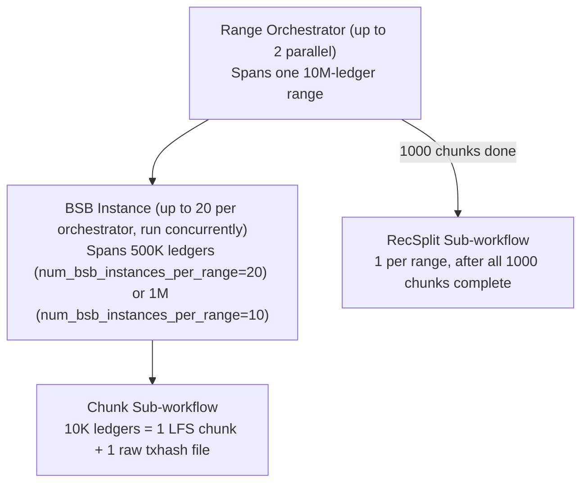
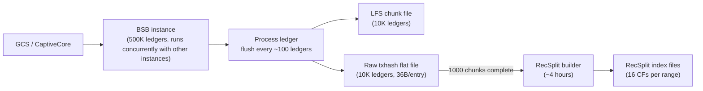
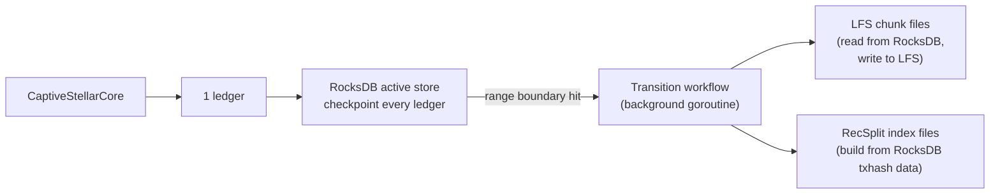
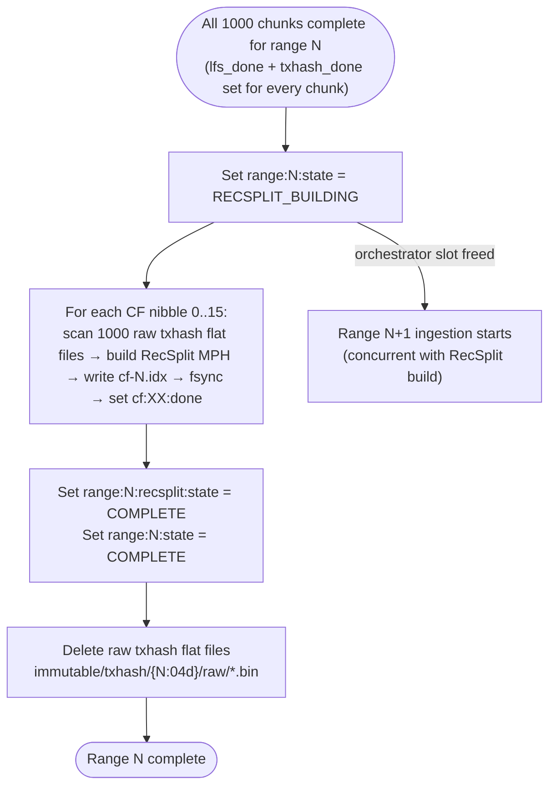
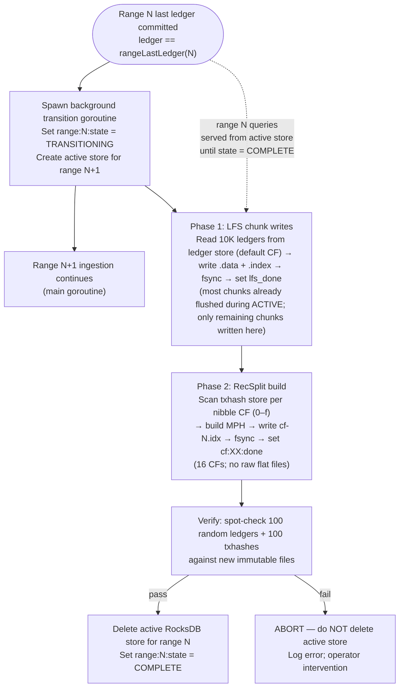
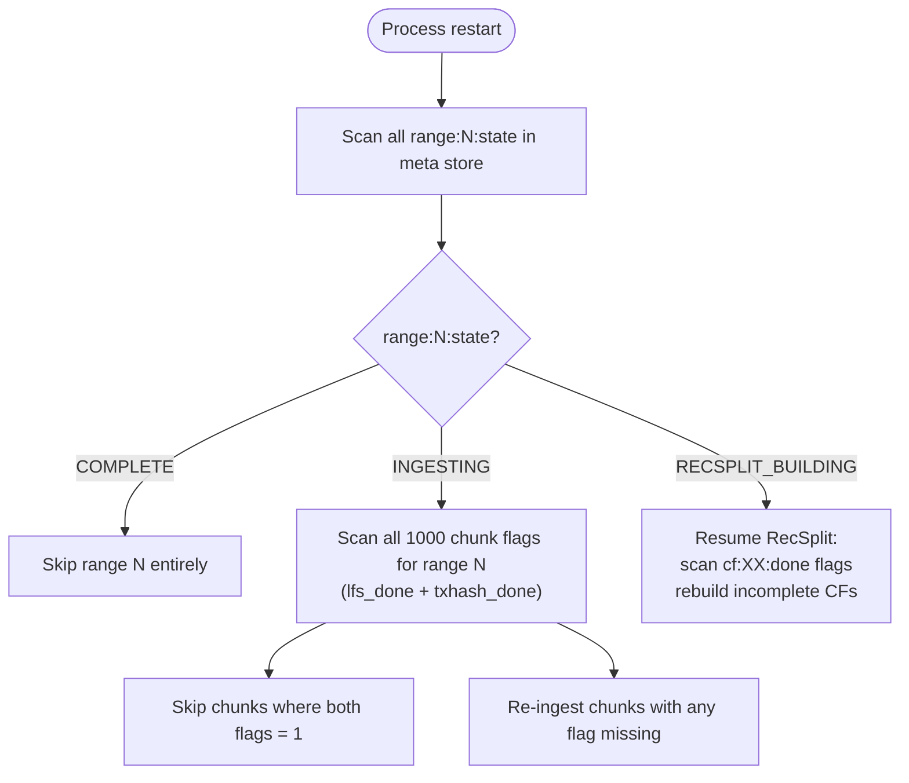
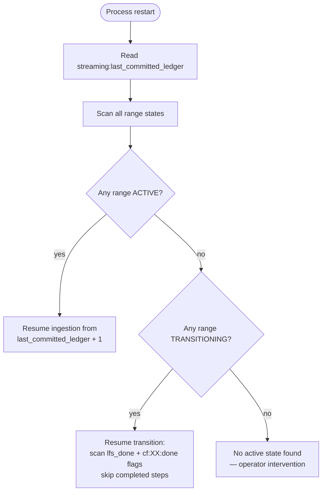

# Architecture Overview

## Overview

The Stellar Full History RPC Service ingests and serves the complete Stellar blockchain history. It operates in two **mutually exclusive, fully independent** modes:

- **Backfill Mode** — offline historical ingestion. Writes directly to immutable formats (LFS chunks + raw txhash flat files) without RocksDB. No queries served. Operator re-runs the same command on failure until completion, then switches to streaming mode.
- **Streaming Mode** — real-time ingestion via CaptiveStellarCore. Writes to an active RocksDB store, serves queries, and periodically transitions completed ranges to immutable storage.

These two modes have **separate transition workflows** and **separate crash recovery semantics**. There is no unified transition path shared between them.

---

## System Diagram

```mermaid
flowchart TB
    subgraph BACKFILL
        BSB["BufferedStorageBackend (BSB)<br/>Up to 2 parallel range orchestrators<br/>Each orchestrator: 20 BSB instances (concurrent)"]
        LFS_BF["LFS Chunk Files<br/>immutable/ledgers/chunks/<br/>(written directly, no RocksDB)"]
        TXRAW["Raw TxHash Flat Files<br/>immutable/txhash/XXXX/raw/<br/>(36 bytes/entry: hash[32]+seq[4])"]
        RECSPLIT["RecSplit Index Files<br/>immutable/txhash/XXXX/index/<br/>(built once all 1000 chunks complete)"]
        BSB --> LFS_BF
        BSB --> TXRAW
        TXRAW -->|"all 1000 chunks done → trigger"| RECSPLIT
    end

    subgraph STREAMING
        CORE["CaptiveStellarCore<br/>batch size = 1 ledger"]
        ACTIVE["Active Store (RocksDB)<br/>Current range, mutable"]
        IMMUTABLE["Immutable Stores<br/>LFS + RecSplit<br/>Completed ranges"]
        CORE --> ACTIVE
        ACTIVE -->|"range complete → transition workflow"| IMMUTABLE
    end

    subgraph META
        MK["Per-range state, chunk completion flags,<br/>RecSplit build state, checkpoint ledgers"]
    end

    subgraph QUERY
        HTTP["HTTP Server<br/>getTransactionByHash / getLedgerBySequence"]
        ROUTER["Query Router"]
        ACTIVE_Q["Active Stores<br/>(RocksDB)"]
        IMMUTABLE_Q["Immutable Stores<br/>(LFS + RecSplit)"]
        HTTP --> ROUTER
        ROUTER --> ACTIVE_Q
        ROUTER --> IMMUTABLE_Q
    end
```

---

## Two Pipelines, Two Designs

| Dimension | Backfill | Streaming |
|-----------|----------|-----------|
| Data source | BufferedStorageBackend (GCS) or CaptiveStellarCore | CaptiveStellarCore only |
| RocksDB for ingestion | **No** — writes directly to files | **Yes** — active store per range |
| WAL concern | **None** — no RocksDB during ingestion | Required — crash recovery depends on WAL |
| Parallelism | Up to 2 range orchestrators; 20 BSB instances each (concurrent) | Single goroutine, 1 ledger/batch |
| Flush cadence | Every ~100 ledgers to file | Every ledger (checkpoint_interval = 1) |
| Queries | Not served | All endpoints available |
| Transition workflow | Direct-write (no active store to tear down) | Active RocksDB → LFS + RecSplit |
| Crash recovery | Chunk-level granularity; re-run from first incomplete chunk | Ledger-level; resume from `last_committed_ledger + 1` |
| Process lifecycle | Exits when all ranges complete | Long-running daemon |

---

## Store Types

### Active Store (streaming mode only)

**Two separate RocksDB instances** per range being ingested in streaming mode:

- **Ledger store** (`<active_stores_base_dir>/ledger-store-chunk-{chunkID:06d}/`) — default CF only. Key: `uint32BE(ledgerSeq)`, Value: `zstd(LedgerCloseMeta)`. One RocksDB instance per 10K-ledger chunk; transitions at every chunk boundary.
- **TxHash store** (`<active_stores_base_dir>/txhash-store-range-{rangeID:04d}/`) — 16 column families, one per first hex character of the txhash (`0`–`f`). Key: `txhash[32]`, Value: `uint32BE(ledgerSeq)`. CF routing: first hex char of the 64-char hash string (equivalently `txhash[0] >> 4` on raw bytes). One RocksDB instance per 10M-ledger range.

At most one pair of active stores exists at a time. The ledger store is replaced at every 10K-ledger chunk boundary; the txhash store is replaced at every 10M-ledger range boundary. **The ledger store has no column families** — it uses only the default CF.

### Immutable Stores (both modes)

**LFS (Ledger File Store)** — chunk files, 10K ledgers each:
- Path: `immutable/ledgers/chunks/XXXX/YYYYYY.data` + `.index`
- Data: individually zstd-compressed `LedgerCloseMeta` records
- Written per chunk (10K ledgers) during ingestion

**RecSplit Index** — minimal perfect hash, 16 column family files sharded by the first hex character of the txhash (`0`–`f`):
- Path: `immutable/txhash/XXXX/index/cf-{0..f}.idx`
- Built once per range, after all 1000 chunk raw txhash flat files are written
- Build time: ~4 hours per range

**Raw TxHash Flat Files** (intermediate, backfill only — never created during streaming):
- Path: `immutable/txhash/XXXX/raw/YYYYYY.bin`
- Format: `[txhash[32] || ledgerSeq[4]]` repeated, 36 bytes per entry
- Written per chunk during backfill ingestion; consumed by RecSplit builder at range completion; **deleted immediately after all 16 RecSplit CFs are built and verified**
- A range in state `COMPLETE` has no `raw/` directory

### Meta Store

Single RocksDB instance tracking state for both modes. Stores:
- Per-range ingestion state (ACTIVE / COMPLETE)
- Per-chunk sub-workflow completion flags
- RecSplit build state per range
- Checkpoint ledger for streaming crash recovery

See [02-meta-store-design.md](./02-meta-store-design.md) for full key hierarchy.

---

## Ingestion Hierarchy (Backfill)

**Key numbers** (default config, 20 BSB instances per orchestrator):
- Range size: 10M ledgers
- BSB instance size: 500K ledgers (10M ÷ 20)
- Chunks per BSB instance: 50 (500K ÷ 10K)
- Chunks per range: 1,000
- Total BSBs in flight (2 orchestrators × 20): up to 40

---

## Data Flow Summary

### Backfill

### Streaming

---

## Hardware Requirements

See [12-metrics-and-sizing.md](./12-metrics-and-sizing.md#hardware-requirements) for CPU, RAM, disk, and network requirements.

---

## Recommended Reading Order

1. **This document** — system-level mental model
2. [09-directory-structure.md](./09-directory-structure.md) — concrete on-disk layout
3. [10-configuration.md](./10-configuration.md) — TOML reference
4. [03-backfill-workflow.md](./03-backfill-workflow.md) — backfill ingestion details
5. [04-streaming-workflow.md](./04-streaming-workflow.md) — streaming ingestion details
6. [05-backfill-transition-workflow.md](./05-backfill-transition-workflow.md) — RecSplit build for backfill
7. [06-streaming-transition-workflow.md](./06-streaming-transition-workflow.md) — active→immutable for streaming
8. [07-crash-recovery.md](./07-crash-recovery.md) — failure scenarios
9. [08-query-routing.md](./08-query-routing.md) — query dispatch logic
10. [02-meta-store-design.md](./02-meta-store-design.md) — meta store key hierarchy (reference)
11. [11-checkpointing-and-transitions.md](./11-checkpointing-and-transitions.md) — math invariants (reference)

---

## Backfill Transition (Summary)

The backfill transition is a **RecSplit index build**, not a store conversion. There is no active RocksDB to tear down — the raw txhash flat files written per-chunk during ingestion are the sole input.

**Key facts**:
- Input: `immutable/txhash/{N:04d}/raw/{chunkID:06d}.bin` (36 bytes/entry: hash[32]+seq[4])
- Crash recovery: per-CF granularity — `cf:XX:done` flags; at most 1/16th of work re-done
- Raw files are NOT deleted until all 16 CFs are built
- Duration: ~4 hours per range

See [05-backfill-transition-workflow.md](./05-backfill-transition-workflow.md) for full details.

---

## Streaming Transition (Summary)

The streaming transition is an **active RocksDB → immutable storage conversion**. The active store remains open for live queries throughout the transition; it is never deleted until all phases complete and verification passes.

**Key facts**:
- Input: two active RocksDB stores — ledger store (default CF) + txhash store (16 CFs, one per nibble)
- Background LFS flush during ACTIVE: a background goroutine flushes completed 10K-ledger chunks from the ledger store to LFS chunk files at each chunk boundary; sets `lfs_done="1"` after fsync. Most chunks are flushed before the transition goroutine starts.
- At TRANSITIONING: Phase 1 handles remaining unflushed chunks; Phase 2 builds RecSplit directly from txhash store (no raw flat files produced)
- Active stores kept open for queries throughout; not deleted until verification passes
- Crash recovery: `lfs_done` + `cf:XX:done` flags; WAL ensures both RocksDB stores survive crash

See [06-streaming-transition-workflow.md](./06-streaming-transition-workflow.md) for full details.

---

## Transition Workflow Comparison

| Dimension | Backfill Transition | Streaming Transition |
|-----------|---------------------|----------------------|
| Trigger | All 1000 chunks complete (`lfs_done` + `txhash_done` set for all) | Range boundary ledger committed to active store |
| Input | Raw txhash flat files (`immutable/txhash/{N}/raw/`) | Two active RocksDB stores: ledger store (default CF) + txhash store (16 CFs) |
| Execution context | Orchestrator goroutine (sequential per range, then frees slot) | Background goroutine (concurrent with next range ingestion) |
| LFS chunks | Written by chunk sub-workflow during ingestion | Flushed by background goroutine during ACTIVE at chunk cadence; remaining chunks flushed in Phase 1 of transition |
| RecSplit input | 1000 raw flat files scanned per nibble | Txhash store CF scan per nibble (no raw flat files) |
| Raw txhash flat files | Produced, consumed, then deleted post-RecSplit | Not produced |
| Active store teardown | Not applicable (no active store in backfill) | Deleted after verification passes |
| Live queries during transition | Not applicable (no query layer in backfill) | Served from active store until `state = COMPLETE` |
| Crash recovery granularity | Per-CF (`cf:XX:done` flags) | Per-chunk + per-CF (`lfs_done` + `cf:XX:done` flags) |
| Duration | ~4 hours (RecSplit build only) | Longer: LFS chunk writes + RecSplit build + verification |

---

## Crash & Recovery Level-Set

Both modes use the meta store as the source of truth for crash recovery. WAL is **never disabled** for meta store writes — this is a hard invariant.

### Backfill Crash Recovery

**Resume rule**: restart from first incomplete chunk. Completed chunks (both `lfs_done` and `txhash_done` set after fsync) are never re-ingested. BSB instances resume independently — non-contiguous completion is safe.

### Streaming Crash Recovery

**Resume rule**: streaming always resumes from `last_committed_ledger + 1`. Both active RocksDB stores (ledger store + txhash store) are WAL-backed — all committed ledgers survive a crash. The transition workflow resumes mid-flight using per-chunk and per-CF flags; neither active store is deleted until verification passes.

**Expectations**:
- Backfill: operator re-runs same command; idempotent by design. Expect ≤1 chunk (~100 ledgers) lost per BSB instance on crash.
- Streaming: daemon restarts; expect ≤1 ledger lost (the uncommitted ledger at crash time). No data loss for committed ledgers.

See [07-crash-recovery.md](./07-crash-recovery.md) for all 6 crash scenarios with detailed decision trees.

---

## getEvents — Placeholder

`getEvents` is **not yet designed**. Placeholders are maintained across all workflow documents to reserve implementation space and ensure the state machine, meta store key hierarchy, and transition diagrams are extended correctly when the feature is added.

| Document | Placeholder Location | What Will Be Added |
|----------|---------------------|-------------------|
| [03-backfill-workflow.md](./03-backfill-workflow.md) | `## getEvents Immutable Store — Placeholder` | Events flat file write per chunk during ingestion |
| [04-streaming-workflow.md](./04-streaming-workflow.md) | `## getEvents Immutable Store — Placeholder` | Events CF write per ledger to active RocksDB |
| [05-backfill-transition-workflow.md](./05-backfill-transition-workflow.md) | `## getEvents Immutable Store — Placeholder` | Phase 3: events index build from per-chunk event files |
| [06-streaming-transition-workflow.md](./06-streaming-transition-workflow.md) | `## getEvents Immutable Store — Placeholder` | Phase 3: events index build from active RocksDB events CF |
| [07-crash-recovery.md](./07-crash-recovery.md) | `## getEvents Immutable Store — Placeholder` | Recovery cases for events index build |

**When `getEvents` is implemented**:
- Range state machine extends: `INGESTING → RECSPLIT_BUILDING → EVENTS_INDEX_BUILDING → COMPLETE`
- Active store (streaming) is NOT deleted until LFS + RecSplit + events index all complete
- Raw events files (backfill) are NOT deleted until events index is complete
- New meta store keys: `range:N:events_index:state` and per-partition done flags

---

## Key Invariants

1. **No RocksDB during backfill ingestion** — data is written directly to LFS chunks and raw txhash flat files.
2. **Flush every ~100 ledgers** — never accumulate more than ~100 ledgers in RAM during backfill.
3. **RecSplit built at range granularity** — triggered only after all 1,000 chunk sub-workflows for a range are complete.
4. **RecSplit runs async with next range** — while RecSplit builds (~4 hours), the orchestrator moves on to ingest the next range.
5. **Backfill and streaming transitions are separate** — no shared transition workflow exists.
6. **No queries during backfill** — process exits when all requested ranges complete.
7. **Range boundaries inclusive** — Range N = ledgers `(N×10M)+2` to `((N+1)×10M)+1` inclusive.
8. **Chunk boundaries align to ranges** — Range N spans exactly chunks `N×1000` through `(N×1000)+999`.
9. **BSB instances run in parallel** — all 20 BSB instances within a range start concurrently; completed chunks are non-contiguous at crash time; recovery scans all 1,000 chunk flag pairs.
10. **WAL is never disabled for meta store writes** — the meta store WAL is required for crash recovery; `DisableWAL(true)` is forbidden for any meta store operation in either mode.
11. **Active stores are never deleted until verification passes** — both active RocksDB stores (ledger store + txhash store) for the transitioning range remain open for queries and as recovery sources until all `lfs_done` + `cf:XX:done` flags are set and spot-check verification succeeds.
12. **`getEvents` is a placeholder everywhere** — no events indexing is implemented; all workflow docs carry an explicit placeholder section to track where implementation will hook in.
