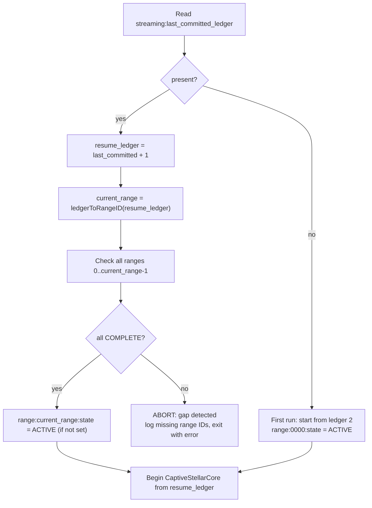
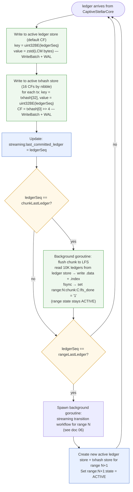

# Streaming Workflow

## Overview

Streaming mode ingests live Stellar ledgers via CaptiveStellarCore, one ledger at a time, while simultaneously serving queries. It writes to two separate active RocksDB stores for the current range (one ledger store, one txhash store), and automatically triggers a background transition workflow (see [06-streaming-transition-workflow.md](./06-streaming-transition-workflow.md)) when a 10M-ledger range boundary is crossed.

Streaming mode is a long-running daemon. It never exits unless there is a fatal error.

---

## Design Principles

1. **One ledger per batch** — optimizes for low latency and fine-grained crash recovery.
2. **Checkpoint every ledger** — `streaming:last_committed_ledger` updated after every successful write.
3. **WAL enabled** — both active RocksDB stores (ledger and txhash) must have WAL on; crash recovery depends on it.
4. **Background LFS flush at chunk boundary** — while ACTIVE, completed 10K-ledger chunks are flushed from the ledger store → LFS chunk files in a background goroutine. Range state stays `ACTIVE` throughout.
5. **Transition in background at range boundary** — when range N completes (last ledger committed), a goroutine handles: final LFS chunk flush (if not yet done) + RecSplit txhash index build. Ingestion of range N+1 starts immediately.
6. **Gap detection at startup** — all ranges before the current streaming range must be `COMPLETE`.

---

## Active Store Architecture

Each streaming range has **two separate RocksDB instances**:

### Ledger Store

Stores full ledger data for the range. No column families — default CF only.

| Key | Value | Notes |
|-----|-------|-------|
| `uint32BE(ledgerSeq)` | `zstd(LedgerCloseMeta bytes)` | Big-endian key for lexicographic order |

Path: `{data_dir}/active/rocksdb/{rangeID:04d}-ledger-store/`

WAL is **required** (never `DisableWAL`).

### TxHash Store

Stores transaction hash → ledger sequence mappings, sharded into 16 column families by the first hex nibble of the txhash.

| CF Name | Key | Value | Notes |
|---------|-----|-------|-------|
| `cf-0` through `cf-f` | `txhash[32]` | `uint32BE(ledgerSeq)` | 32-byte raw hash; 4-byte value |

CF routing: `cfIndex = txhash[0] >> 4` (high nibble of first byte, values `0x0`–`0xf`).

Path: `{data_dir}/active/rocksdb/{rangeID:04d}-txhash-store/`

WAL is **required** (never `DisableWAL`).

---

## Startup Validation

Before ingestion begins, the service validates the meta store:



**Gap detection invariant**: Every range before the current streaming range must be `COMPLETE`. If any prior range is not `COMPLETE`, the service exits. This prevents querying a range that has not been fully transitioned.

---

## Main Ingestion Loop



**Per-ledger write detail**:
- Marshal LCM to binary → zstd compress → write to ledger store (default CF) with key = `uint32BE(ledgerSeq)`, in a single `WriteBatch` (WAL enabled)
- For each transaction in ledger: write `txhash[32] → uint32BE(ledgerSeq)` to txhash store, routing to CF by `txhash[0] >> 4`, in a single `WriteBatch` (WAL enabled)
- After both WriteBatches succeed: update `streaming:last_committed_ledger` in meta store

**Chunk boundary behavior** (every 10K ledgers, while ACTIVE):
- A background goroutine reads the completed chunk's 10K ledgers from the ledger store
- Writes the LFS `.data` + `.index` chunk files; fsyncs both
- Sets `range:N:chunk:C:lfs_done = "1"` in meta store (WAL-backed)
- The range state remains `ACTIVE` — this flush is a background optimization to reduce LFS conversion work at range boundary

---

## Range Boundary Handling

When `ledgerSeq == rangeLastLedger(currentRange)` (e.g., ledger 10,000,001 for range 0):

1. Last ledger written to both active stores (ledger store + txhash store) with WAL
2. `streaming:last_committed_ledger` updated to boundary ledger
3. `range:N:state` set to `TRANSITIONING`
4. Background goroutine spawned for range N transition (see [06-streaming-transition-workflow.md](./06-streaming-transition-workflow.md))
5. New active ledger store + txhash store created for range N+1
6. `range:N+1:state` set to `ACTIVE`
7. Ingestion continues immediately with range N+1's first ledger

The transition goroutine handles: any remaining LFS chunks not yet flushed during ACTIVE + full RecSplit txhash index build from the range N txhash store. The background transition runs **concurrently** with ingestion of range N+1. Queries for range N during transition are served from the still-open range N active stores (see [08-query-routing.md](./08-query-routing.md)).

---

## Checkpoint Timing

The streaming checkpoint is per-ledger:

```
After ledger L is committed to both active RocksDB stores (WriteBatch + WAL flush):
  Write: streaming:last_committed_ledger = L
```

On crash, resume from `last_committed_ledger + 1`. Re-ingested ledgers are idempotent (same key/value pairs overwrite existing entries).

| Mode | Checkpoint interval | Resume from |
|------|--------------------|-----------  |
| Backfill | per-chunk (10K ledgers) | first incomplete chunk |
| Streaming | per-ledger (1 ledger) | `last_committed_ledger + 1` |

LFS chunk flush checkpoints (separate from ledger checkpoints): `range:N:chunk:C:lfs_done = "1"` after each chunk fsync during ACTIVE. These accumulate independently and are preserved across crashes — on resume, the transition goroutine skips already-flushed chunks.

---

## Query Availability During Streaming

| Range State | getLedgerBySequence | getTransactionByHash |
|-------------|--------------------|--------------------|
| `ACTIVE` | Active ledger RocksDB store | Active txhash RocksDB store |
| `TRANSITIONING` | Active ledger RocksDB store (still open) | Active txhash RocksDB store (still open) |
| `COMPLETE` | Immutable LFS store | Immutable RecSplit index |

Queries are never blocked. Both active stores remain open and queryable throughout the transition.

> **getEvents placeholder**: When `getEvents` support is added, it will require a new column family in the txhash store (or a separate active events RocksDB store) for event data, with per-chunk flush to an immutable events index. Query routing for `getEvents` will follow the same ACTIVE→TRANSITIONING→COMPLETE pattern.

---

## getEvents Immutable Store — Placeholder

> **Status**: Not yet designed. This section reserves space for future work.

When `getEvents` support is added to the streaming workflow, it will require:

- A new column family in the active txhash store (or a separate events RocksDB store) for event data
- Per-ledger event data written alongside existing txhash writes
- Background chunk-level flush to an immutable events index (same cadence as LFS: per 10K ledgers, while ACTIVE)
- A Phase 3 events index build in the streaming transition workflow (after LFS and RecSplit complete)
- Query availability: served from active store during ACTIVE/TRANSITIONING, from immutable events index once COMPLETE

---

## Error Handling

| Error Type | Action |
|-----------|--------|
| CaptiveStellarCore unavailable | RETRY with backoff; log; ABORT after N retries |
| Ledger store write failure | ABORT — storage is corrupted or disk full |
| TxHash store write failure | ABORT — storage is corrupted or disk full |
| Meta store write failure | ABORT — cannot maintain checkpoint |
| Background LFS flush failure | LOG error; do not set `lfs_done`; transition goroutine handles on retry at range boundary |
| Transition goroutine failure | LOG error; set range state to error; ABORT daemon |

---

## Related Documents

- [01-architecture-overview.md](./01-architecture-overview.md) — two-pipeline overview
- [02-meta-store-design.md](./02-meta-store-design.md) — `streaming:last_committed_ledger` key and `lfs_done` flags
- [06-streaming-transition-workflow.md](./06-streaming-transition-workflow.md) — active→immutable conversion
- [07-crash-recovery.md](./07-crash-recovery.md) — streaming crash scenarios
- [08-query-routing.md](./08-query-routing.md) — routing during TRANSITIONING state
- [11-checkpointing-and-transitions.md](./11-checkpointing-and-transitions.md) — range boundary math
