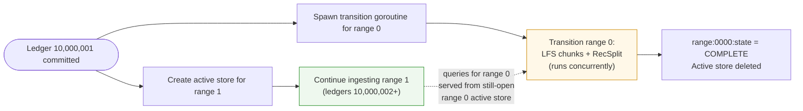

# Streaming Transition Workflow

## Overview

The streaming transition workflow converts a completed range from active RocksDB storage to immutable storage (LFS chunks + RecSplit index). It is triggered when a 10M-ledger range boundary is crossed during streaming ingestion, runs in a background goroutine, and proceeds concurrently with ingestion of the next range.

This workflow is **distinct from the backfill transition** — its input is two fully-populated active RocksDB stores (ledger store + txhash store), and it must handle live queries to the range while conversion proceeds.

**Important**: By the time the transition goroutine is spawned, most LFS chunks will already have been flushed during the ACTIVE phase (background per-chunk flush). Phase 1 of the transition only needs to flush any remaining chunks not yet done.

---

## Trigger Condition

Triggered in the streaming ingestion loop when:
```go
ledgerSeq == rangeLastLedger(currentRange)
```
(e.g., ledger 10,000,001 for range 0, ledger 20,000,001 for range 1, etc.)

At trigger:
- Current range's last ledger is committed to active RocksDB with WAL
- `streaming:last_committed_ledger` is updated to boundary ledger
- `range:N:state` set to `TRANSITIONING`
- Background goroutine spawned for transition
- New active store created for range N+1
- `range:N+1:state` set to `ACTIVE`
- Ingestion of range N+1 starts immediately

---

## Workflow Diagram

```mermaid
flowchart TD
    classDef action fill:#eef8ee,stroke:#228b22
    classDef meta fill:#e8f0ff,stroke:#3366cc
    classDef decision fill:#fff8e8,stroke:#cc8800
    classDef query fill:#fff0f0,stroke:#cc3333

    START(["Background goroutine starts for range N"]) --> SET_TRANS["range:N:state = TRANSITIONING<br/>(already set before goroutine spawned)"]:::meta
    SET_TRANS --> LFS_PHASE["Phase 1: Flush remaining LFS chunks"]:::action
    LFS_PHASE --> CHUNK_LOOP["For each chunk 0..999 in range N"]
    CHUNK_LOOP --> LFS_DONE{lfs_done = '1'?}:::decision
    LFS_DONE -->|yes| MORE["skip (already flushed during ACTIVE)"]
    LFS_DONE -->|no| READ_CHUNK["Read 10K ledgers from range N ledger store<br/>(default CF, sequential scan by uint32BE key)"]:::action
    READ_CHUNK --> WRITE_LFS["Write LFS chunk file:<br/>{chunkID:06d}.data + .index<br/>zstd-compressed LCM records + offset table<br/>fsync"]:::action
    WRITE_LFS --> SET_LFS["Set range:N:chunk:{chunkID:06d}:lfs_done = 1"]:::meta
    SET_LFS --> MORE{more chunks?}:::decision
    MORE -->|yes| CHUNK_LOOP
    MORE -->|no| TXHASH_PHASE["Phase 2: RecSplit Build from TxHash Store"]:::action

    TXHASH_PHASE --> SET_RS_STATE["Set range:N:recsplit:state = BUILDING"]:::meta
    SET_RS_STATE --> CF_LOOP["For each CF nibble 0..15"]
    CF_LOOP --> CF_DONE2{cf:XX:done = 1?}:::decision
    CF_DONE2 -->|yes| NEXT_CF["Skip (already built)"]
    CF_DONE2 -->|no| SCAN_CF["Scan txhash store CF for nibble X<br/>iterate all keys in cf-X where key[0] >> 4 == X<br/>build RecSplit MPH over (txhash, ledgerSeq) pairs<br/>write immutable/txhash/{N:04d}/index/cf-{X}.idx<br/>fsync"]:::action
    SCAN_CF --> SET_CF["Set range:N:recsplit:cf:{X:02d}:done = 1"]:::meta
    SET_CF --> NEXT_CF
    NEXT_CF --> MORE_CF{more CFs?}:::decision
    MORE_CF -->|yes| CF_LOOP
    MORE_CF -->|no| VERIFY["Verify: spot-check random ledgers and txhashes<br/>against new immutable stores"]:::action
    VERIFY --> DELETE_ACTIVE["Delete active ledger store + txhash store for range N"]:::action
    DELETE_ACTIVE --> SET_COMPLETE["range:N:recsplit:state = COMPLETE<br/>range:N:state = COMPLETE"]:::meta
    SET_COMPLETE --> DONE(["Range N transition complete"])
```



**Query routing during transition**: While `range:N:state == "TRANSITIONING"`, both active RocksDB stores for range N remain open. All queries for range N ledgers/transactions are served from them. The immutable LFS and RecSplit files are not used for queries until `state == "COMPLETE"` and both active stores are deleted.

---

## Phase 1: LFS Chunk Writes

Each chunk (10K ledgers) is read from the active RocksDB `ledger_seq_to_lcm` CF and written to an LFS chunk file. The data in RocksDB is already zstd-compressed; it is written as-is into the LFS chunk format (with an offset index for random access).

**LFS chunk file format**:
- `.data` file: contiguous compressed LCM records (variable-length)
- `.index` file: offset table, one `uint64` per ledger, enabling O(1) random access

**Flush/fsync**: Each chunk file pair is fsynced before setting `lfs_done`. Partial writes are safe — the `lfs_done` flag is the sole indicator of completion.

---

## Phase 2: RecSplit Build from Active Store

Unlike backfill (which reads raw flat files), the streaming transition reads directly from the active RocksDB `tx_hash_to_ledger_seq` CF. For each of the 16 nibbles:

1. Iterate all keys in `tx_hash_to_ledger_seq` CF where `key[0] >> 4 == nibble`
2. Build RecSplit minimal perfect hash over the matching `(txhash, ledgerSeq)` pairs
3. Write `immutable/txhash/{rangeID:04d}/index/cf-{nibble}.idx`
4. fsync
5. Set `range:N:recsplit:cf:{nibble:02d}:done = 1` in meta store

The active RocksDB store is read-only during RecSplit build (ingestion has moved to range N+1's store).

**Note**: The streaming transition does **not** produce raw txhash flat files. It builds RecSplit directly from RocksDB. This is the primary structural difference from the backfill transition.

---

## Verification Step

Before deleting the active store, the workflow performs a spot-check:

1. Sample 100 random ledger sequence numbers from range N
2. Read each from the new LFS chunk file → compare against RocksDB value
3. Sample 100 random txhashes from range N
4. Look up each in the RecSplit index → verify by fetching the ledger from LFS and confirming presence

If any mismatch is detected: ABORT; do not delete active store; log error; set range to error state.

---

## State Transitions in Meta Store

```
At transition trigger (ledger 10,000,001, range 0):
  range:0000:state                     →  "TRANSITIONING"
  streaming:last_committed_ledger      →  10,000,001
  range:0001:state                     →  "ACTIVE"

Phase 1 progresses (chunk writes):
  range:0000:chunk:000000:lfs_done     →  "1"
  range:0000:chunk:000001:lfs_done     →  "1"
  ...
  range:0000:chunk:000999:lfs_done     →  "1"

Phase 2 starts:
  range:0000:recsplit:state            →  "BUILDING"

Per-CF progress:
  range:0000:recsplit:cf:00:done       →  "1"
  ...
  range:0000:recsplit:cf:0f:done       →  "1"

Verification passes, active store deleted:
  range:0000:recsplit:state            →  "COMPLETE"
  range:0000:state                     →  "COMPLETE"
```

---

## Crash Recovery

If the streaming daemon crashes while the transition goroutine is running:

1. On restart: read all range states
2. If `range:N:state == "TRANSITIONING"`: resume transition
3. Scan `lfs_done` flags — skip completed chunks in Phase 1
4. Scan `recsplit:cf:XX:done` flags — skip completed CFs in Phase 2
5. Active store is still intact (WAL-backed); all reads for resume are from it

**Active store is never deleted until all flags are set and verification passes**. Crash recovery is always safe.

---

## Relationship to Streaming Ingestion



---

## Error Handling

| Error | Action |
|-------|--------|
| RocksDB read failure during LFS write | ABORT transition; do not set `lfs_done`; log; daemon restarts and resumes |
| LFS file write/fsync failure | ABORT transition; do not set `lfs_done` |
| RecSplit build failure | ABORT transition; do not set `cf:XX:done` |
| Verification mismatch | ABORT; do NOT delete active store; log; operator intervention required |
| Active store delete failure | LOG and continue; store will be cleaned up on next run |

---

## getEvents Immutable Store — Placeholder

> **Status**: Not yet designed. This section reserves space for future work.

When `getEvents` support is added to the streaming transition workflow, it will require:

- **Phase 3: Events index build** — after RecSplit completes, before active store deletion
- Input: events data from the active RocksDB store (a new CF written during streaming ingestion)
- Output: `immutable/events/{rangeID:04d}/index/` — events index files
- Meta store tracking: `range:N:events_index:state` and per-partition done flags
- Verification step extends to include events: spot-check random events against new index
- Active store is NOT deleted until Phase 1 (LFS), Phase 2 (RecSplit), and Phase 3 (events index) all complete

The workflow diagram above will gain a Phase 3 branch between `VERIFY` and `DELETE_ACTIVE`.

---

## Related Documents

- [04-streaming-workflow.md](./04-streaming-workflow.md) — trigger conditions and concurrency model
- [02-meta-store-design.md](./02-meta-store-design.md) — state keys written during transition
- [07-crash-recovery.md](./07-crash-recovery.md) — streaming transition crash scenarios
- [08-query-routing.md](./08-query-routing.md) — query routing during TRANSITIONING state
- [05-backfill-transition-workflow.md](./05-backfill-transition-workflow.md) — contrast: backfill transition uses raw flat files
