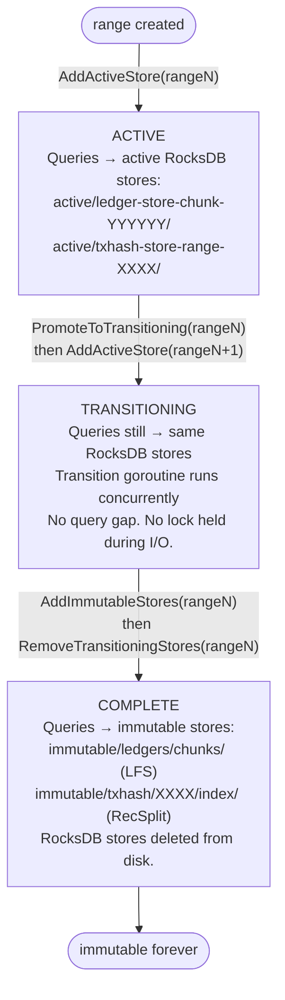
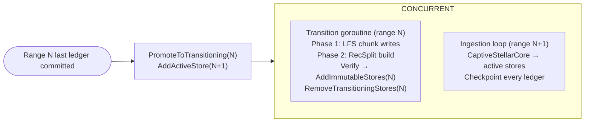
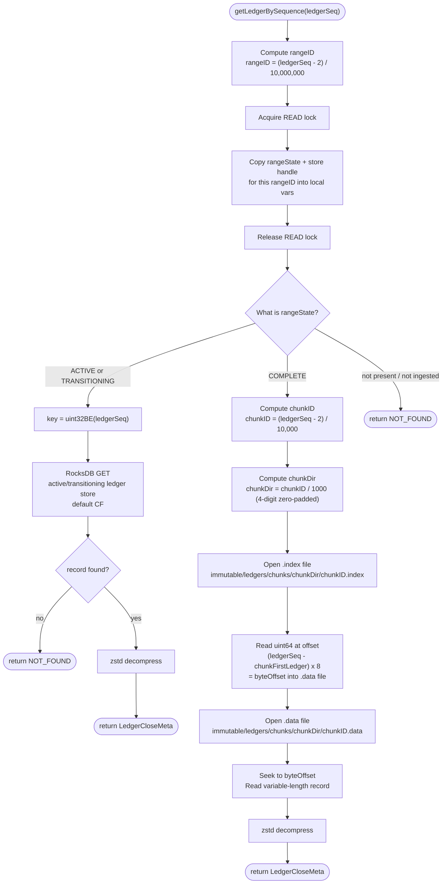
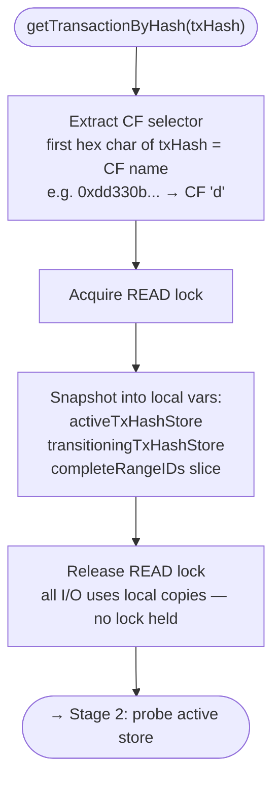
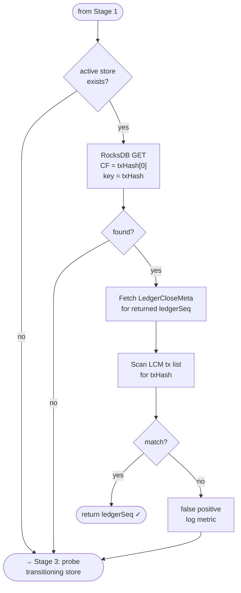
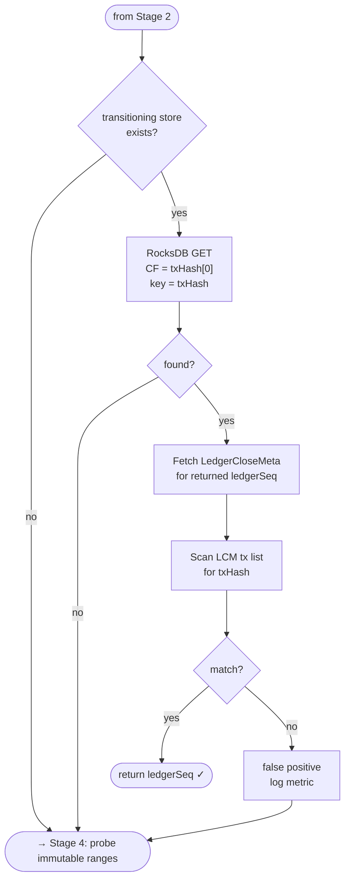
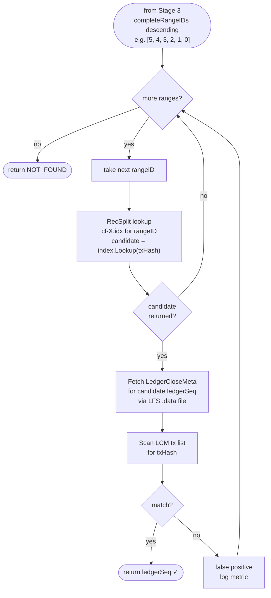

# Query Routing

## Overview

The QueryRouter dispatches `getLedgerBySequence` and `getTransactionByHash` requests to the correct store based on the range state in the meta store. Queries are only served in streaming mode. Backfill mode serves only `getHealth` and `getStatus`.

**Key Responsibilities**:
- Calculate range ID from ledger sequence
- Check range state in meta store (not filesystem)
- Route to the appropriate store (determined by `range:{rangeID:04d}:state`)
- Handle RecSplit false positives — verify transaction actually exists in returned ledger
- Maintain thread-safe handle registry; swap store references as ranges transition

---

## Store Lifecycle and Query Availability

| Range State | `getLedgerBySequence` | `getTransactionByHash` |
|-------------|----------------------|----------------------|
| `ACTIVE` | Active ledger store (default CF) | Active txhash store (CF for nibble) |
| `TRANSITIONING` | Active ledger store (still open) | Active txhash store (still open) |
| `COMPLETE` | Immutable LFS store | Immutable RecSplit index |
| Not yet started | Not available — range not ingested | Not available |

The active ledger and txhash RocksDB stores for a transitioning range remain open and queryable until `state == COMPLETE` and the stores are explicitly deleted. There is no query gap during transition.

---

## System State Example

To ground all routing examples, consider this concrete system state:

**Current State**: Streaming mode, `streaming:last_committed_ledger = 61,111,222`

**Meta Store State**:
```
streaming:last_committed_ledger = "61111222"

# COMPLETE ranges (immutable — LFS + RecSplit)
range:0000:state = "COMPLETE"   # Ledgers 2 – 10,000,001
range:0001:state = "COMPLETE"   # Ledgers 10,000,002 – 20,000,001
range:0002:state = "COMPLETE"   # Ledgers 20,000,002 – 30,000,001
range:0003:state = "COMPLETE"   # Ledgers 30,000,002 – 40,000,001
range:0004:state = "COMPLETE"   # Ledgers 40,000,002 – 50,000,001
range:0005:state = "COMPLETE"   # Ledgers 50,000,002 – 60,000,001

# ACTIVE range (two RocksDB stores open)
range:0006:state = "ACTIVE"     # Ledgers 60,000,002 – 70,000,001
```

**Store Layout**:

| Range | State | Ledger Store | TxHash Store |
|-------|-------|--------------|--------------|
| 0–5 | COMPLETE | LFS chunks in `immutable/ledgers/chunks/` | RecSplit indexes in `immutable/txhash/{rangeID:04d}/index/` |
| 6 | ACTIVE | `<active_stores_base_dir>/ledger-store-chunk-006111/` | `<active_stores_base_dir>/txhash-store-range-0006/` (16 CFs) |

All examples in this document use this state.

---

## Ledger Store vs TxHash Store Cadence

The two active stores have **different transition frequencies**. This is the most important structural distinction in the QueryRouter.

| Dimension | Ledger Store | TxHash Store |
|-----------|-------------|--------------|
| Transition trigger | Chunk boundary (every 10K ledgers) | Range boundary (every 10M ledgers) |
| Frequency | ~1000× per range | ~1× per range |
| Path key | `chunkID` (e.g. `006111`) | `rangeID` (e.g. `0006`) |
| Path pattern | `ledger-store-chunk-{chunkID:06d}/` | `txhash-store-range-{rangeID:04d}/` |
| Router method | `SwapActiveLedgerStore(newChunkID, newDB)` | `AddActiveStore(rangeID, chunkID, ...)` |
| Promoted at range boundary? | Yes — `transitioningLedgerStore` = last chunk's DB | Yes — `transitioningTxHashStore` = range's DB |
| Struct field tracking | `activeChunkID`, `transitioningChunkID` | `activeRangeID`, `transitioningRangeID` |

**Concrete example at `last_committed_ledger = 61,111,222`**:
- `chunkID = (61111222 - 2) / 10_000 = 6111` → ledger store: `ledger-store-chunk-006111/`
- `rangeID = (61111222 - 2) / 10_000_000 = 6` → txhash store: `txhash-store-range-0006/`

These are completely independent values on different update cadences.

---

## QueryRouter Architecture

The QueryRouter is the central component that knows where all data lives. It maintains an in-memory registry of store handles and provides thread-safe access for query routing.

### QueryRouter Struct

> **Note**: The following Go code is **pseudocode** illustrating the design. It shows the intended API contract and concurrency model. Actual implementation may differ in details.

```go
// PSEUDOCODE — illustrative design, not compilable
// QueryRouter manages routing queries to the correct data stores.
// It maintains a registry of all active, transitioning, and immutable stores.
// Thread-safe: uses RWMutex for concurrent read access during lookups.
//
// CADENCE NOTE:
//   - The ledger store transitions at CHUNK boundaries (every 10K ledgers, ~1000x per range).
//     It is keyed by chunkID: ledger-store-chunk-{chunkID:06d}/
//     activeChunkID tracks the current 10K-ledger chunk being written.
//   - The txhash store transitions at RANGE boundaries (every 10M ledgers, ~1x per range).
//     It is keyed by rangeID: txhash-store-range-{rangeID:04d}/
//     activeRangeID tracks the current 10M-ledger range being written.
//   - These are independent values. At ledger 65,000,000:
//       chunkID = (65000000 - 2) / 10000       = 6499 → ledger-store-chunk-006499/
//       rangeID = (65000000 - 2) / 10000000    = 6    → txhash-store-range-0006/
type QueryRouter struct {
    mu sync.RWMutex

    // Active stores (currently ingesting) — at most one pair at a time.
    // The ledger store is swapped at every chunk boundary (~every 10K ledgers).
    // The txhash store is swapped only at range boundaries (~every 10M ledgers).
    activeLedgerStore *rocksdb.DB  // ledger-store-chunk-{activeChunkID:06d}/ (default CF only)
    activeTxHashStore *rocksdb.DB  // txhash-store-range-{activeRangeID:04d}/ (16 CFs, one per nibble)
    activeChunkID     uint32       // current chunk (10K-ledger granularity); updated by SwapActiveLedgerStore
    activeRangeID     uint32       // current range (10M-ledger granularity); updated by AddActiveStore

    // Transitioning stores (being converted to immutable) — at most one pair at a time.
    // These remain open for reads until AddImmutableStores + RemoveTransitioningStores completes.
    // transitioningChunkID is the LAST chunkID of the transitioning range
    // (e.g. chunk 005999 for range 5, which spans global chunks 005000–005999).
    transitioningLedgerStore *rocksdb.DB  // ledger-store-chunk-{transitioningChunkID:06d}/ (read-only)
    transitioningTxHashStore *rocksdb.DB  // txhash-store-range-{transitioningRangeID:04d}/ (read-only)
    transitioningChunkID     uint32       // last chunkID of the transitioning range
    transitioningRangeID     uint32       // rangeID of the transitioning range

    // Immutable stores (COMPLETE ranges) — indexed by range ID
    immutableLedgerStores map[uint32]*LFSStore       // rangeID → LFS store handle
    immutableTxHashStores map[uint32]*RecSplitStore  // rangeID → RecSplit handle (16 CFs)

    // Ordered list of complete range IDs for search order (newest first).
    // e.g. [5, 4, 3, 2, 1, 0] — maintained in descending order by insertDescending.
    // getTransactionByHash searches this slice left-to-right (newest range probed first).
    completeRangeIDs []uint32

    // Meta store reference for startup initialization
    metaStore *MetaStore
}
```

### QueryRouter Initialization

On streaming mode startup, the router initializes its registry from the meta store:

1. Read all `range:{rangeID:04d}:state` keys from meta store
2. For each `COMPLETE` range: open and cache RecSplit index handles for all 16 CFs + LFS store handle; insert rangeID into `completeRangeIDs` using `insertDescending` so the slice stays sorted descending (newest first)
3. For each `ACTIVE` range: derive `chunkID` from `streaming:last_committed_ledger` to open the correct `ledger-store-chunk-{chunkID:06d}/`; open both RocksDB stores
4. For each `TRANSITIONING` range: derive the last `chunkID` of that range from `(rangeLastLedger - 2) / 10000`; open both RocksDB stores

> **`insertDescending` note**: Maintains `completeRangeIDs` as a sorted-descending slice. After inserting ranges 0, 1, 2, 3, 4, 5 (in any order), the result is `[5, 4, 3, 2, 1, 0]`. This ordering ensures `getTransactionByHash` probes newest ranges first — the most common access pattern for recent transactions.

```go
// PSEUDOCODE — startup initialization
func NewQueryRouter(metaStore *MetaStore, basePath string) (*QueryRouter, error) {
    qr := &QueryRouter{
        immutableLedgerStores: make(map[uint32]*LFSStore),
        immutableTxHashStores: make(map[uint32]*RecSplitStore),
        metaStore:             metaStore,
    }

    rangeStates := metaStore.ScanAllRangeStates()  // returns map[rangeID]state

    // lastCommittedLedger is needed to derive chunkID for the ACTIVE range.
    lastCommittedLedger := metaStore.GetUint32("streaming:last_committed_ledger")

    for rangeID, state := range rangeStates {
        switch state {
        case "COMPLETE":
            lfs := openLFSStore(basePath, rangeID)
            recsplit := openRecSplitStore(basePath, rangeID)  // loads all 16 CF indexes
            qr.immutableLedgerStores[rangeID] = lfs
            qr.immutableTxHashStores[rangeID] = recsplit
            // insertDescending maintains [N, N-1, ..., 1, 0] order for newest-first search
            qr.completeRangeIDs = insertDescending(qr.completeRangeIDs, rangeID)

        case "ACTIVE":
            // The ledger store path depends on the current chunkID, not rangeID.
            // Derive chunkID from last_committed_ledger:
            //   chunkID = (lastCommittedLedger - 2) / 10_000
            // e.g. last_committed_ledger=61,111,222 → chunkID=6111 → ledger-store-chunk-006111/
            chunkID := (lastCommittedLedger - 2) / 10_000
            qr.activeLedgerStore = openRocksDB(basePath, chunkPath(chunkID))
            qr.activeTxHashStore = openRocksDB(basePath, txHashPath(rangeID))
            qr.activeChunkID = chunkID
            qr.activeRangeID = rangeID

        case "TRANSITIONING":
            // The transitioning ledger store is the LAST chunk of the transitioning range.
            // Last ledger of range N = rangeN * 10_000_000 + 10_000_001
            // transitioningChunkID = (rangeLastLedger - 2) / 10_000
            // e.g. range 5 last ledger = 60,000,001 → chunkID = 5999 → ledger-store-chunk-005999/
            rangeLastLedger := rangeID*10_000_000 + 10_000_001
            transitioningChunkID := (rangeLastLedger - 2) / 10_000
            qr.transitioningLedgerStore = openRocksDB(basePath, chunkPath(transitioningChunkID))
            qr.transitioningTxHashStore = openRocksDB(basePath, txHashPath(rangeID))
            qr.transitioningChunkID = transitioningChunkID
            qr.transitioningRangeID = rangeID
        }
    }
    return qr, nil
}
```

---

## Registry Update Interface

The streaming ingestion loop and transition goroutine call these methods as ranges progress through the `ACTIVE → TRANSITIONING → COMPLETE` lifecycle.

**Two distinct update triggers**:
- **Chunk boundary** (every 10K ledgers, ~1000× per range): Only the ledger store is replaced. `SwapActiveLedgerStore` opens a new `ledger-store-chunk-{newChunkID:06d}/` and closes the old one. The txhash store is unchanged.
- **Range boundary** (every 10M ledgers, ~1× per range): Both stores transition. `PromoteToTransitioning` moves the current pair to the transitioning slots; `AddActiveStore` opens a new pair for range N+1.

### 1. SwapActiveLedgerStore

```go
// SwapActiveLedgerStore replaces the active ledger store at a chunk boundary.
// Called when: a chunk boundary is crossed (every 10K ledgers, ~1000 times per range).
// Effect: Old ledger store is closed and replaced with the new one.
//         The txhash store is NOT touched — it spans the full range.
// Locking: Acquires WRITE lock (brief — pointer swap only).
func (qr *QueryRouter) SwapActiveLedgerStore(newChunkID uint32, newDB *rocksdb.DB) {
    qr.mu.Lock()
    defer qr.mu.Unlock()

    // Close old store before replacing the pointer
    if qr.activeLedgerStore != nil {
        qr.activeLedgerStore.Close()
    }
    qr.activeLedgerStore = newDB
    qr.activeChunkID = newChunkID
    // qr.activeTxHashStore and qr.activeRangeID are unchanged
}
```

**When called**: Immediately after the new `ledger-store-chunk-{newChunkID:06d}/` is opened and the first ledger of the new chunk is committed. The streaming ingestion loop calls this for every chunk boundary — approximately 1000 times per 10M-ledger range.

**Example at ledger 60,010,002** (first ledger of range 6, chunk 6000):
```
SwapActiveLedgerStore(6000, openRocksDB("ledger-store-chunk-006000/"))
```
Old store `ledger-store-chunk-005999/` is closed; new store `ledger-store-chunk-006000/` is registered.

### 2. AddActiveStore

```go
// AddActiveStore registers new active stores for a range.
// Called when: a new range starts ingesting (range boundary crossed, new RocksDB pair opened).
// Takes both chunkID (first chunk of the new range) and rangeID (new range ID).
// Locking: Acquires WRITE lock (brief — pointer assignments only).
func (qr *QueryRouter) AddActiveStore(rangeID uint32, chunkID uint32, ledgerDB, txHashDB *rocksdb.DB) {
    qr.mu.Lock()
    defer qr.mu.Unlock()

    qr.activeLedgerStore = ledgerDB
    qr.activeTxHashStore = txHashDB
    qr.activeChunkID = chunkID
    qr.activeRangeID = rangeID
}
```

**When called**: At range boundary, immediately after `PromoteToTransitioning`. The new range's first chunk is chunk `rangeID * 1000` (e.g. range 6 → first chunk = 6000).

**Caller sequence at range boundary**:
1. `PromoteToTransitioning(rangeN, lastChunkID)` — move range N pair to transitioning
2. `AddActiveStore(rangeN+1, firstChunkOfN+1, newLedgerDB, newTxHashDB)` — register new pair
3. Spawn background transition goroutine for range N

### 3. PromoteToTransitioning

```go
// PromoteToTransitioning moves active stores to transitioning status.
// Called when: range boundary reached, BEFORE spawning the background transition goroutine.
// Takes the last chunkID of the range being promoted (used for path tracking in cleanup).
// Effect: Active range becomes TRANSITIONING; active slots become nil.
//         Queries for the transitioning range continue to hit the same RocksDB stores.
// Locking: Acquires WRITE lock (brief — pointer swaps only).
func (qr *QueryRouter) PromoteToTransitioning(rangeID uint32, lastChunkID uint32) {
    qr.mu.Lock()
    defer qr.mu.Unlock()

    // Move active handles → transitioning slots
    qr.transitioningLedgerStore = qr.activeLedgerStore
    qr.transitioningTxHashStore = qr.activeTxHashStore
    qr.transitioningChunkID = lastChunkID  // e.g. 5999 for range 5 (last chunk of range 5)
    qr.transitioningRangeID = rangeID

    // Clear active slots (AddActiveStore will fill them for the new range)
    qr.activeLedgerStore = nil
    qr.activeTxHashStore = nil
    qr.activeChunkID = 0
    qr.activeRangeID = 0
}
```

**When called**: At the range boundary, in this sequence:
1. `PromoteToTransitioning(rangeN, lastChunkID)` — move range N handles to transitioning
2. `AddActiveStore(rangeN+1, firstChunkID, ...)` — register new pair for range N+1
3. Spawn background transition goroutine for range N

Queries for range N continue to route to the transitioning RocksDB stores without interruption.

**Example at range 5→6 boundary** (last ledger of range 5 = 60,000,001):
- `lastChunkID = (60000001 - 2) / 10000 = 5999` → `transitioningLedgerStore = ledger-store-chunk-005999/`
- `firstChunkIDofRange6 = 6000` → `AddActiveStore(6, 6000, ...)`

### 4. AddImmutableStores

```go
// AddImmutableStores registers immutable stores after transition completes.
// Called when: background transition goroutine has completed Phase 1 (LFS) + Phase 2 (RecSplit)
//              AND spot-check verification has passed.
// Effect: Range moves from TRANSITIONING to COMPLETE in the router's in-memory state.
//         Queries for the range now route to LFS + RecSplit instead of RocksDB.
// Locking: Acquires WRITE lock (brief).
func (qr *QueryRouter) AddImmutableStores(rangeID uint32, lfs *LFSStore, recsplit *RecSplitStore) {
    qr.mu.Lock()
    defer qr.mu.Unlock()

    qr.immutableLedgerStores[rangeID] = lfs
    qr.immutableTxHashStores[rangeID] = recsplit

    // Insert in descending order for newest-first search
    qr.completeRangeIDs = insertDescending(qr.completeRangeIDs, rangeID)
}
```

**When called**: After the transition goroutine sets `range:{rangeID:04d}:state = COMPLETE` in the meta store. `AddImmutableStores` and `RemoveTransitioningStores` are called in sequence (see ordering below).

### 5. RemoveTransitioningStores

```go
// RemoveTransitioningStores closes and deletes the transitioning RocksDB stores.
// Called when: AddImmutableStores has completed AND queries are now routed to immutable stores.
// CRITICAL: This is the point at which RocksDB stores are DELETED from disk.
// Uses transitioningChunkID (not rangeID) for the ledger store path, because the ledger
// store is keyed by chunkID (the last chunk of the transitioning range).
// Locking: Acquires WRITE lock (brief).
func (qr *QueryRouter) RemoveTransitioningStores(rangeID uint32) {
    qr.mu.Lock()
    defer qr.mu.Unlock()

    if qr.transitioningRangeID == rangeID {
        qr.transitioningLedgerStore.Close()
        qr.transitioningTxHashStore.Close()
        // Delete the RocksDB directories from disk.
        // NOTE: ledger store path uses transitioningChunkID, NOT rangeID.
        // e.g. range 5 → ledger path = ledger-store-chunk-005999/ (last chunk of range 5)
        os.RemoveAll(ledgerStoreChunkPath(qr.transitioningChunkID))
        os.RemoveAll(txHashStorePath(rangeID))

        qr.transitioningLedgerStore = nil
        qr.transitioningTxHashStore = nil
        qr.transitioningChunkID = 0
        qr.transitioningRangeID = 0
    }
}
```

**When called**: Immediately after `AddImmutableStores`. The caller sequence in the transition goroutine:

```go
// Transition goroutine — final steps (pseudocode)
verifyImmutableStores(rangeID)    // spot-check 100 ledgers + 100 txhashes
metaStore.Set(rangeNState, "COMPLETE")
router.AddImmutableStores(rangeID, lfs, recsplit)    // swap routing
router.RemoveTransitioningStores(rangeID)            // delete RocksDB (safe: routing already swapped)
```

---

## State Transition Lifecycle Diagram

The following diagram shows how the router's internal state evolves as a range moves through the full lifecycle.



### Concurrent Timeline at Range Boundary



---

## Concurrency Model

| Operation | Lock Type | Blocking Behavior |
|-----------|-----------|-------------------|
| `getLedgerBySequence` | Read Lock | Non-blocking — concurrent reads allowed |
| `getTransactionByHash` | Read Lock (snapshot only) | Non-blocking — lock released before I/O |
| `SwapActiveLedgerStore` | Write Lock | Blocks all reads briefly (pointer swap); called every chunk boundary (~10K ledgers) |
| `AddActiveStore` | Write Lock | Blocks all reads briefly (pointer assignments); called at range boundary (~10M ledgers) |
| `PromoteToTransitioning` | Write Lock | Blocks all reads briefly (pointer swaps); called at range boundary |
| `AddImmutableStores` | Write Lock | Blocks all reads briefly (map insert); called at range boundary |
| `RemoveTransitioningStores` | Write Lock | Blocks all reads briefly (close + nil); called at range boundary |

**Key Insight**: `SwapActiveLedgerStore` fires at every chunk boundary (~every 10K ledgers, ~1000× per range) — but it holds the write lock only for a pointer swap, typically sub-microsecond. The heavier range-boundary operations (`PromoteToTransitioning`, `AddActiveStore`) fire ~every 10M ledgers. The write lock is **never** held during disk I/O. Queries experience negligible contention.

**getTransactionByHash locking pattern**: The read lock is acquired only to snapshot store references into local variables, then released. All disk I/O (RecSplit lookups, LFS reads, RocksDB reads) happens without holding any lock. This prevents one slow query from blocking registry updates.

---

## Locking Model

The `QueryRouter` uses a single `sync.RWMutex` to protect its in-memory store references.

### Two Lock Modes

| Mode | Acquired By | Behavior |
|------|-------------|----------|
| **Read lock** (`RLock` / `RUnlock`) | Query handlers (`getLedgerBySequence`, `getTransactionByHash`) | Multiple goroutines can hold it simultaneously. Used to safely read store pointers before any I/O. |
| **Write lock** (`Lock` / `Unlock`) | Registry update methods (`SwapActiveLedgerStore`, `AddActiveStore`, `PromoteToTransitioning`, `AddImmutableStores`, `RemoveTransitioningStores`) | Exclusive — blocks all readers. Held only for in-memory pointer/map assignments. **Never held during disk I/O.** |

### The Snapshot Pattern

Both query handlers follow the same two-phase structure:

**Phase 1 — Snapshot (lock held)**
```
acquire READ lock
copy store handles into local variables
release READ lock
```

**Phase 2 — I/O (no lock held)**
```
do all disk I/O using the local copies
return result
```

This means:
- The read lock is held for nanoseconds (a few pointer copies)
- All RocksDB reads, LFS file seeks, and RecSplit lookups happen **without holding any lock**
- A slow query cannot block a registry update, and a registry update cannot block in-flight queries

The store handles copied into local variables are safe to use after the lock is released: the registry update methods only swap the pointer in the registry (so future queries see the new store), but the old handle remains open until explicitly closed.

---

## getLedgerBySequence



---

## getTransactionByHash

The query runs in four sequential stages. Each stage is shown separately for clarity.

### Stage 1 — Setup (snapshot under lock)



### Stage 2 — Probe active store



### Stage 3 — Probe transitioning store



### Stage 4 — Probe immutable ranges (newest first)



### RecSplit False-Positive Handling

RecSplit is a minimal perfect hash function — it maps a known set of keys to indices, but it **does not return "not found"** for keys outside the set. Looking up a txhash that does not belong to a given range returns an arbitrary candidate ledger sequence.

**Protocol**:
1. Get `candidate_ledger = recsplit.Lookup(txHash)`
2. Fetch `LedgerCloseMeta` for `candidate_ledger` via `getLedgerBySequence`
3. Scan transaction list: check if any transaction hash equals `txHash`
4. If match: return `candidate_ledger`
5. If no match: this is a false positive — log metric, continue to next range

This is O(1) per range probe (RecSplit lookup + one ledger read + one LCM scan), not O(N) over all transactions.

**Three False Positive Scenarios**:

| Type | Description |
|------|-------------|
| `FALSE_POSITIVE_NORMAL` | Single RecSplit returns wrong ledger — txHash not found in that LCM |
| `FALSE_POSITIVE_COMPOUND` | Multiple RecSplits (different ranges) return wrong ledgers — none contain the txHash |
| `FALSE_POSITIVE_PARTIAL` | Some RecSplits wrong, one correct — wrong ones are skipped, correct one returns success |

---

## Range Enumeration for getTransactionByHash

The QueryRouter does not know a priori which range a txhash belongs to. It probes in this fixed order:

1. **Active store** (`ACTIVE` state) — most likely for recent transactions; direct RocksDB CF lookup
2. **Transitioning store** (`TRANSITIONING` state) — same RocksDB stores, still alive during transition
3. **Complete ranges** (`COMPLETE` state) — newest first via `completeRangeIDs` descending slice

**Optimization**: the router holds pre-loaded `RecSplitStore` handles (all 16 CF indexes per range), loaded at startup and cached forever. No file opens per query.

---

## Routing Matrix by Range State

| Range State | `getLedgerBySequence(N)` store | `getTransactionByHash` store |
|-------------|-------------------------------|------------------------------|
| `ACTIVE` | `<active_stores_base_dir>/ledger-store-chunk-{chunkID:06d}/` (default CF) | `<active_stores_base_dir>/txhash-store-range-{rangeID:04d}/` (CF for nibble) |
| `TRANSITIONING` | `<active_stores_base_dir>/ledger-store-chunk-{chunkID:06d}/` (default CF) | `<active_stores_base_dir>/txhash-store-range-{rangeID:04d}/` (CF for nibble) |
| `COMPLETE` | `immutable/ledgers/chunks/{XXXX}/{YYYYYY}.data` | `immutable/txhash/{rangeID:04d}/index/cf-{nibble}.idx` |

---

## Detailed Examples

### Example 1: getLedgerBySequence(5,000,000) — Immutable Range

**Request**: `getLedgerBySequence(5000000)`

**Routing**:
1. `rangeID = (5000000 - 2) / 10000000 = 0`
2. `range:0000:state = "COMPLETE"` → route to LFS
3. `chunkID = (5000000 - 2) / 10000 = 499`
4. `chunkDir = 499 / 1000 = 0` → path: `immutable/ledgers/chunks/0000/000499.data`
5. Seek via `.index` → decompress → return `LedgerCloseMeta`

**Response**: 200 OK

---

### Example 2: getLedgerBySequence(65,000,000) — Active Range

**Request**: `getLedgerBySequence(65000000)`

**Routing**:
1. `rangeID = (65000000 - 2) / 10000000 = 6`
2. `range:0006:state = "ACTIVE"` → route to active ledger store
3. `key = uint32BE(65000000)`
4. RocksDB get from `<active_stores_base_dir>/ledger-store-chunk-006111/` (default CF) → decompress → return

> **Why chunk 006111?** The active ledger store opened at startup is determined by `streaming:last_committed_ledger = 61,111,222`, not by the queried ledger sequence. At startup: `chunkID = (61111222 - 2) / 10000 = 6111`. This is the chunk currently being written. Ledger 65,000,000 (chunk 6499) will live in a future chunk that hasn't been opened yet — but since range 6 is `ACTIVE`, ALL ledgers for range 6 have been committed to whatever chunk store is currently active. This query hits ledger 65,000,000 which was committed earlier (to whatever chunk store was active when that ledger was ingested and is now the current active store at time of the query).
>
> **Note**: In a real system, this query would only succeed if ledger 65,000,000 has already been ingested (i.e. `last_committed_ledger ≥ 65,000,000`). With `last_committed_ledger = 61,111,222`, this query would return NOT_FOUND because range 6 has only reached ledger 61,111,222.

**Response**: 200 OK (if ledger has been ingested), 404 Not Found otherwise

---

### Example 3: getLedgerBySequence(35,000,000) — Transitioning Range

**System state variation**: range 3 is `TRANSITIONING` (background goroutine is converting it to immutable).

**Request**: `getLedgerBySequence(35000000)`

**Routing**:
1. `rangeID = (35000000 - 2) / 10000000 = 3`
2. `range:0003:state = "TRANSITIONING"` → route to transitioning ledger store
3. `key = uint32BE(35000000)`
4. The transitioning ledger store for range 3 is its **last chunk**: `transitioningChunkID = (40000001 - 2) / 10000 = 3999` → `ledger-store-chunk-003999/`
5. RocksDB get from `<active_stores_base_dir>/ledger-store-chunk-003999/` (default CF) → decompress → return

**Response**: 200 OK

**Key insight**: The transitioning ledger store is the **last chunk store** of range 3 (`ledger-store-chunk-003999/`), held open in `transitioningLedgerStore`. All ledgers of range 3 (including ledger 35,000,000, which lived in chunk 3499) are accessible via the transitioning store — RocksDB stores all range 3 ledgers regardless of chunk ID. The transitioning pointer points to the last chunk's DB handle, which remains open and readable for the full range. The `TRANSITIONING` state is purely logical — no data movement until the goroutine completes.

---

### Example 4: getTransactionByHash(0xabcd1234...) — Found in Immutable Range

**Request**: `getTransactionByHash(0xabcd1234...)`

**Execution**:
1. First hex char of `0xabcd1234...` = `'a'` → CF `a`
2. Snapshot store refs under read lock → release lock
3. **Active store (range 6)**: query CF `a` for `0xabcd1234...` → not found
4. **No transitioning store** (range 6 is ACTIVE; nothing transitioning)
5. **Immutable ranges (newest first: [5, 4, 3, 2, 1, 0])**:
   - Range 5: RecSplit `cf-a.idx` → not found
   - Range 4: RecSplit `cf-a.idx` → not found
   - Range 3: RecSplit `cf-a.idx` → **candidate ledgerSeq = 35,123,456**
     - Fetch LCM: `immutable/ledgers/chunks/0003/003512.data`
     - Decompress + scan transactions → **txHash 0xabcd1234... found!**
6. Return `35123456`

**Response**: 200 OK, `{"ledger_sequence": 35123456}`

---

### Example 5: getTransactionByHash(0xdead0000...) — Not Found (with False Positives)

**Request**: `getTransactionByHash(0xdead0000...)` (transaction does not exist)

**Execution**:
1. First hex char of `0xdead0000...` = `'d'` → CF `d`
2. **Active store (range 6)**: CF `d` → not found
3. **Immutable ranges (5 → 0)**:
   - Range 5: RecSplit `cf-d.idx` → **candidate ledgerSeq = 55,000,100** (FALSE_POSITIVE_NORMAL)
     - Fetch LCM from `immutable/ledgers/chunks/0005/005500.data`
     - Scan all transactions → `0xdead0000...` not found → **false positive, continue**
     - Log `false_positive_count++`
   - Range 4: not found
   - Range 3: RecSplit `cf-d.idx` → **candidate ledgerSeq = 38,500,200** (ANOTHER FALSE_POSITIVE_NORMAL)
     - Fetch LCM → scan transactions → not found → **false positive, continue**
   - Ranges 2, 1, 0: not found
4. All ranges exhausted → return NOT_FOUND

**Response**: 404 Not Found

**Performance impact**: This query took ~2× longer due to 2 false positives — each required one LFS fetch + LCM scan.

---

### Example 6: getLedgerBySequence(100,000,000) — Not Yet Ingested

**Request**: `getLedgerBySequence(100000000)`

**Routing**:
1. `rangeID = (100000000 - 2) / 10000000 = 9`
2. `range:0009:state` not present → return NOT_FOUND

**Response**: 404 Not Found

---

## Performance Characteristics

### getLedgerBySequence

| Store Type | Typical Latency | Notes |
|------------|----------------|-------|
| Active RocksDB | 1–5 ms | In-memory block cache |
| Transitioning RocksDB | 1–5 ms | Same as active — no difference |
| Immutable LFS | 5–10 ms | zstd decompression overhead + seek |

### getTransactionByHash

| Store Type | Typical Latency per Probe | Notes |
|------------|--------------------------|-------|
| Active RocksDB | 1–5 ms | 16 CFs, hash-based direct lookup |
| Transitioning RocksDB | 1–5 ms | Same as active |
| Immutable RecSplit (no false positive) | 1–3 ms | Minimal perfect hash, very fast |
| Immutable RecSplit (false positive) | +5–15 ms | One extra LFS fetch + LCM scan |

**Worst case**: `getTransactionByHash` must search all N+1 ranges (active + all immutable) if the transaction is in the oldest immutable range or does not exist.

---

## Caching Strategy

**RecSplit handle cache**: All `RecSplitStore` handles (16 CF indexes per range) are opened at startup for `COMPLETE` ranges and kept open in `immutableTxHashStores`. No file open/close per query. New handles added via `AddImmutableStores` as ranges complete.

**Meta store range state**: Not polled per query. The router's in-memory state is the authoritative source for routing decisions. It is updated only via the four registry update methods. The meta store is the durable source of truth; the in-memory state is derived from it at startup and kept in sync by registry updates.

```go
// PSEUDOCODE — range state is maintained via registry methods, not polled
// The router NEVER calls metaStore.Get(rangeState) per query.
// Only registry update methods (called by ingestion + transition goroutines) mutate router state.
```

**LFS chunk files**: Not cached — OS page cache handles this. Each `getLedgerBySequence` call opens the `.data` and `.index` files, reads the needed bytes, and closes. The OS caches recently accessed pages.

---

## Error Handling

| Error | Action |
|-------|--------|
| LFS file not found for COMPLETE range | LOG ERROR; return NOT_FOUND; should not happen if transition was verified |
| RecSplit index not found for COMPLETE range | LOG ERROR; return NOT_FOUND |
| Active RocksDB unreachable | ABORT — data integrity cannot be guaranteed |
| Transitioning RocksDB unreachable | ABORT — crash recovery depends on these stores |
| RecSplit false positive | LOG metric (`false_positive_count++`); continue scanning |
| `ledgerSeq` in gap between ranges | Return NOT_FOUND (gap should not exist per gap detection invariant) |
| LCM decompression failure | LOG ERROR; return error (do not return partial data) |

---

## getEvents Immutable Store — Placeholder

> **Status**: Not yet designed. This section reserves space for future work.

When `getEvents` support is added, the QueryRouter will require:

- A new `getEvents(ledgerSeq, ...)` or `getEvents(txHash, ...)` routing path
- New store type in the routing matrix: `immutable/events/{rangeID:04d}/index/` for COMPLETE ranges, and a new active events store for ACTIVE/TRANSITIONING ranges
- Extension of the store lifecycle table (above) with a `getEvents` column
- Two new registry update methods: `AddActiveEventsStore` and `AddImmutableEventsStores`
- Extension of `QueryRouter` initialization: load events index handles for COMPLETE ranges
- Store swap callback: when range transitions to COMPLETE, swap events store reference too
- False-positive handling: if the events index uses a probabilistic structure, the same verify-then-return protocol applies

The existing routing infrastructure (range state reads, store handle caching, `ACTIVE→TRANSITIONING→COMPLETE` swap) is designed to accommodate additional query types without restructuring the lock model.

---

## Related Documents

- [02-meta-store-design.md](./02-meta-store-design.md) — range state keys read by query router at startup
- [04-streaming-workflow.md](./04-streaming-workflow.md) — gap detection; when `AddActiveStore` is called
- [05-backfill-transition-workflow.md](./05-backfill-transition-workflow.md) — RecSplit index construction
- [06-streaming-transition-workflow.md](./06-streaming-transition-workflow.md) — when `PromoteToTransitioning`, `AddImmutableStores`, `RemoveTransitioningStores` are called
- [07-crash-recovery.md](./07-crash-recovery.md) — router re-initializes from meta store on restart
- [11-checkpointing-and-transitions.md](./11-checkpointing-and-transitions.md) — `ledgerToChunkID` and `ledgerToRangeID` formulas
