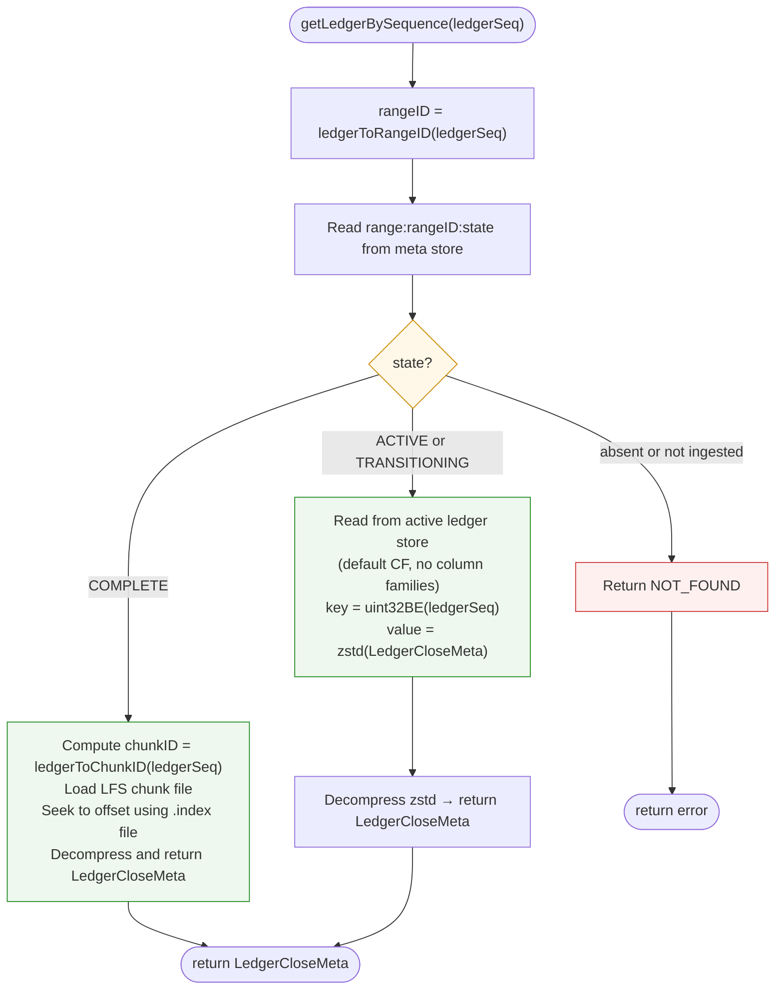
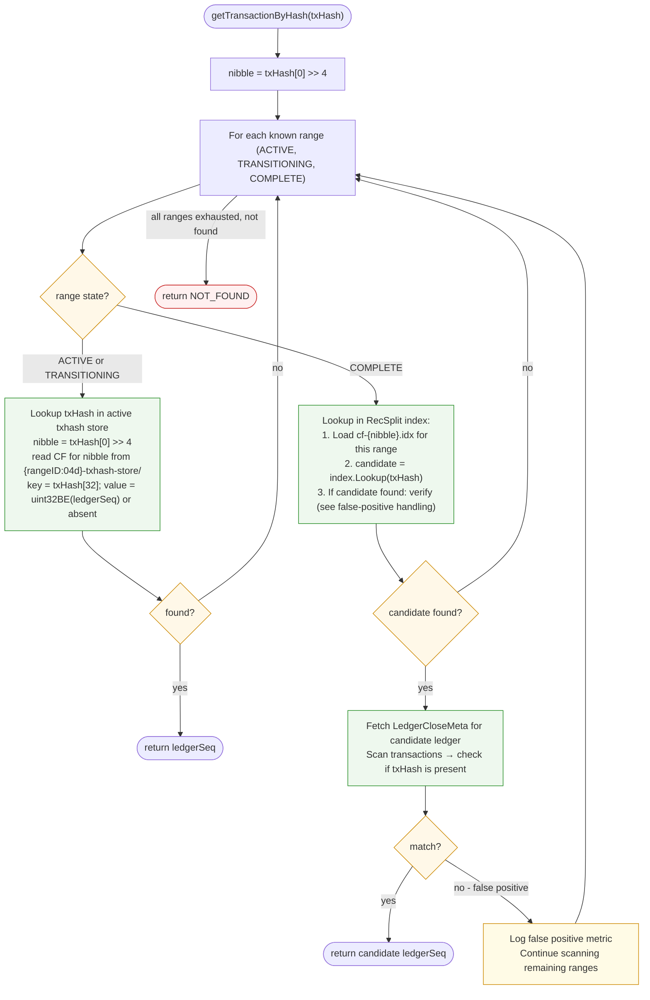

# Query Routing

## Overview

The QueryRouter dispatches `getLedgerBySequence` and `getTransactionByHash` requests to the correct store based on the range state in the meta store. Queries are only served in streaming mode. Backfill mode serves only `getHealth` and `getStatus`.

---

## Store Lifecycle and Query Availability

| Range State | `getLedgerBySequence` | `getTransactionByHash` |
|-------------|----------------------|----------------------|
| `ACTIVE` | Active ledger store (default CF) | Active txhash store (CF for nibble) |
| `TRANSITIONING` | Active ledger store (still open) | Active txhash store (still open) |
| `COMPLETE` | Immutable LFS store | Immutable RecSplit index |
| Not yet started | Not available — range not ingested | Not available |

The active ledger and txhash RocksDB stores for a transitioning range remain open and queryable until `state == COMPLETE` and the stores are explicitly deleted. There is no query gap.

---

## getLedgerBySequence

**LFS lookup detail** (for COMPLETE state):
1. `chunkID = (ledgerSeq - 2) / 10000`
2. `chunkDir = chunkID / 1000` (zero-padded 4 digits)
3. Open `.index` file → read `uint64` at offset `(ledgerSeq - chunkFirstLedger) * 8` → byte offset into `.data` file
4. Open `.data` file → seek to offset → read variable-length record → zstd decompress → return

---

## getTransactionByHash

### RecSplit False-Positive Handling

RecSplit is a minimal perfect hash function — it maps a known set of keys to indices, but it **does not return "not found"** for keys outside the set. Looking up a txhash that does not belong to a given range will return some candidate ledger sequence.

**Protocol**:
1. Get `candidate_ledger = recsplit.Lookup(txHash)`
2. Fetch `LedgerCloseMeta` for `candidate_ledger` via `getLedgerBySequence`
3. Scan transaction list: check if any transaction hash equals `txHash`
4. If match: return `candidate_ledger`
5. If no match: this is a false positive — continue to next range

This is O(1) per range probe (RecSplit lookup + one ledger read), not O(N) over all transactions.

---

## Range Enumeration for getTransactionByHash

The QueryRouter does not know a priori which range a txhash belongs to. It probes ranges in the following order:

1. **Active range first** (ACTIVE state) — most likely for recent transactions
2. **Transitioning ranges** (TRANSITIONING state) — if a range is mid-transition
3. **Complete ranges** — scan from most recent to oldest

Optimization: the QueryRouter maintains an in-memory list of open RecSplit handles, sorted by range ID descending, to avoid re-loading indexes per query.

---

## Routing Matrix by Range State

| Range State | `getLedgerBySequence(N)` store | `getTransactionByHash` store |
|-------------|-------------------------------|------------------------------|
| `ACTIVE` | `active/{rangeID:04d}-ledger-store/` (default CF) | `active/{rangeID:04d}-txhash-store/` (CF for nibble) |
| `TRANSITIONING` | `active/{rangeID:04d}-ledger-store/` (default CF) | `active/{rangeID:04d}-txhash-store/` (CF for nibble) |
| `COMPLETE` | `immutable/ledgers/chunks/{XXXX}/{YYYYYY}.data` | `immutable/txhash/{rangeID:04d}/index/cf-{nibble}.idx` |

---

## QueryRouter Initialization

On streaming mode startup:

1. Read all range states from meta store
2. For each `COMPLETE` range: load and cache RecSplit index handles for all 16 CFs
3. For each `ACTIVE` or `TRANSITIONING` range: open (or reference) both active RocksDB stores (ledger store + txhash store)
4. Register a callback: when a range transitions from `TRANSITIONING` to `COMPLETE`, swap the store references from the two RocksDB active stores to RecSplit + LFS

---

## Error Handling

| Error | Action |
|-------|--------|
| LFS file not found for COMPLETE range | LOG ERROR; return NOT_FOUND; should not happen if transition was verified |
| RecSplit index not found for COMPLETE range | LOG ERROR; return NOT_FOUND |
| Active RocksDB unreachable | ABORT — data integrity cannot be guaranteed |
| RecSplit false positive | LOG metric; continue scanning |
| `ledgerSeq` in gap between ranges | Return NOT_FOUND (gap should not exist per gap detection invariant) |

---

## getEvents Immutable Store — Placeholder

> **Status**: Not yet designed. This section reserves space for future work.

When `getEvents` support is added, the QueryRouter will require:

- A new `getEvents(ledgerSeq, ...)` or `getEvents(txHash, ...)` routing path
- New store type in the routing matrix: `immutable/events/{rangeID:04d}/index/` for COMPLETE ranges, and a new active events store for ACTIVE/TRANSITIONING ranges
- Extension of the store lifecycle table (above) with a `getEvents` column
- Extension of `QueryRouter` initialization: load events index handles for COMPLETE ranges
- Store swap callback extended: when range transitions to COMPLETE, swap events store reference from active events store to immutable events index
- False-positive handling: if the events index also uses a probabilistic structure, the same verify-then-return protocol applies

The existing routing infrastructure (range state reads, store handle caching, ACTIVE→TRANSITIONING→COMPLETE swap) is designed to accommodate additional query types without restructuring.

---

## Related Documents

- [02-meta-store-design.md](./02-meta-store-design.md) — range state keys read by query router
- [05-backfill-transition-workflow.md](./05-backfill-transition-workflow.md) — RecSplit index construction
- [06-streaming-transition-workflow.md](./06-streaming-transition-workflow.md) — when active store remains queryable
- [04-streaming-workflow.md](./04-streaming-workflow.md) — gap detection prevents missing ranges
- [11-checkpointing-and-transitions.md](./11-checkpointing-and-transitions.md) — `ledgerToChunkID` and `ledgerToRangeID` formulas
