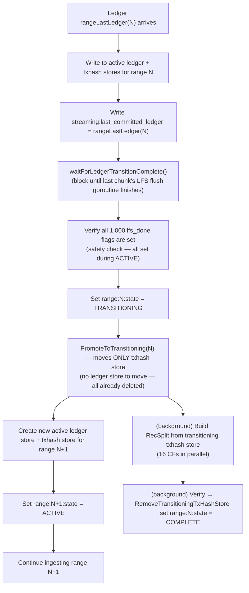
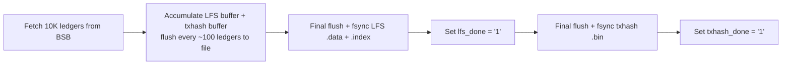

# Checkpointing and Transitions

## Overview

This document is the canonical reference for all boundary math: chunk boundaries, range boundaries, streaming checkpoint timing, transition triggers, and crash recovery resume formulas. It does not describe workflows in detail — cross-reference the workflow docs for that. It establishes the invariants that all implementations must satisfy.

---

## Key Constants

```go
const (
    FirstLedger  = 2             // Stellar genesis ledger (not 0 or 1)
    RangeSize    = 10_000_000    // Ledgers per range
    ChunkSize    = 10_000        // Ledgers per LFS chunk / raw txhash file
    ChunksPerRange = RangeSize / ChunkSize  // 1000 chunks per range
)
```

---

## Range Boundary Formulas

```go
func ledgerToRangeID(ledgerSeq uint32) uint32 {
    return (ledgerSeq - FirstLedger) / RangeSize
}

func rangeFirstLedger(rangeID uint32) uint32 {
    return (rangeID * RangeSize) + FirstLedger
}

func rangeLastLedger(rangeID uint32) uint32 {
    return ((rangeID + 1) * RangeSize) + FirstLedger - 1
}
```

### Range Boundary Table

| Range ID | First Ledger | Last Ledger | Chunk IDs |
|---------|-------------|------------|-----------|
| 0 | 2 | 10,000,001 | 0–999 |
| 1 | 10,000,002 | 20,000,001 | 1000–1999 |
| 2 | 20,000,002 | 30,000,001 | 2000–2999 |
| 3 | 30,000,002 | 40,000,001 | 3000–3999 |
| N | (N×10M)+2 | ((N+1)×10M)+1 | N×1000–(N×1000)+999 |

**Invariant**: Range boundaries are **inclusive** on both ends. Ledger (N×10M)+1 is in range N-1; ledger (N×10M)+2 is in range N. No gaps, no overlaps.

---

## Chunk Boundary Formulas

```go
func ledgerToChunkID(ledgerSeq uint32) uint32 {
    return (ledgerSeq - FirstLedger) / ChunkSize
}

func chunkFirstLedger(chunkID uint32) uint32 {
    return (chunkID * ChunkSize) + FirstLedger
}

func chunkLastLedger(chunkID uint32) uint32 {
    return ((chunkID + 1) * ChunkSize) + FirstLedger - 1
}

func chunkToRangeID(chunkID uint32) uint32 {
    return chunkID / ChunksPerRange  // chunkID / 1000
}
```

### Chunk Boundary Examples

| Chunk ID | First Ledger | Last Ledger | Range |
|---------|-------------|------------|-------|
| 0 | 2 | 10,001 | 0 |
| 1 | 10,002 | 20,001 | 0 |
| 999 | 9,990,002 | 10,000,001 | 0 |
| 1000 | 10,000,002 | 10,010,001 | 1 |
| 4999 | 49,990,002 | 50,000,001 | 4 |

**Invariant**: Chunk boundaries align exactly with range boundaries. Chunk 999 ends at ledger 10,000,001 (= range 0 last ledger). Chunk 1000 starts at ledger 10,000,002 (= range 1 first ledger).

---

## BSB Instance Boundaries (Backfill)

BSB instances are concurrent workers, each assigned a contiguous sub-range of a 10M-ledger range. All instances start simultaneously and run in parallel.

```go
// With num_bsb_instances_per_range = 20:
bsbInstanceSize = RangeSize / 20 = 500_000  // ledgers per BSB instance
chunksPerInstance = bsbInstanceSize / ChunkSize = 50

// BSB instance B within range R starts at:
bsbFirstLedger(R, B) = rangeFirstLedger(R) + B*bsbInstanceSize
bsbLastLedger(R, B)  = rangeFirstLedger(R) + (B+1)*bsbInstanceSize - 1

// With num_bsb_instances_per_range = 10:
bsbInstanceSize = 1_000_000
chunksPerInstance = 100
```

**Invariant**: `bsbInstanceSize` is always an exact multiple of `ChunkSize`. Both valid values (10 and 20) satisfy this: 500K/10K = 50, 1M/10K = 100.

---

## Streaming Checkpoint Formula

In streaming mode, a checkpoint is written to the meta store after every ledger:

```go
// Written to meta store after every successful WriteBatch to the active ledger store + txhash store:
streaming:last_committed_ledger = ledgerSeq  // uint32 big-endian

// On crash recovery, resume from:
resume_ledger = last_committed_ledger + 1
```

**Checkpoint ledger sequence** (for context — NOT a modulo check; streaming checkpoints every single ledger):

The checkpoint key tracks the last ledger safely committed with WAL to both the ledger store and the txhash store. It is written atomically with the WriteBatch for that ledger. No periodic-only checkpointing in streaming mode — every ledger is a checkpoint.

**Crash re-ingest range**: After crash with `last_committed_ledger = L`, ledgers `[L+1, crash_point]` are re-ingested. These writes are idempotent (same input → same key/value in both active stores).

---

## Transition Trigger (Streaming)

```go
func shouldTriggerTransition(ledgerSeq uint32) bool {
    return ledgerSeq == rangeLastLedger(ledgerToRangeID(ledgerSeq))
}
```

Transitions trigger at: **10,000,001 / 20,000,001 / 30,000,001 / …**

Pattern: `((N+1) × 10,000,000) + 1` for range N.

---

## Ledger Sub-flow Transition at Chunk Boundaries (Streaming)

While a streaming range is in `ACTIVE` state, the ledger sub-flow transitions independently at every chunk boundary (every 10K ledgers). This is NOT a background optimization — it IS the ledger store's transition lifecycle.

**Each sub-flow can have at most 1 active store and 1 transitioning store at any point in time.**

| Sub-flow | Transition cadence | Max active | Max transitioning | Max total |
|----------|-------------------|------------|-------------------|-----------|
| Ledger | Every 10K ledgers (chunk boundary) | **1** | **1** | **2** |
| TxHash | Every 10M ledgers (range boundary) | **1** | **1** | **2** |

**When**: After ledger `chunkLastLedger(C)` is committed to the ledger store (i.e., every 10,000 ledgers):

1. `SwapActiveLedgerStore` moves the current active ledger store to `transitioningLedgerStore` (stays open for reads)
2. A new active ledger store opens for the next chunk
3. A background goroutine reads the 10K ledgers from the transitioning store → writes `.data` + `.index` files → fsyncs

**After a successful flush + fsync**:
```
range:{N:04d}:chunk:{chunkID:06d}:lfs_done = "1"
```

4. `CompleteLedgerTransition(chunkID)` closes + deletes the transitioning ledger store, sets `transitioningLedgerStore = nil`

**Range state stays `ACTIVE`** throughout — the ledger sub-flow transitions happen entirely within the ACTIVE phase. The txhash store is **not** transitioned during ACTIVE; the txhash sub-flow's RecSplit build only happens at the 10M-ledger range boundary.

**Result**: By the time the range boundary is reached, ALL 1,000 `lfs_done` flags are already set. There are no "remaining" chunks to flush at transition time — only the txhash store's RecSplit build remains.

**Key invariant**: `lfs_done` for streaming ranges is set during ACTIVE at each chunk boundary as the ledger sub-flow transitions. There is no deferred "Phase 1" flush at transition time. `txhash_done` is **never** written for streaming ranges — it is backfill-only.

---

### What Happens at Range Boundary (TxHash Sub-flow Transition)

At the range boundary (every 10M ledgers), all ledger sub-flow transitions have already completed during ACTIVE. The range boundary triggers only the txhash sub-flow transition:



**Key points**:
- The `waitForLedgerTransitionComplete()` call blocks until the last chunk boundary's LFS flush goroutine has called `CompleteLedgerTransition` and set `transitioningLedgerStore = nil`.
- `PromoteToTransitioning` moves ONLY the txhash store — all ledger stores were individually transitioned and deleted at their chunk boundaries during ACTIVE.
- The transitioning txhash store remains open for queries until `RemoveTransitioningTxHashStore` deletes it after verification.
- The RecSplit build goroutine and the next-range ingestion run **concurrently**.

---

## Backfill Chunk Completion Checkpoints

Backfill has no per-ledger checkpoint. The checkpoint granularity is the **chunk** (10K ledgers). A chunk is considered complete only when both meta store flags are set:

```
range:{rangeID:04d}:chunk:{chunkID:06d}:lfs_done    = "1"  (written after fsync of .data + .index)
range:{rangeID:04d}:chunk:{chunkID:06d}:txhash_done = "1"  (written after fsync of .bin)
```

**Why per-chunk (not per-BSB-instance)?** Because all 20 BSB instances run concurrently, completed chunks at crash time are non-contiguous — instance 3 may have finished all 50 of its chunks while instance 0 only completed 9. Per-instance tracking would be insufficient to represent this gap pattern. Per-chunk flags handle every completion state regardless of which instance completed them.

**Resume rule**: On restart, scan ALL 1,000 chunks for each non-COMPLETE range. Skip chunks where both flags = `"1"`. Rewrite from scratch any chunk with missing flags.

**Partial file safety**: If either `lfs_done` or `txhash_done` is absent (or not `"1"`), **both** files are deleted and rewritten from scratch. There is no partial-rewrite path — even if only one flag is missing, both the `.data`/`.index` and the `.bin` are discarded and re-fetched. The only way to skip a chunk is if **both** flags are `"1"`.

### Chunk Write Sequence



`lfs_done` and `txhash_done` are always written in this order. An implementation may set both atomically in a single meta store WriteBatch after both fsyncs complete.

---

## RecSplit Transition Trigger (Backfill)

```go
func allChunksDoneForRange(rangeID uint32, metaStore) bool {
    for chunkID in range [rangeID*1000, (rangeID+1)*1000) {
        if metaStore.Get(lfs_done_key) != "1" { return false }
        if metaStore.Get(txhash_done_key) != "1" { return false }
    }
    return true
}
```

When `allChunksDoneForRange` returns true:
1. Set `range:{N}:state = RECSPLIT_BUILDING`
2. Set `range:{N}:recsplit:state = BUILDING`
3. Begin building RecSplit index CFs 0–15 from raw txhash flat files
4. After each CF: set `range:{N}:recsplit:cf:{cfIndex:02d}:done = "1"`
5. After all 16 CFs: set `recsplit:state = COMPLETE`, then `range:{N}:state = COMPLETE`
6. Delete raw txhash flat files for range N

**Async with next range**: When RecSplit starts for range N, the orchestrator slot is freed. The next range (N+1) begins ingestion immediately. RecSplit (~4 hours) runs concurrently with range N+1 ingestion.

---

## Complete Walk-Through: Range 0 (Backfill)

```
Ledger 2        → chunk 0 starts accumulating (lfs+txhash buffers)
Ledger 100      → flush buffer to disk (100-ledger cadence)
Ledger 10,001   → chunk 0 last ledger: flush + fsync → set lfs_done + txhash_done
Ledger 10,002   → chunk 1 starts
...
Ledger 10,000,001 → chunk 999 last ledger: flush + fsync → set lfs_done + txhash_done
                    allChunksDoneForRange(0) = true
                    → trigger RecSplit build (async)
                    → orchestrator slot freed: begin ingesting range 1
RecSplit builds for ~4 hours (concurrent with range 1 ingestion)
All 16 CFs done → range:0000:state = "COMPLETE"
                → delete immutable/txhash/0000/raw/*.bin
```

---

## Complete Walk-Through: Range 0 → Range 1 Transition (Streaming)

```
During ACTIVE (Range 0, ledger sub-flow transitions at each chunk boundary):
  Ledger 10,001 (= chunkLastLedger(0)):
    SwapActiveLedgerStore: move active → transitioningLedgerStore, open new active for chunk 1
    Background goroutine: read chunk 0 from transitioning store → write LFS files → fsync
    Set range:0000:chunk:000000:lfs_done = "1"
    CompleteLedgerTransition(0): close + delete transitioning ledger store
  Ledger 20,001 (= chunkLastLedger(1)):
    Same lifecycle: swap → flush → lfs_done → CompleteLedgerTransition(1)
  ... (each chunk boundary triggers an independent ledger sub-flow transition;
       at most 1 active + 1 transitioning ledger store exist at any time)
  Ledger 9,990,001 (= chunkLastLedger(998)):
    Same lifecycle: swap → flush → lfs_done → CompleteLedgerTransition(998)
  Ledger 10,000,001 (= chunkLastLedger(999) = rangeLastLedger(0)):
    SwapActiveLedgerStore for chunk 999 → triggers ledger sub-flow transition
    (chunk 999's LFS flush goroutine is now running in background)

Range boundary handling (ledger 10,000,001 = rangeLastLedger(0)):
  1. Write ledger 10,000,001 to Range 0 active ledger store + txhash store
  2. Write streaming:last_committed_ledger = 10,000,001
  3. waitForLedgerTransitionComplete()
     → blocks until chunk 999's LFS flush finishes and CompleteLedgerTransition(999) is called
  4. Verify all 1,000 lfs_done flags are set (safety check — all set during ACTIVE)
  5. Set range:0000:state = "TRANSITIONING"
  6. PromoteToTransitioning(0) — moves ONLY txhash store to transitioningTxHashStore
     (no ledger store to move — all 1,000 already transitioned and deleted)
  7. Create Range 1 ledger store + txhash store
  8. Set range:0001:state = "ACTIVE"

Ledger 10,000,002:
  Written to Range 1 active ledger store + txhash store

RecSplit build goroutine (running concurrently with Range 1 ingestion):
  Build 16 RecSplit CFs from transitioning txhash store (read each CF by nibble)
  After each CF: set recsplit:cf:XX:done = "1"
  Spot-check verify LFS + RecSplit
  Set range:0000:state = "COMPLETE"
  AddImmutableStores(0, lfsStore, recsplitStore)
  RemoveTransitioningTxHashStore(0) — close + delete transitioning txhash store

Queries during transition:
  Range 0 ledger queries: route to LFS (all ledger stores already deleted;
    LFS files written at each chunk boundary during ACTIVE)
  Range 0 txhash queries: route to transitioning txhash store (still open) until COMPLETE,
    then route to RecSplit index
  Range 1: route to active ledger store / txhash store
```

---

## Math Reference Card

| Formula | Expression |
|---------|-----------|
| Range of ledger L | `(L - 2) / 10,000,000` |
| First ledger of range N | `(N × 10,000,000) + 2` |
| Last ledger of range N | `((N+1) × 10,000,000) + 1` |
| Chunk of ledger L | `(L - 2) / 10,000` |
| First ledger of chunk C | `(C × 10,000) + 2` |
| Last ledger of chunk C | `((C+1) × 10,000) + 1` |
| Range of chunk C | `C / 1000` |
| First chunk of range N | `N × 1000` |
| Last chunk of range N | `(N × 1000) + 999` |
| Streaming resume ledger | `last_committed_ledger + 1` |
| Transition triggers at | `((N+1) × 10,000,000) + 1` for range N |

---

## Related Documents

- [02-meta-store-design.md](./02-meta-store-design.md) — state keys and enums that encode this math
- [03-backfill-workflow.md](./03-backfill-workflow.md) — chunk sub-workflow implementation
- [04-streaming-workflow.md](./04-streaming-workflow.md) — streaming checkpoint write path
- [05-backfill-transition-workflow.md](./05-backfill-transition-workflow.md) — RecSplit build sequence
- [06-streaming-transition-workflow.md](./06-streaming-transition-workflow.md) — transition goroutine detail
- [07-crash-recovery.md](./07-crash-recovery.md) — how these formulas drive recovery decisions
