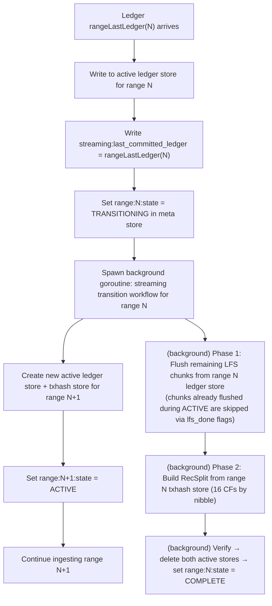
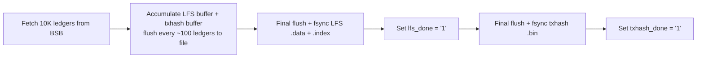

# Checkpointing and Transitions

## Overview

This document is the canonical reference for all boundary math: chunk boundaries, range boundaries, streaming checkpoint timing, transition triggers, and crash recovery resume formulas. It does not describe workflows in detail — cross-reference the workflow docs for that. It establishes the invariants that all implementations must satisfy.

---

## Key Constants

```go
const (
    FirstLedger  = 2             // Stellar genesis ledger (not 0 or 1)
    RangeSize    = 10_000_000    // Ledgers per range
    ChunkSize    = 10_000        // Ledgers per LFS chunk / raw txhash file
    ChunksPerRange = RangeSize / ChunkSize  // 1000 chunks per range
)
```

---

## Range Boundary Formulas

```go
func ledgerToRangeID(ledgerSeq uint32) uint32 {
    return (ledgerSeq - FirstLedger) / RangeSize
}

func rangeFirstLedger(rangeID uint32) uint32 {
    return (rangeID * RangeSize) + FirstLedger
}

func rangeLastLedger(rangeID uint32) uint32 {
    return ((rangeID + 1) * RangeSize) + FirstLedger - 1
}
```

### Range Boundary Table

| Range ID | First Ledger | Last Ledger | Chunk IDs |
|---------|-------------|------------|-----------|
| 0 | 2 | 10,000,001 | 0–999 |
| 1 | 10,000,002 | 20,000,001 | 1000–1999 |
| 2 | 20,000,002 | 30,000,001 | 2000–2999 |
| 3 | 30,000,002 | 40,000,001 | 3000–3999 |
| N | (N×10M)+2 | ((N+1)×10M)+1 | N×1000–(N×1000)+999 |

**Invariant**: Range boundaries are **inclusive** on both ends. Ledger (N×10M)+1 is in range N-1; ledger (N×10M)+2 is in range N. No gaps, no overlaps.

---

## Chunk Boundary Formulas

```go
func ledgerToChunkID(ledgerSeq uint32) uint32 {
    return (ledgerSeq - FirstLedger) / ChunkSize
}

func chunkFirstLedger(chunkID uint32) uint32 {
    return (chunkID * ChunkSize) + FirstLedger
}

func chunkLastLedger(chunkID uint32) uint32 {
    return ((chunkID + 1) * ChunkSize) + FirstLedger - 1
}

func chunkToRangeID(chunkID uint32) uint32 {
    return chunkID / ChunksPerRange  // chunkID / 1000
}
```

### Chunk Boundary Examples

| Chunk ID | First Ledger | Last Ledger | Range |
|---------|-------------|------------|-------|
| 0 | 2 | 10,001 | 0 |
| 1 | 10,002 | 20,001 | 0 |
| 999 | 9,990,002 | 10,000,001 | 0 |
| 1000 | 10,000,002 | 10,010,001 | 1 |
| 4999 | 49,990,002 | 50,000,001 | 4 |

**Invariant**: Chunk boundaries align exactly with range boundaries. Chunk 999 ends at ledger 10,000,001 (= range 0 last ledger). Chunk 1000 starts at ledger 10,000,002 (= range 1 first ledger).

---

## BSB Instance Boundaries (Backfill)

BSB instances are concurrent workers, each assigned a contiguous sub-range of a 10M-ledger range. All instances start simultaneously and run in parallel.

```go
// With num_instances = 20:
bsbInstanceSize = RangeSize / 20 = 500_000  // ledgers per BSB instance
chunksPerInstance = bsbInstanceSize / ChunkSize = 50

// BSB instance B within range R starts at:
bsbFirstLedger(R, B) = rangeFirstLedger(R) + B*bsbInstanceSize
bsbLastLedger(R, B)  = rangeFirstLedger(R) + (B+1)*bsbInstanceSize - 1

// With num_instances = 10:
bsbInstanceSize = 1_000_000
chunksPerInstance = 100
```

**Invariant**: `bsbInstanceSize` is always an exact multiple of `ChunkSize`. Both valid values (10 and 20) satisfy this: 500K/10K = 50, 1M/10K = 100.

---

## Streaming Checkpoint Formula

In streaming mode, a checkpoint is written to the meta store after every ledger:

```go
// Written to meta store after every successful WriteBatch to the active ledger store + txhash store:
streaming:last_committed_ledger = ledgerSeq  // uint32 big-endian

// On crash recovery, resume from:
resume_ledger = last_committed_ledger + 1
```

**Checkpoint ledger sequence** (for context — NOT a modulo check; streaming checkpoints every single ledger):

The checkpoint key tracks the last ledger safely committed with WAL to both the ledger store and the txhash store. It is written atomically with the WriteBatch for that ledger. No periodic-only checkpointing in streaming mode — every ledger is a checkpoint.

**Crash re-ingest range**: After crash with `last_committed_ledger = L`, ledgers `[L+1, crash_point]` are re-ingested. These writes are idempotent (same input → same key/value in both active stores).

---

## Transition Trigger (Streaming)

```go
func shouldTriggerTransition(ledgerSeq uint32) bool {
    return ledgerSeq == rangeLastLedger(ledgerToRangeID(ledgerSeq))
}
```

Transitions trigger at: **10,000,001 / 20,000,001 / 30,000,001 / …**

Pattern: `((N+1) × 10,000,000) + 1` for range N.

---

## Background LFS Flush During ACTIVE (Streaming)

While a streaming range is in `ACTIVE` state, a background goroutine flushes completed chunks from the **ledger store** to LFS at each chunk boundary. This is independent of the transition trigger.

**When**: After ledger `chunkLastLedger(C)` is committed to the ledger store (i.e., every 10,000 ledgers), the background goroutine reads that chunk's ledgers from the ledger store and writes the corresponding LFS `.data` + `.index` files.

**After a successful flush + fsync**:
```
range:{N:04d}:chunk:{chunkID:06d}:lfs_done = "1"
```

**Range state stays `ACTIVE`** throughout — this is not a transition. The txhash store is **not** flushed during ACTIVE; RecSplit build from the txhash store only happens during the transition goroutine at the 10M-ledger boundary.

**Benefit**: By the time transition is triggered, most LFS chunks are already written. Phase 1 of the transition goroutine only needs to flush the remaining incomplete chunks (those whose `lfs_done` flag is absent).

**Key invariant**: `lfs_done` for streaming ranges is set during ACTIVE (by the background flush goroutine) or during TRANSITIONING Phase 1 (for any remaining unflushed chunks). `txhash_done` is **never** written for streaming ranges — it is backfill-only.

---

### What Happens at Transition



The transition goroutine and the next-range ingestion goroutine run **concurrently**. The active store for range N remains open for queries until the transition goroutine deletes it.

---

## Backfill Chunk Completion Checkpoints

Backfill has no per-ledger checkpoint. The checkpoint granularity is the **chunk** (10K ledgers). A chunk is considered complete only when both meta store flags are set:

```
range:{rangeID:04d}:chunk:{chunkID:06d}:lfs_done    = "1"  (written after fsync of .data + .index)
range:{rangeID:04d}:chunk:{chunkID:06d}:txhash_done = "1"  (written after fsync of .bin)
```

**Why per-chunk (not per-BSB-instance)?** Because all 20 BSB instances run concurrently, completed chunks at crash time are non-contiguous — instance 3 may have finished all 50 of its chunks while instance 0 only completed 9. Per-instance tracking would be insufficient to represent this gap pattern. Per-chunk flags handle every completion state regardless of which instance completed them.

**Resume rule**: On restart, scan ALL 1,000 chunks for each non-COMPLETE range. Skip chunks where both flags = `"1"`. Rewrite from scratch any chunk with missing flags.

**Partial file safety**: If `lfs_done` is absent, the `.data` and `.index` files may be partial. Truncate and rewrite. If `lfs_done = "1"` but `txhash_done` is absent, only rewrite the `.bin` file (re-fetch same ledgers to extract transactions).

### Chunk Write Sequence



`lfs_done` and `txhash_done` are always written in this order. An implementation may set both atomically in a single meta store WriteBatch after both fsyncs complete.

---

## RecSplit Transition Trigger (Backfill)

```go
func allChunksDoneForRange(rangeID uint32, metaStore) bool {
    for chunkID in range [rangeID*1000, (rangeID+1)*1000) {
        if metaStore.Get(lfs_done_key) != "1" { return false }
        if metaStore.Get(txhash_done_key) != "1" { return false }
    }
    return true
}
```

When `allChunksDoneForRange` returns true:
1. Set `range:{N}:state = RECSPLIT_BUILDING`
2. Set `range:{N}:recsplit:state = BUILDING`
3. Begin building RecSplit index CFs 0–15 from raw txhash flat files
4. After each CF: set `range:{N}:recsplit:cf:{cfIndex:02d}:done = "1"`
5. After all 16 CFs: set `recsplit:state = COMPLETE`, then `range:{N}:state = COMPLETE`
6. Delete raw txhash flat files for range N

**Async with next range**: When RecSplit starts for range N, the orchestrator slot is freed. The next range (N+1) begins ingestion immediately. RecSplit (~4 hours) runs concurrently with range N+1 ingestion.

---

## Complete Walk-Through: Range 0 (Backfill)

```
Ledger 2        → chunk 0 starts accumulating (lfs+txhash buffers)
Ledger 100      → flush buffer to disk (100-ledger cadence)
Ledger 10,001   → chunk 0 last ledger: flush + fsync → set lfs_done + txhash_done
Ledger 10,002   → chunk 1 starts
...
Ledger 10,000,001 → chunk 999 last ledger: flush + fsync → set lfs_done + txhash_done
                    allChunksDoneForRange(0) = true
                    → trigger RecSplit build (async)
                    → orchestrator slot freed: begin ingesting range 1
RecSplit builds for ~4 hours (concurrent with range 1 ingestion)
All 16 CFs done → range:0000:state = "COMPLETE"
                → delete immutable/txhash/0000/raw/*.bin
```

---

## Complete Walk-Through: Range 0 → Range 1 Transition (Streaming)

```
During ACTIVE (Range 0, background goroutine):
  Ledger 10,001 (= chunkLastLedger(0)):
    Background flush: read chunk 0 from ledger store → write LFS files → fsync
    Set range:0000:chunk:000000:lfs_done = "1"
  Ledger 20,001 (= chunkLastLedger(1)):
    Background flush: chunk 1 → LFS → lfs_done = "1"
  ... (repeats every 10,000 ledgers for all 1000 chunks)
  Ledger 9,990,001 (= chunkLastLedger(998)):
    Background flush: chunk 998 → LFS → lfs_done = "1"
  (chunk 999 will still be in-progress when the transition trigger fires)

Ledger 10,000,001 (= rangeLastLedger(0)):
  1. Write ledger 10,000,001 to Range 0 ledger store
  2. Write ledger 10,000,001 to Range 0 txhash store (CF for nibble)
  3. Write streaming:last_committed_ledger = 10,000,001
  4. Set range:0000:state = "TRANSITIONING"
  5. Spawn transition goroutine for range 0
  6. Create Range 1 ledger store + txhash store
  7. Set range:0001:state = "ACTIVE"

Ledger 10,000,002:
  Written to Range 1 ledger store + txhash store

Transition goroutine (running concurrently):
  Phase 1: Scan lfs_done flags for all 1000 chunks of Range 0
           Chunks 0–998: lfs_done="1" already → skip (flushed during ACTIVE)
           Chunk 999: lfs_done absent → read from Range 0 ledger store → write LFS → set lfs_done="1"
  Phase 2: Build 16 RecSplit CFs from Range 0 txhash store (read each CF by nibble)
           After each CF: set recsplit:cf:XX:done = "1"
  Phase 3: Spot-check verify LFS + RecSplit
  Phase 4: Set range:0000:state = "COMPLETE"
  Phase 5: Delete Range 0 ledger store and txhash store directories

Queries during transition:
  Range 0 ledger queries: route to active ledger store (still present) until COMPLETE
  Range 0 txhash queries: route to active txhash store (still present) until COMPLETE
  Range 1: route to active ledger store / txhash store
```

---

## Math Reference Card

| Formula | Expression |
|---------|-----------|
| Range of ledger L | `(L - 2) / 10,000,000` |
| First ledger of range N | `(N × 10,000,000) + 2` |
| Last ledger of range N | `((N+1) × 10,000,000) + 1` |
| Chunk of ledger L | `(L - 2) / 10,000` |
| First ledger of chunk C | `(C × 10,000) + 2` |
| Last ledger of chunk C | `((C+1) × 10,000) + 1` |
| Range of chunk C | `C / 1000` |
| First chunk of range N | `N × 1000` |
| Last chunk of range N | `(N × 1000) + 999` |
| Streaming resume ledger | `last_committed_ledger + 1` |
| Transition triggers at | `((N+1) × 10,000,000) + 1` for range N |

---

## Related Documents

- [02-meta-store-design.md](./02-meta-store-design.md) — state keys and enums that encode this math
- [03-backfill-workflow.md](./03-backfill-workflow.md) — chunk sub-workflow implementation
- [04-streaming-workflow.md](./04-streaming-workflow.md) — streaming checkpoint write path
- [05-backfill-transition-workflow.md](./05-backfill-transition-workflow.md) — RecSplit build sequence
- [06-streaming-transition-workflow.md](./06-streaming-transition-workflow.md) — transition goroutine detail
- [07-crash-recovery.md](./07-crash-recovery.md) — how these formulas drive recovery decisions
