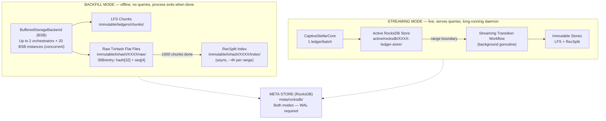
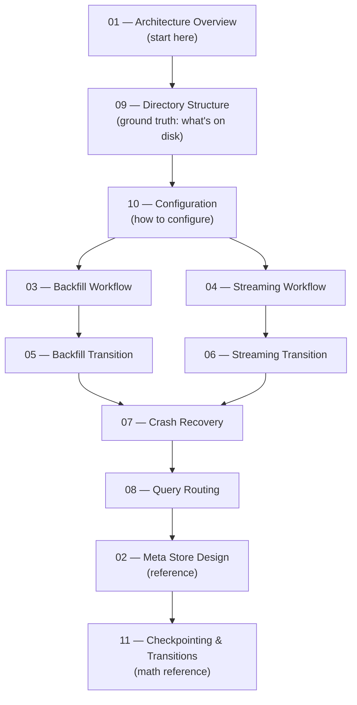

# Stellar Full History RPC Service — Design Docs v2

> **Status**: Complete redesign  
> **Purpose**: Authoritative design documentation for the redesigned ingestion pipeline

---

## What Changed from v1

| Dimension | v1 | v2 |
|-----------|----|----|
| Backfill storage | RocksDB active stores | **Direct write to LFS + raw txhash flat files** (no RocksDB) |
| Backfill transition | Unified transition workflow with streaming | **Separate per-range RecSplit build** |
| WAL during backfill | Required concern | **Not applicable** (no RocksDB) |
| `transitioning/` directory | Created on filesystem | **Eliminated** — state tracked in meta store only |
| `global:mode` meta key | Tracked in meta store | **Eliminated** — determined by startup flags |
| BSB parallelism | Vague | **Explicit**: 20 batches/orchestrator, 2 orchestrators max |
| Flush discipline | Unspecified | **Every ~100 ledgers** — no unbounded RAM accumulation |

---

## System Overview



---

## Document Index

| # | Document | What It Covers |
|---|----------|----------------|
| 01 | [01-architecture-overview.md](./01-architecture-overview.md) | Two-pipeline architecture, store types, data flow diagrams |
| 02 | [02-meta-store-design.md](./02-meta-store-design.md) | Full key hierarchy, state enums, range ID formulas, scenario walkthroughs |
| 03 | [03-backfill-workflow.md](./03-backfill-workflow.md) | BSB parallelism, chunk sub-workflow, two-level flush/fsync lifecycle |
| 04 | [04-streaming-workflow.md](./04-streaming-workflow.md) | CaptiveStellarCore loop, checkpoint write, range boundary detection |
| 05 | [05-backfill-transition-workflow.md](./05-backfill-transition-workflow.md) | RecSplit build from raw txhash flat files, per-CF tracking, async overlap |
| 06 | [06-streaming-transition-workflow.md](./06-streaming-transition-workflow.md) | Active RocksDB → LFS + RecSplit, background goroutine, store deletion |
| 07 | [07-crash-recovery.md](./07-crash-recovery.md) | All crash scenarios for both modes, recovery decision tree |
| 08 | [08-query-routing.md](./08-query-routing.md) | getLedgerBySequence and getTransactionByHash routing logic |
| 09 | [09-directory-structure.md](./09-directory-structure.md) | Full file tree, path formulas, multi-disk config |
| 10 | [10-configuration.md](./10-configuration.md) | TOML reference, validation rules, example configs |
| 11 | [11-checkpointing-and-transitions.md](./11-checkpointing-and-transitions.md) | All boundary math, formulas, and transition trigger invariants |
| 12 | [12-metrics-and-sizing.md](./12-metrics-and-sizing.md) | Storage estimates, memory budgets, hardware requirements, structural constants |
| 13 | [13-recommended-operator-approach.md](./13-recommended-operator-approach.md) | Step-by-step operator runbook: backfill → streaming, crash recovery, multi-disk layout |
| — | [FAQ.md](./FAQ.md) | Consolidated Q&A index |

---

## Recommended Reading Order



---

## Quick Reference

### Key Numbers

See [12-metrics-and-sizing.md](./12-metrics-and-sizing.md) for all structural constants, storage estimates, memory budgets, hardware requirements, and timing figures.

### API Endpoints

| Endpoint | Availability |
|----------|-------------|
| `getTransactionByHash(txHash)` | Streaming mode only |
| `getLedgerBySequence(ledgerSeq)` | Streaming mode only |
| `getHealth()` | Both modes |
| `getStatus()` | Both modes |

### Range Boundaries (First 5)

| Range | First Ledger | Last Ledger |
|-------|-------------|------------|
| 0 | 2 | 10,000,001 |
| 1 | 10,000,002 | 20,000,001 |
| 2 | 20,000,002 | 30,000,001 |
| 3 | 30,000,002 | 40,000,001 |
| 4 | 40,000,002 | 50,000,001 |

### Key Design Invariants

1. **No RocksDB during backfill ingestion** — write directly to LFS chunks + raw txhash flat files
2. **Flush every ~100 ledgers** — no unbounded RAM accumulation
3. **Chunk = atomic unit of crash recovery (backfill)** — both `lfs_done` and `txhash_done` must be set after fsync before a chunk is skippable
4. **RecSplit built at range granularity** — triggered once all 1,000 chunks for a range are complete
5. **RecSplit runs async with next range** — while RecSplit builds (~4h), the next range begins ingesting
6. **Backfill and streaming transitions are completely separate workflows**
7. **No `transitioning/` directory** — transition state lives in meta store
8. **No `global:mode` key** — mode determined by `--mode` startup flag
9. **No queries during backfill** — process exits when all requested ranges complete
10. **Streaming: no gaps allowed** — all prior ranges must be COMPLETE before streaming can start

---

## Operator Runbook (Summary)

See [13-recommended-operator-approach.md](./13-recommended-operator-approach.md) for the full step-by-step guide including prerequisites, crash recovery procedures, multi-disk layout, and a deployment checklist.

### First-time setup: ingest history then stream

```
# Step 1: Backfill all historical ranges
ingestion-workflow --config backfill.toml --mode backfill
# Re-run exact same command on failure until it exits 0

# Step 2: Switch to streaming
ingestion-workflow --config streaming.toml --mode streaming
# Long-running daemon; restart on crash
```

### Resuming after crash (backfill)

Re-run the exact same command. The process reads the meta store, skips completed chunks and ranges, and resumes from the first incomplete chunk.

### Resuming after crash (streaming)

Restart the process. It reads `streaming:last_committed_ledger` and resumes from `last_committed_ledger + 1`.
