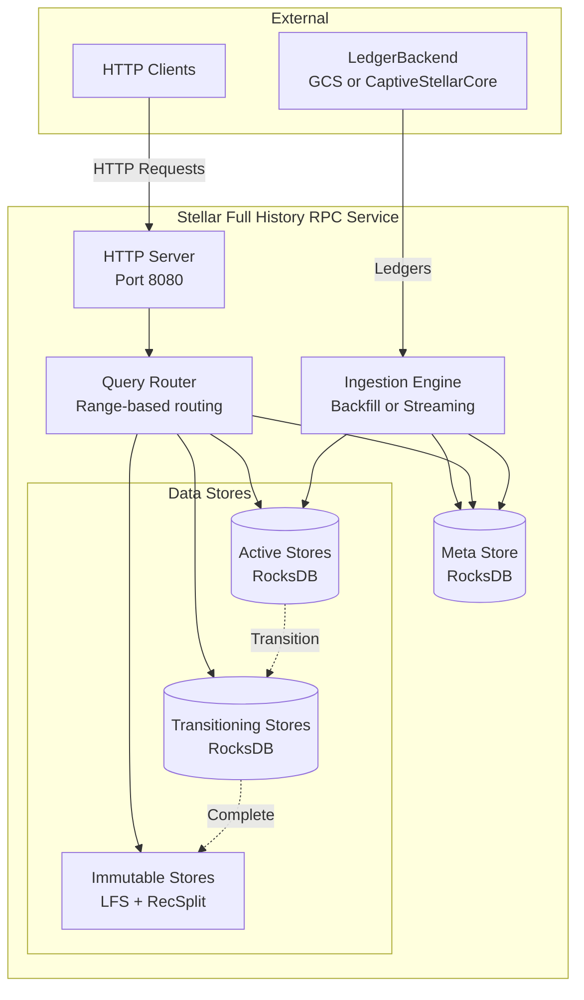
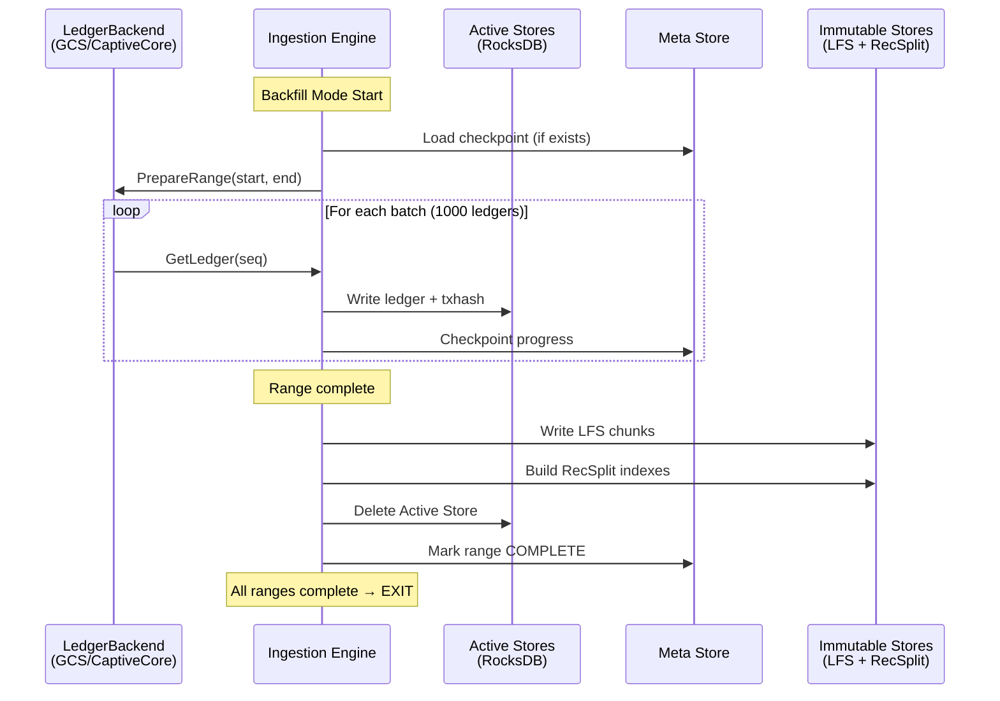
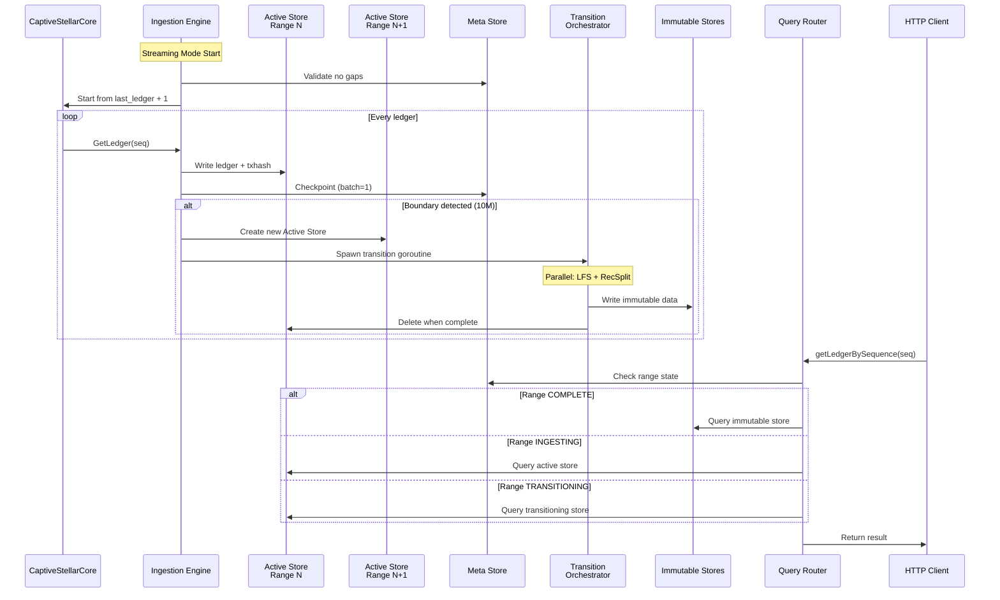

# Architecture Overview

> **Document**: 01-architecture-overview.md  
> **Purpose**: High-level system architecture, components, and data flow  
> **Last Updated**: 2026-01-29

---

## System Components

The Stellar Full History RPC Service consists of six major components working together to provide efficient query access to the complete blockchain history:



---

## Component Responsibilities

| Component | Responsibility | Key Operations |
|-----------|----------------|----------------|
| **HTTP Server** | Expose REST endpoints, handle client requests | Accept connections, parse requests, return responses |
| **Query Router** | Route queries to correct data store based on ledger sequence/range | Calculate range ID, check range state, select store |
| **Ingestion Engine** | Process ledgers from LedgerBackend, write to stores | Read ledgers, batch processing, checkpoint progress |
| **Meta Store** | Track global state, per-range state, checkpoints | Store/retrieve state, atomic updates, crash recovery |
| **Active Stores** | RocksDB instances for current/live data | Write ledgers, write txhash mappings, serve queries |
| **Immutable Stores** | Read-only LFS chunks and RecSplit indexes | Serve queries for completed ranges |

---

## Data Flow

### Backfill Mode Data Flow



### Streaming Mode Data Flow



---

## Store Types

### Active Stores (RocksDB)

Active stores hold data for the current 10M ledger range being ingested. They are mutable and optimized for write throughput.

**Ledger Store**:
- **Key**: `uint32(ledgerSeq)` (4 bytes, big-endian)
- **Value**: `zstd(LedgerCloseMeta)` (compressed protobuf)
- **Column Families**: 1 (default)
- **Purpose**: Store compressed ledger data for quick retrieval

**TxHash Store**:
- **Key**: `[32]byte(txHash)` (SHA-256 hash)
- **Value**: `uint32(ledgerSeq)` (4 bytes, big-endian)
- **Column Families**: 16 (sharded by first hex character: 0-9, a-f)
- **Purpose**: Map transaction hash to ledger sequence

**Configuration**:
- Write-optimized settings during ingestion
- Auto-compaction disabled (manual compaction before transition)
- Block cache: 8GB (configurable)
- Write buffer: 512MB per CF

### Immutable Stores

Immutable stores hold data for completed 10M ledger ranges. They are read-only and optimized for storage efficiency and query performance.

**LFS (Local File System) Ledger Store**:
- **Format**: Chunk-based storage, 10,000 ledgers per chunk
- **Files**: 
  - `.data` file: Concatenated zstd-compressed ledgers
  - `.index` file: Offset table for random access
- **Chunks per range**: 1,000 chunks (10M ledgers / 10K per chunk)
- **Compression**: zstd (level 3)
- **Purpose**: Efficient storage and retrieval of historical ledgers

**RecSplit TxHash Index**:
- **Format**: Minimal perfect hash function
- **Files**: 16 `.idx` files (one per hex prefix: 0-9, a-f)
- **Overhead**: ~2-3 bits per key
- **Lookup**: O(1) with 2-3 disk seeks
- **Purpose**: Space-efficient txhash → ledgerSeq mapping

**Path Structure**:
```
immutable/
├── ledgers/
│   └── range-0/
│       ├── chunk-0000.data
│       ├── chunk-0000.index
│       ├── ...
│       └── chunk-0999.index
└── txhash/
    └── range-0/
        ├── 0.idx
        ├── 1.idx
        ├── ...
        └── f.idx
```

---

## Hardware Requirements

### Minimum Specifications

| Resource | Requirement | Notes |
|----------|-------------|-------|
| **CPU** | 32 cores | For parallel backfill orchestrators and compaction |
| **RAM** | 128 GB | CaptiveStellarCore (~8GB) + RocksDB caches + buffers |
| **Disk (Active)** | 2 TB NVMe SSD | Active stores, meta store (high IOPS required) |
| **Disk (Immutable)** | 50+ TB HDD | Immutable stores (sequential access, lower IOPS acceptable) |
| **Network** | 10 Gbps | For GCS access in backfill mode |

### Memory Breakdown

| Component | Memory Usage | Configurable |
|-----------|--------------|--------------|
| CaptiveStellarCore | ~8 GB per instance | No |
| RocksDB Block Cache | 8 GB (default) | Yes (`block_cache_mb`) |
| RocksDB Write Buffers | 512 MB × 2 × 17 CFs = ~17 GB | Yes (`write_buffer_mb`, `max_write_buffer_number`) |
| Ingestion Buffers | 1000 ledgers × 1 MB = ~1 GB | Yes (`checkpoint_interval`) |
| Application Overhead | ~2 GB | No |
| **Total (Streaming)** | ~36 GB | |
| **Total (Backfill, 2 parallel)** | ~52 GB | |

### Disk Space Estimates

**Per 10M Ledger Range**:
- Active Ledger Store: ~1.5 TB (compressed)
- Active TxHash Store: ~500 GB
- Immutable LFS: ~1.2 TB (compressed)
- Immutable RecSplit: ~50 GB
- **Total per range**: ~3.2 TB (active + immutable during transition)

**Current Stellar Network** (as of 2026-01-29):
- Current ledger: ~62,000,000
- Ranges: 0-5 (6 ranges)
- Immutable storage: ~7.2 TB (6 ranges × 1.25 TB)
- Active storage: ~2 TB (range 6)
- **Total**: ~9.2 TB

---

## HTTP Endpoints by Mode

### Backfill Mode

| Endpoint | Method | Description | Response |
|----------|--------|-------------|----------|
| `getHealth` | GET | Health check | `{ "status": "healthy" }` |
| `getStatus` | GET | Backfill progress | `{ "mode": "backfill", "ranges": [...] }` |

**Query endpoints are UNAVAILABLE** in backfill mode:
- `getTransactionByHash` → HTTP 503 "Service in backfill mode"
- `getLedgerBySequence` → HTTP 503 "Service in backfill mode"

### Streaming Mode

| Endpoint | Method | Description | Response |
|----------|--------|-------------|----------|
| `getHealth` | GET | Health check | `{ "status": "healthy" }` |
| `getStatus` | GET | Service status | `{ "mode": "streaming", "last_ledger": 62000000 }` |
| `getTransactionByHash` | POST | Get ledger for txhash | `{ "ledger_sequence": 12345678 }` |
| `getLedgerBySequence` | POST | Get ledger data | `{ "ledger": <LedgerCloseMeta> }` |

**Canonical Endpoint Names** (MUST USE):
- ✅ `getTransactionByHash` (NOT "getTransaction")
- ✅ `getLedgerBySequence` (NOT "getLedger")

---

## Scalability Considerations

### Horizontal Scaling

**Current Design**: Single-instance service (no horizontal scaling)

**Rationale**:
- Ingestion MUST be single-threaded per range to maintain consistency
- Query load can be handled by single instance with proper caching
- Immutable stores are read-only and can be replicated if needed

**Future**: If query load exceeds single-instance capacity:
- Deploy read-only replicas with immutable stores only
- Use load balancer to distribute query traffic
- Keep single writer instance for ingestion

### Vertical Scaling

**CPU**: Add more cores for faster backfill (more parallel orchestrators)
**RAM**: Increase RocksDB caches for better query performance
**Disk**: Add more volumes for immutable stores (multi-disk configuration)

---

## Related Documents

- [Meta Store Design](./02-meta-store-design.md) - State tracking and checkpointing
- [Backfill Workflow](./03-backfill-workflow.md) - Historical data ingestion
- [Streaming Workflow](./04-streaming-workflow.md) - Real-time data ingestion
- [Query Routing](./07-query-routing.md) - How queries find the right store
- [Directory Structure](./08-directory-structure.md) - File system layout
- [Configuration](./09-configuration.md) - TOML configuration reference
