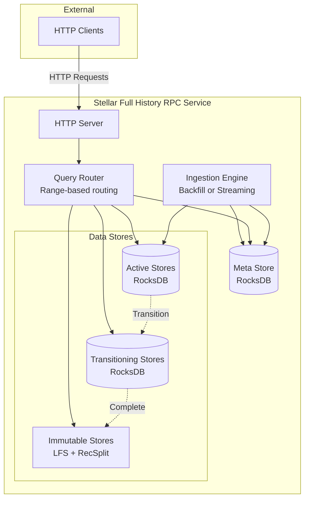
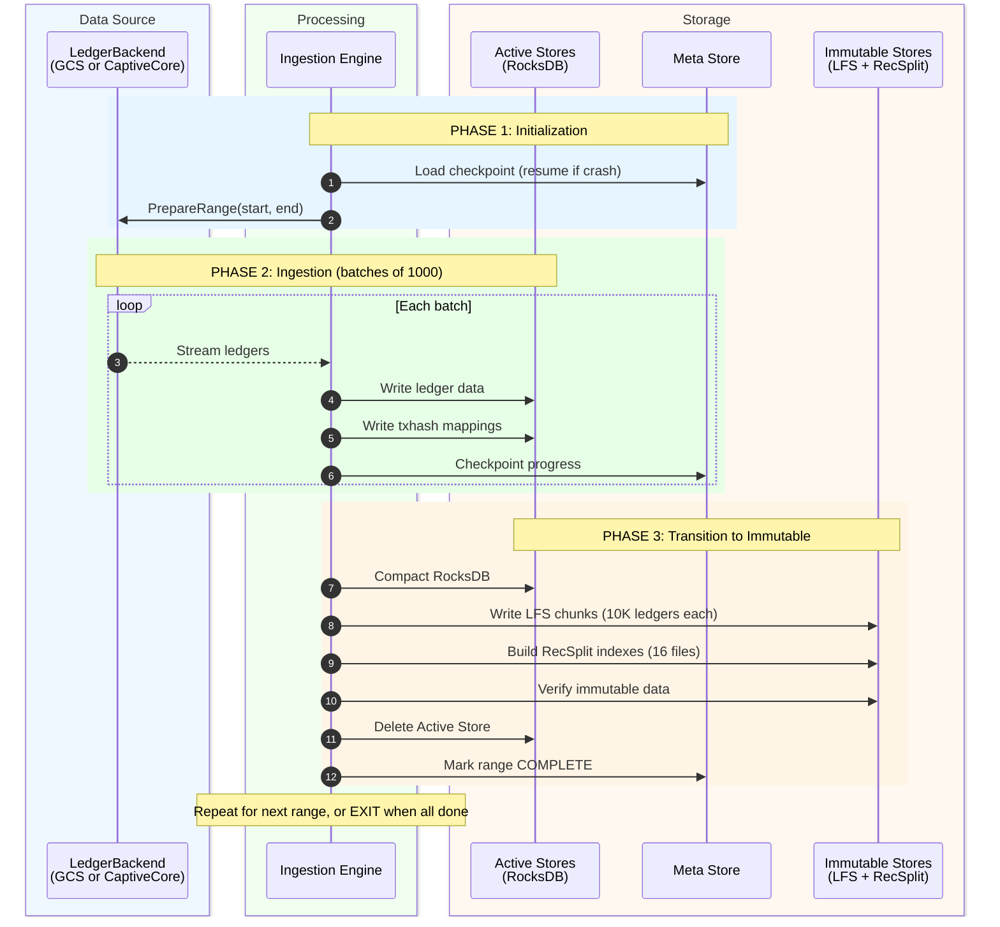
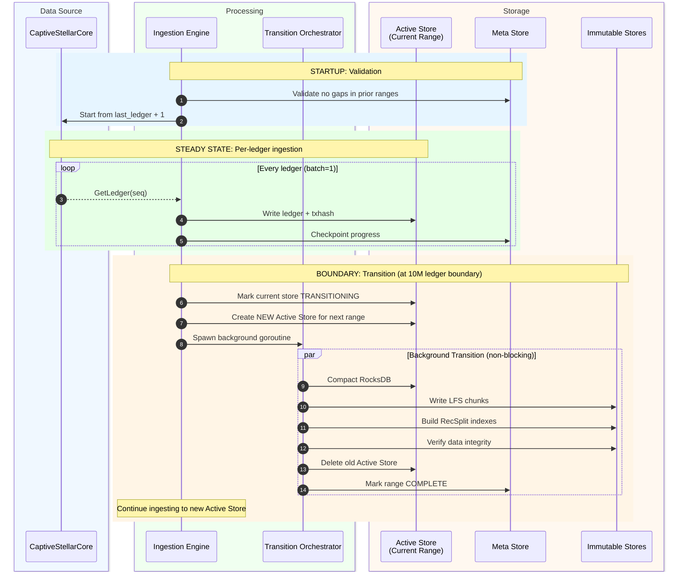
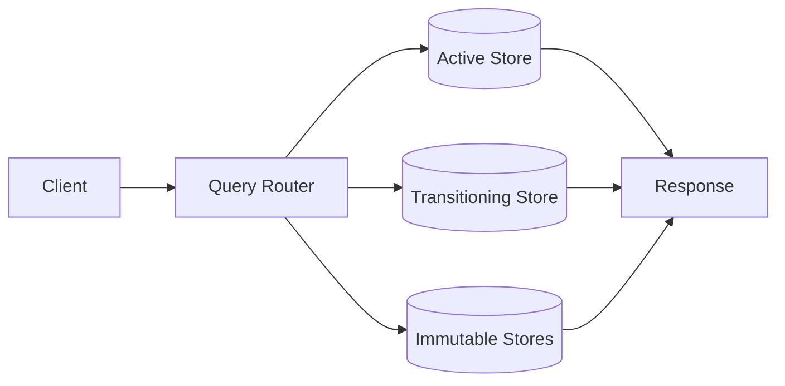

# Architecture Overview

> **Document**: 01-architecture-overview.md  
> **Purpose**: High-level system architecture, components, and data flow
---

## System Components

The Stellar Full History RPC Service consists of six major components working together to provide efficient query access to complete blockchain history:



---

## Component Responsibilities

| Component | Responsibility | Key Operations |
|-----------|----------------|----------------|
| **HTTP Server** | Expose REST endpoints, handle client requests | Accept connections, parse requests, return responses |
| **Query Router** | Route queries to correct data store based on ledger sequence/range | Calculate range ID, check range state, select store |
| **Ingestion Engine** | Process ledgers from LedgerBackend, write to stores | Read ledgers, batch processing, checkpoint progress |
| **Meta Store** | Track global state, per-range state, checkpoints | Store/retrieve state, atomic updates, crash recovery |
| **Active Stores** | RocksDB instances for current/live data | Write ledgers, write txhash mappings, serve queries |
| **Immutable Stores** | Read-only LFS chunks and RecSplit indexes | Serve queries for completed ranges |

---

## Data Flow

### Backfill Mode Data Flow



> **Note**: The transition phase (Phase 3) is **identical** in both backfill and streaming modes.  
> The only difference is that in **streaming mode**, the store being transitioned is marked `TRANSITIONING` and remains queryable during conversion, whereas in **backfill mode**, queries are not served so there is no transitioning store state.
---

### Streaming Mode Data Flow

The streaming mode diagram is split into two parts for clarity: **Ingestion Flow** (how data enters) and **Query Flow** (how data is served).

---

#### Ingestion Flow (streaming mode)



> **Note**: The transition steps (compact → LFS → RecSplit → verify → delete → mark complete) are **identical** in both modes.  
> The key difference: In streaming mode, the old store is marked `TRANSITIONING` and **remains queryable** while conversion happens in the background. In backfill mode, no queries are served, so this state doesn't exist.
---

#### Query Flow (streaming mode)



| Query | Routing Logic |
|-------|---------------|
| **getLedgerBySequence** | Range calculated from ledger sequence → query single store based on range state |
| **getTransactionByHash** | Range unknown → search Active → Transitioning → Immutable (newest to oldest) until found |

> For detailed query routing logic, search order, and false positive handling, see [Query Routing - getTransactionByHash Workflow](./07-query-routing.md#gettransactionbyhash-workflow).

---

## Store Types

### Active Stores (RocksDB)

Active stores hold data for the current 10M ledger range being ingested. They are mutable and optimized for write throughput.

**Ledger Store**:
- **Key**: `uint32(ledgerSeq)` (4 bytes, big-endian)
- **Value**: `zstd(LedgerCloseMeta)` (compressed LedgerCloseMeta in bytes, appx 150kb for recent ledgers)
- **Column Families**: 1 (default)
- **Purpose**: Store compressed ledger data for quick retrieval

**TxHash Store**:
- **Key**: `[32]byte(txHash)`
- **Value**: `uint32(ledgerSeq)` (4 bytes, big-endian)
- **Column Families**: 16 (sharded by first character in the hex representation of transaction hash: 0-9, a-f)
- **Purpose**: Map transaction hash to ledger sequence

**Configuration**:
- Write-optimized settings during ingestion
- Auto-compaction disabled (manual compaction before transition)
- Tuned block cache and write buffer sizes for performance
- Bloom filters enabled for txhash CFs
- See [Configuration Document](./09-configuration.md) for full details

### Immutable Stores

Immutable stores hold data for completed 10M ledger ranges. They are read-only and optimized for storage efficiency and query performance.

**LFS (Local File System) Ledger Store**:
- **Format**: Chunk-based storage, 10,000 ledgers per chunk
- **Files**: 
  - `.data` file: Concatenated zstd-compressed ledgers
  - `.index` file: Offset table for random access
- **Chunks per range**: 1,000 chunks (10M ledgers / 10K per chunk)
- **Compression**: zstd (level 3)
- **Purpose**: Efficient storage and retrieval of historical ledgers

**RecSplit TxHash Index**:
- **Format**: Minimal perfect hash function
- **Files**: 16 `.idx` files (one per hex prefix: 0-9, a-f)
- **Size**: ~4.5 bytes/entry (including overhead, compared to 36 bytes/entry (plus bloom filter overhead) in Rocksdb)
- **Lookup**: O(1) with 2-3 disk seeks
- **Purpose**: Space-efficient txhash → ledgerSeq mapping

**Path Structure**:
```
immutable/
├── ledgers/                              # Single LFS store for all ranges
│   └── chunks/
│       ├── 0000/                         # Range 0: chunks 0-999 (ledgers 2 - 10,000,001)
│       │   ├── 000000.data               # Chunk 0 (ledgers 2-10,001)
│       │   ├── 000000.index
│       │   ├── 000001.data               # Chunk 1 (ledgers 10,002-20,001)
│       │   ├── 000001.index
│       │   └── ...
│       ├── 0001/                         # Range 1: chunks 1000-1999 (ledgers 10,000,002 - 20,000,001)
│       │   ├── 001000.data
│       │   ├── 001000.index
│       │   └── ...
│       ├── 0005/                         # Range 5: chunks 5000-5999 (ledgers 50,000,002 - 60,000,001)
│       │   ├── 005000.data               # First chunk (ledgers 50,000,002 - 50,010,001)
│       │   ├── 005000.index
│       │   ├── 005001.data               # Second chunk (ledgers 50,010,002 - 50,020,001)
│       │   ├── 005001.index
│       │   ├── ...
│       │   ├── 005998.data               # Second-to-last chunk (ledgers 59,980,002 - 59,990,001)
│       │   ├── 005998.index
│       │   ├── 005999.data               # Last chunk (ledgers 59,990,002 - 60,000,001)
│       │   └── 005999.index
│       └── ...
└── txhash/                               # RecSplit indexes per range
    ├── 0000/                             # Range 0
    │   └── index/
    │       ├── cf-0.idx
    │       └── ...
    ├── 0001/                             # Range 1
    │   └── index/
    │       └── ...
    ├── 0005/                             # Range 5
    │   └── index/
    │       ├── cf-0.idx
    │       ├── cf-1.idx
    │       ├── ...
    │       ├── cf-e.idx
    │       └── cf-f.idx
    └── ...
```

---

## Hardware Requirements

### Minimum Specifications

| Resource | Requirement            | Notes                                                |
|----------|------------------------|------------------------------------------------------|
| **CPU** | 32 cores               | For parallel backfill orchestrators and compaction   |
| **RAM** | 128 GB                 | CaptiveStellarCore (~8GB) + RocksDB caches + buffers |
| **Disk (Active)** | 2 TB NVMe SSD          | Active stores, meta store (high IOPS required)       |
| **Disk (Immutable)** | 32+ TB (SSD Preferred) | Immutable stores (sequential access)                 |
| **Network** | 10 Gbps                | For GCS access in backfill mode                      |

### Memory Breakdown

| Component | Memory Usage                 | Configurable |
|-----------|------------------------------|--------------|
| CaptiveStellarCore | ~8 GB per instance           | No |
| RocksDB Block Cache | 8 GB (default)               | Yes (`block_cache_mb`) |
| RocksDB Write Buffers | 512 MB × 2 × 17 CFs = ~17 GB | Yes (`write_buffer_mb`, `max_write_buffer_number`) |
| Ingestion Buffers | 1000 ledgers × 1 MB = ~1 GB  | Yes (`checkpoint_interval`) |
| Application Overhead | ~2 GB                        | No |
| **Total (Streaming)** | ~36 GB                       | |
| **Total (Backfill, 2 parallel)** | ~72 GB                       | |

### Storage Size Reference (Per 10M Ledger Range)

>  Based on real-world data from ledger ranges 30,000,002 - 60,000,001. 
> Earlier ranges (2 - 30,000,001) may have smaller LCM sizes due to lower network activity.


#### Ledger Store (LedgerSeq → LCM)

| Stage | Calculation | Size |
|-------|-------------|------|
| **RocksDB (Active)** | 10M ledgers × 150KB avg compressed LCM + 5% overhead | **~1.58 TB** |
| **LFS (Immutable)** | 10M ledgers × 150KB (zstd compressed chunks) | **~1.5 TB** |
| **Compression Ratio** | RocksDB → LFS | ~5% reduction (overhead removed) |

**Notes**:
- LCM sizes vary significantly by ledger activity (recent ranges: ~150KB, early ranges: ~10-50KB)
- LFS chunks are 10K ledgers each, independently compressed with zstd

#### TxHash Store (TxHash → LedgerSeq)

| Stage | Calculation | Size |
|-------|-------------|------|
| **Entry Size** | 32-byte txhash key + 4-byte uint32 value | 36 bytes/entry |
| **Entry Count** | 10M ledgers × 325 tx/ledger avg | **~3.25 billion entries** |
| **RocksDB (Active)** | 3.25B entries × 36 bytes + 25% overhead (bloom filters, index blocks) | **~140 GB** |
| **RecSplit (Immutable)** | 16 minimal perfect hash indexes | **~15 GB** |
| **Compression Ratio** | RocksDB → RecSplit | **~89% reduction** |

**Notes**:
- RocksDB overhead includes bloom filters for each of 16 column families
- RecSplit is a minimal perfect hash function - O(1) lookup, very space-efficient
- 16 column families partition entries by first hex char of txhash

#### Total Per-Range Storage

| Store Type | RocksDB (Active) | Immutable | Savings |
|------------|------------------|-----------|---------|
| Ledger | ~1.58 TB | ~1.5 TB | ~5% |
| TxHash | ~140 GB | ~15 GB | ~89% |
| **Total** | **~1.72 TB** | **~1.52 TB** | **~12%** |

#### Memory During Transition

During transition, the system temporarily holds both active and transitioning stores:

| Component | Memory |
|-----------|--------|
| Current Active Stores (Range N+1) | ~Variable (RocksDB MemTables) |
| Transitioning Stores (Range N) | ~Variable (RocksDB read-only) |
| Transition goroutine buffers | ~2 GB |
| **Recommended Total RAM** | **128 GB** |

---

## HTTP Endpoints by Mode

### Backfill Mode

| Endpoint | Method | Description | Response |
|----------|--------|-------------|----------|
| `getHealth` | GET | Health check | `{ "status": "healthy" }` |
| `getStatus` | GET | Backfill progress | `{ "mode": "backfill", "ranges": [...] }` |

**Query endpoints are UNAVAILABLE** in backfill mode:
- `getTransactionByHash` → HTTP 503 "Service in backfill mode"
- `getLedgerBySequence` → HTTP 503 "Service in backfill mode"

### Streaming Mode

| Endpoint | Method | Description | Response |
|----------|--------|-------------|----------|
| `getHealth` | GET | Health check | `{ "status": "healthy" }` |
| `getStatus` | GET | Service status | `{ "mode": "streaming", "last_ledger": 62000000 }` |
| `getTransactionByHash` | POST | Get ledger for txhash | `{ "ledger_sequence": 12345678 }` |
| `getLedgerBySequence` | POST | Get ledger data | `{ "ledger": <LedgerCloseMeta> }` |

**Canonical Endpoint Names** (MUST USE):
- ✅ `getTransactionByHash` (NOT "getTransaction")
- ✅ `getLedgerBySequence` (NOT "getLedger")

---

## Scalability Considerations
TBD

---

## Future Scope and Design Considerations

This section documents planned extensions and design decisions that may evolve as the system matures.

### Current Scope: getLedgerBySequence and getTransactionByHash

The design documents in this repository focus exclusively on two query types:

| Endpoint | Data Flow | Stores Involved |
|----------|-----------|-----------------|
| `getLedgerBySequence` | LedgerSeq → LedgerCloseMeta | Ledger Store (RocksDB → LFS) |
| `getTransactionByHash` | TxHash → LedgerSeq | TxHash Store (RocksDB → RecSplit) |

### Planned Extension: getEvents

A separate body of work will add `getEvents` support following the same architectural pattern:

**Ingestion Changes:**
- Add one additional write step: Write events data to Active Events Store (RocksDB)
- Events extracted from LedgerCloseMeta during ledger processing

**Transition Changes:**
- Add one additional sub-workflow: Convert Active Events Store → Immutable Events Store
- Follows same pattern: RocksDB → compaction → immutable format → verification → deletion

**Query Routing:**
- Integrate Events Store into QueryRouter
- Same routing logic: Active → Transitioning → Immutable stores
- Range-based routing (events belong to specific ledger ranges)

The core architecture (meta store state machine, checkpoint mechanism, crash recovery, transition workflow) remains unchanged. Only the number of stores and sub-workflows increases.

### RecSplit Sharding: 16 Files vs Single Index

**Current Design**: 16 RecSplit index files per range (sharded by first hex character of txhash: 0-9, a-f)

**Why 16 Shards?**

| Approach | Build Time | Rationale |
|----------|------------|-----------|
| Single RecSplit index | ~7 hours | Building one index for ~3.25 billion entries is memory and CPU intensive |
| 16 parallel RecSplit indexes | ~45 minutes | Each shard has ~200M entries, builds independently in parallel |

**Ongoing Investigation**: Research is underway to reduce single-index build time significantly. If successful, the design may pivot to non-sharded RecSplit indexes, which would simplify:
- File management (1 file instead of 16 per range)
- Query routing (no prefix-based file selection)
- Transition workflow (single build step instead of 16 parallel)

The sharding decision is isolated to the TxHash sub-workflow and RecSplit build phase. Changes would not affect the overall architecture.

### Alternative Backfill Source: Pre-Created Archives

**Current Backfill Sources**:
1. **BufferedStorageBackend (GCS)**: Download ledgers from Google Cloud Storage
2. **CaptiveStellarCore**: Replay ledgers from Stellar network

**Potential Third Source**: Pre-created immutable archives hosted on S3/GCS

If an operator hosts complete LFS chunks and RecSplit indexes for multiple ranges in cloud storage, backfill could become a simple download operation:

| Aspect | Current Backfill                     | Archive-Based Backfill |
|--------|--------------------------------------|------------------------|
| Speed | Slow (ingestion bound)               | Network-bound (potentially 10-100x faster) |
| Processing | Full ingestion + transition pipeline | Download + verify only |
| Meta Store | Track ingestion progress, phases     | Simplified: track download progress only |
| Transition | Required (RocksDB → Immutable)       | Skipped (files already immutable) |

**Impact on Design**:
- Backfill workflow would have a third code path
- Meta store state machine may be simplified for this mode (no INGESTING → TRANSITIONING flow)
- Verification becomes critical (downloaded files must be validated before marking COMPLETE)

This option is not yet designed in detail. See [Backfill Workflow](./03-backfill-workflow.md) for current implementation.

---

## Related Documents

- [Meta Store Design](./02-meta-store-design.md) - State tracking and checkpointing
- [Backfill Workflow](./03-backfill-workflow.md) - Historical data ingestion
- [Streaming Workflow](./04-streaming-workflow.md) - Real-time data ingestion
- [Query Routing](./07-query-routing.md) - How queries find the right store
- [Directory Structure](./08-directory-structure.md) - File system layout
- [Configuration](./09-configuration.md) - TOML configuration reference
