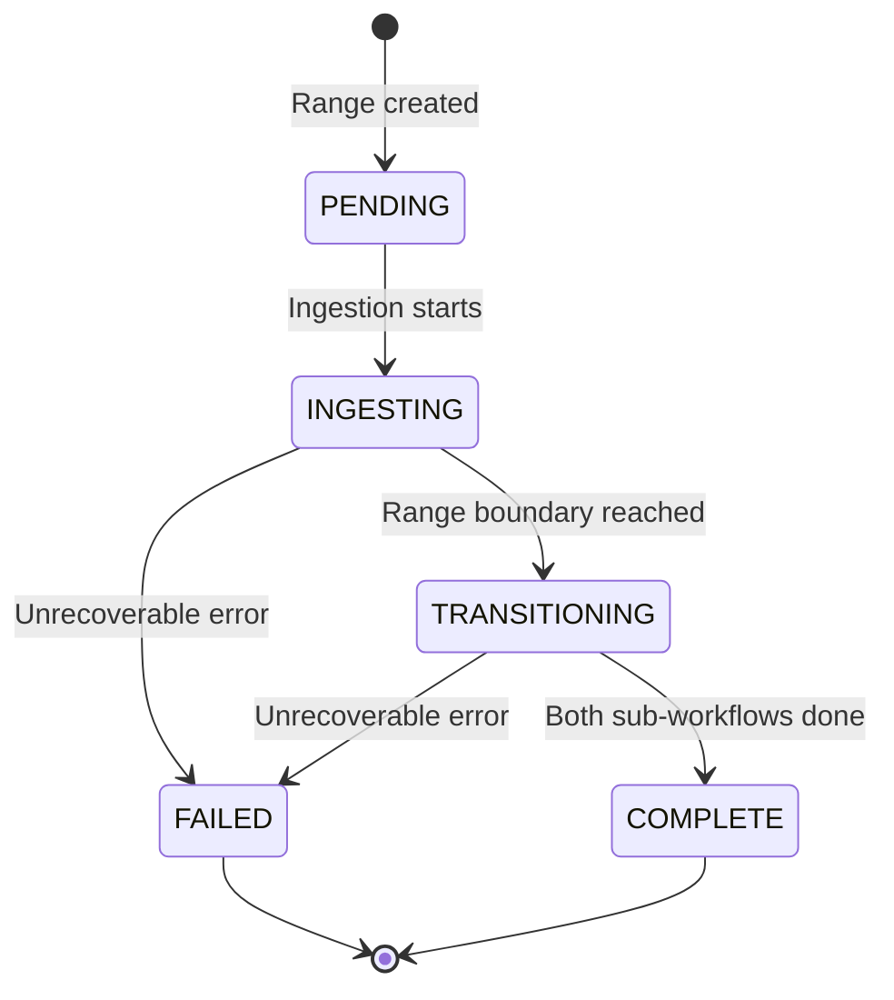
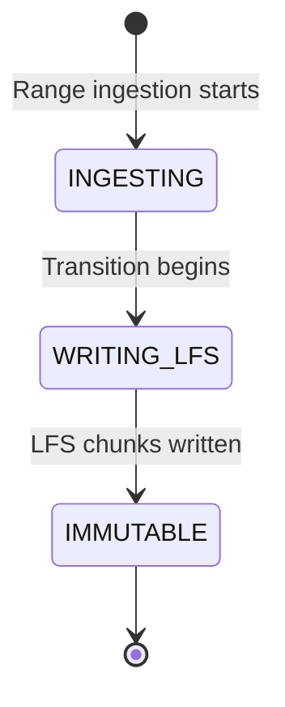
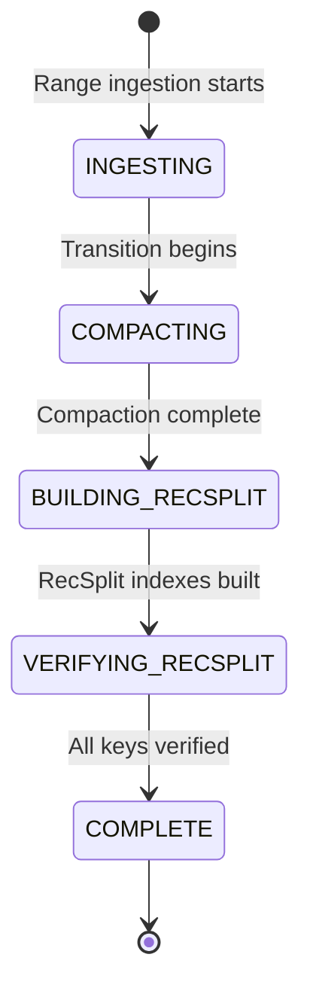

# Meta Store Design

> **Purpose**: Detailed specification of the meta store RocksDB instance that tracks all state for backfill and streaming modes  
> **Related**: [Architecture Overview](./01-architecture-overview.md), [Crash Recovery](./06-crash-recovery.md)

---

## Prerequisites

Before reading this document, ensure you understand these concepts:

- **Operating Modes**: The service runs in either Backfill or Streaming mode. See [Architecture Overview](./01-architecture-overview.md#http-endpoints-by-mode).
- **Range Boundaries**: Data is partitioned into 10-million ledger ranges. See [Checkpointing and Transitions](./10-checkpointing-and-transitions.md#immutable-store-range-table).
- **Store Types**: Active stores (RocksDB) vs Immutable stores (LFS + RecSplit). See [Architecture Overview](./01-architecture-overview.md#store-types).
- **Crash Recovery**: How the system recovers from failures using checkpoints. See [Crash Recovery](./06-crash-recovery.md).

---

## Broad Context

### What Problem Does the Meta Store Solve?

The Stellar Full History RPC Service must track progress across billions of ledgers, survive crashes without data loss, and know which data lives where. The meta store is the single source of truth for all of this.

### Operating Modes at a Glance

| Mode | Purpose | Duration | Queries Available |
|------|---------|----------|-------------------|
| **Backfill** | Ingest historical ledger ranges from GCS or CaptiveStellarCore | Hours to days (exits when complete) | Health/Status only |
| **Streaming** | Ingest real-time ledgers, serve queries, transition old data to immutable | Long-running daemon | All endpoints |

**Mode is tracked in meta store**: `global:mode = "backfill"` or `global:mode = "streaming"`

> **Important**: For the complete ruleset on when mode is set and how transitions work, see the following sections in [Backfill Workflow](./03-backfill-workflow.md#initial-meta-store-state) and [Streaming Workflow](./04-streaming-workflow.md#mode-transition).

### What is a Range?

A **range** is a partition of 10 million consecutive ledgers. Each range goes through a lifecycle:
1. **PENDING**: Waiting to be processed
2. **INGESTING**: Actively receiving ledger data into RocksDB
3. **TRANSITIONING**: Converting from active (RocksDB) to immutable (LFS + RecSplit) stores
4. **COMPLETE**: Fully immutable and queryable

For exact boundary math, see [Checkpointing and Transitions](./10-checkpointing-and-transitions.md#immutable-store-range-table).

### Range ID Explained

The **Range ID** is calculated from a ledger sequence:
- Ledger 2 → Range 0
- Ledger 10,000,001 → Range 0 (last ledger in range)
- Ledger 10,000,002 → Range 1 (first ledger in range)
- Ledger 25,000,000 → Range 2

See the [Range ID Calculation](#range-id-calculation) section below for the formula.

---

## Overview

The meta store is a single RocksDB instance that serves as the source of truth for:
- Operating mode (backfill vs streaming)
- Per-range state and progress
- Checkpoint data for crash recovery
- Paths to active and immutable stores

All state transitions, progress updates, and recovery information flow through the meta store, making it the critical component for system reliability and correctness.

---

## Key Hierarchy

The meta store uses a hierarchical key structure with colon-separated namespaces.

### Global Keys

| Key | Type | Description | Triggers / Conditions |
|-----|------|-------------|----------------------|
| `global:mode` | string | Operating mode: "backfill" or "streaming" | **Set**: At process startup. Backfill mode sets `"backfill"` (see [Backfill Workflow](./03-backfill-workflow.md#initial-meta-store-state)), streaming mode sets `"streaming"` (see [Streaming Workflow](./04-streaming-workflow.md#mode-transition)). **Updated**: Never changes during process lifetime. **Example**: `"backfill"` or `"streaming"`. |
| `global:last_processed_ledger` | uint32 | Last ledger processed in streaming mode | **Set**: When streaming mode starts after backfill completes (highest end_ledger from COMPLETE ranges). **Updated**: After each ledger is processed in streaming mode (checkpoint every 1 ledger). **Component**: Streaming ingestion loop. **Example**: `65000500`. |
| `global:backfill_start_ledger` | uint32 | Start ledger for backfill operation | **Set**: At backfill startup from `--start-ledger` flag. **Updated**: Never. **Component**: Backfill initialization. **Example**: `2` or `10000002`. |
| `global:backfill_end_ledger` | uint32 | End ledger for backfill operation | **Set**: At backfill startup from `--end-ledger` flag. **Updated**: Never. **Component**: Backfill initialization. **Example**: `30000001`. |

### Per-Range Keys

Each 10M ledger range has its own set of keys:

| Key Pattern | Type | Description | Triggers / Conditions |
|-------------|------|-------------|----------------------|
| `range:{id}:state` | RangeState | Overall range lifecycle state | **Set**: To `"PENDING"` when range is created during initialization. **Updated**: `PENDING` → `INGESTING` (when ingestion starts), `INGESTING` → `TRANSITIONING` (when last ledger processed), `TRANSITIONING` → `COMPLETE` (when both sub-workflows finish). **Component**: Range orchestrator. **Example**: `"INGESTING"`. |
| `range:{id}:start_ledger` | uint32 | First ledger in range | **Set**: Once when range is created. Formula: `(rangeID × 10,000,000) + 2`. **Updated**: Never. **Component**: Range initialization. **Example**: `10000002` (range 1). |
| `range:{id}:end_ledger` | uint32 | Last ledger in range | **Set**: Once when range is created. Formula: `((rangeID + 1) × 10,000,000) + 1`. **Updated**: Never. **Component**: Range initialization. **Example**: `20000001` (range 1). |
| `range:{id}:created_at` | timestamp | When range ingestion started | **Set**: When range state changes from `PENDING` to `INGESTING`. **Updated**: Never. **Component**: Range orchestrator. **Example**: `"2026-01-28T10:00:00Z"`. |
| `range:{id}:completed_at` | timestamp | When range became COMPLETE | **Set**: When range state changes to `COMPLETE` (both sub-workflows finished). **Updated**: Never. **Component**: Transition completion handler. **Example**: `"2026-01-28T12:00:00Z"`. |

### Per-Range Ledger Store Keys

| Key Pattern | Type | Description | Triggers / Conditions |
|-------------|------|-------------|----------------------|
| `range:{id}:ledger:phase` | LedgerPhase | Ledger sub-workflow phase | **Set**: To `"INGESTING"` when range ingestion starts. **Updated**: `INGESTING` → `WRITING_LFS` (when transition starts), `WRITING_LFS` → `IMMUTABLE` (when LFS writing completes). **Component**: Ledger sub-workflow. **Example**: `"WRITING_LFS"`. |
| `range:{id}:ledger:last_committed_ledger` | uint32 | Last checkpointed ledger | **Set**: After first batch processed. **Updated**: At each checkpoint (every 1000 ledgers in backfill, every 1 ledger in streaming). **Component**: Ingestion loop. **Example**: `7499001`. |
| `range:{id}:ledger:count` | uint64 | Total ledgers ingested | **Set**: After first batch processed. **Updated**: At each checkpoint (incremented by batch size). **Component**: Ingestion loop. **Example**: `7499000`. |
| `range:{id}:ledger:immutable_path` | string | Path to LFS chunks after transition | **Set**: When LFS writing completes (phase becomes `IMMUTABLE`). **Updated**: Never. **Component**: LFS writer. **Example**: `"/data/stellar-rpc/immutable/ledgers/range-0"`. |

### Per-Range TxHash Store Keys

| Key Pattern | Type | Description | Triggers / Conditions |
|-------------|------|-------------|----------------------|
| `range:{id}:txhash:phase` | TxHashPhase | TxHash sub-workflow phase | **Set**: To `"INGESTING"` when range ingestion starts. **Updated**: `INGESTING` → `COMPACTING` → `BUILDING_RECSPLIT` → `VERIFYING_RECSPLIT` → `COMPLETE` (see [Transition Workflow](./05-transition-workflow.md) for phase details). **Component**: TxHash sub-workflow. **Example**: `"BUILDING_RECSPLIT"`. |
| `range:{id}:txhash:last_committed_ledger` | uint32 | Last checkpointed ledger | **Set**: After first batch processed. **Updated**: At each checkpoint (every 1000 ledgers in backfill, every 1 ledger in streaming). **Component**: Ingestion loop. **Example**: `7499001`. |
| `range:{id}:txhash:cf_counts` | JSON | Per-CF counts: {"0": count, ..., "f": count} | **Set**: After first batch processed. **Updated**: At each checkpoint (counts incremented by transactions in batch). **Component**: Ingestion loop. **Example**: `{"0": 375, "1": 362, ..., "f": 368}`. |
| `range:{id}:txhash:rocksdb_path` | string | Path to Active Store RocksDB | **Set**: When range ingestion starts (RocksDB instance created). **Updated**: Never. **Component**: Range orchestrator. **Example**: `"/data/stellar-rpc/active/txhash/range-1"`. |
| `range:{id}:txhash:recsplit_path` | string | Path to RecSplit indexes after transition | **Set**: When RecSplit building completes (phase becomes `COMPLETE`). **Updated**: Never. **Component**: RecSplit builder. **Example**: `"/data/stellar-rpc/immutable/txhash/range-0"`. |

### Transition Keys (Temporary)

Only present during active→immutable transition:

| Key Pattern | Type | Description | Triggers / Conditions |
|-------------|------|-------------|----------------------|
| `range:{id}:transition:started_at` | timestamp | When transition began | **Set**: When range state changes to `TRANSITIONING` (last ledger of range processed). **Updated**: Never. **Deleted**: After range becomes `COMPLETE`. **Component**: Transition orchestrator. **Example**: `"2026-01-28T11:30:00Z"`. |
| `range:{id}:transition:ledger_status` | string | "pending", "in_progress", "complete" | **Set**: To `"pending"` when transition starts. **Updated**: `"pending"` → `"in_progress"` (LFS writing starts), `"in_progress"` → `"complete"` (LFS writing finishes). **Deleted**: After range becomes `COMPLETE`. **Component**: Ledger sub-workflow. **Example**: `"in_progress"`. |
| `range:{id}:transition:txhash_status` | string | "pending", "in_progress", "complete" | **Set**: To `"pending"` when transition starts. **Updated**: `"pending"` → `"in_progress"` (compaction starts), progresses through RecSplit phases, `"in_progress"` → `"complete"` (verification finishes). **Deleted**: After range becomes `COMPLETE`. **Component**: TxHash sub-workflow. **Example**: `"in_progress"`. |

---

## Enums

### RangeState

Overall lifecycle state for a 10M ledger range.

```go
type RangeState string

const (
    RangeStatePending       RangeState = "PENDING"       // Not started
    RangeStateIngesting     RangeState = "INGESTING"     // Active ingestion
    RangeStateTransitioning RangeState = "TRANSITIONING" // Converting to immutable
    RangeStateComplete      RangeState = "COMPLETE"      // Fully immutable
    RangeStateFailed        RangeState = "FAILED"        // Error state
)
```

**State Transitions**:
- PENDING → INGESTING (ingestion starts)
- INGESTING → TRANSITIONING (backfill: range complete; streaming: 10M boundary hit)
- TRANSITIONING → COMPLETE (both ledger and txhash sub-flows complete)
- Any state → FAILED (unrecoverable error)

### LedgerPhase

Sub-workflow phase for ledger store operations.

```go
type LedgerPhase string

const (
    LedgerPhaseIngesting  LedgerPhase = "INGESTING"   // Writing to Active RocksDB
    LedgerPhaseWritingLFS LedgerPhase = "WRITING_LFS" // Creating LFS chunks
    LedgerPhaseImmutable  LedgerPhase = "IMMUTABLE"   // LFS complete, RocksDB deleted
)
```

### TxHashPhase

Sub-workflow phase for txhash store operations (mirrors txhash-ingestion-workflow pattern).

```go
type TxHashPhase string

const (
    TxHashPhaseIngesting         TxHashPhase = "INGESTING"          // Writing to Active RocksDB
    TxHashPhaseCompacting        TxHashPhase = "COMPACTING"         // Full compaction (16 CFs parallel)
    TxHashPhaseBuildingRecSplit  TxHashPhase = "BUILDING_RECSPLIT"  // Creating RecSplit indexes
    TxHashPhaseVerifyingRecSplit TxHashPhase = "VERIFYING_RECSPLIT" // Verifying all keys
    TxHashPhaseComplete          TxHashPhase = "COMPLETE"           // RecSplit ready, RocksDB deleted
)
```

---

## State Transition Diagrams

The following diagrams visualize how each enum progresses through its lifecycle.

### RangeState Transitions



**Transition Triggers**:
- **PENDING → INGESTING**: Backfill starts this range, or streaming reaches this range's first ledger
- **INGESTING → TRANSITIONING**: Last ledger of range is processed (e.g., ledger 10,000,001 for Range 0)
- **TRANSITIONING → COMPLETE**: Both `ledger:phase = "IMMUTABLE"` AND `txhash:phase = "COMPLETE"`
- **Any → FAILED**: Unrecoverable error (crash recovery may resume from checkpoint if error is transient)

### LedgerPhase Transitions



**Transition Triggers**:
- **[*] → INGESTING**: When range state changes to `INGESTING` (both ledger and txhash phases start together)
- **INGESTING → WRITING_LFS**: When range state changes to `TRANSITIONING` (last ledger of range processed)
- **WRITING_LFS → IMMUTABLE**: When all LFS chunks are written and verified. RocksDB is deleted at this point.

**Key Insight**: The ledger sub-workflow is simpler than txhash because LFS writing is a single-step operation (read RocksDB, write chunks, verify).

### TxHashPhase Transitions



**Transition Triggers**:
- **[*] → INGESTING**: When range state changes to `INGESTING` (both ledger and txhash phases start together)
- **INGESTING → COMPACTING**: When range state changes to `TRANSITIONING` (last ledger of range processed)
- **COMPACTING → BUILDING_RECSPLIT**: When full compaction completes across all 16 column families
- **BUILDING_RECSPLIT → VERIFYING_RECSPLIT**: When all 16 RecSplit index files are built (one per CF)
- **VERIFYING_RECSPLIT → COMPLETE**: When verification confirms all keys from RocksDB exist in RecSplit indexes. RocksDB is deleted at this point.

**Key Insight**: The txhash sub-workflow has more phases because RecSplit index creation requires: (1) compaction to reduce data size, (2) building indexes, (3) verification before deleting source data.

---

## Range ID Calculation

Range IDs are calculated from ledger sequences using these canonical formulas:

```go
const (
    FirstLedger = 2           // Genesis ledger
    RangeSize   = 10_000_000  // 10 million ledgers per range
)

// Calculate range ID from ledger sequence
func ledgerToRangeID(ledgerSeq uint32) uint32 {
    return (ledgerSeq - FirstLedger) / RangeSize
}

// Calculate first ledger in a range
func rangeFirstLedger(rangeID uint32) uint32 {
    return (rangeID * RangeSize) + FirstLedger
}

// Calculate last ledger in a range
func rangeLastLedger(rangeID uint32) uint32 {
    return ((rangeID + 1) * RangeSize) + FirstLedger - 1
}

// Check if ledger triggers transition (last ledger of range)
func shouldTriggerTransition(ledgerSeq uint32) bool {
    rangeID := ledgerToRangeID(ledgerSeq)
    return ledgerSeq == rangeLastLedger(rangeID)
}
```

**Examples**:
- Ledger 2 → Range 0 (first ledger)
- Ledger 10000001 → Range 0 (last ledger, triggers transition)
- Ledger 10000002 → Range 1 (first ledger)
- Ledger 25000000 → Range 2
- Ledger 40000001 → Range 3 (last ledger, triggers transition)

---

## Scenario Walkthroughs

These scenarios show exactly how meta store keys evolve through different operations.


### Scenario 1: Fresh Backfill (Ledgers 2 to 30,000,001)

> **What**: Initial backfill operation starting from genesis ledger 2.
> **When**: First-time setup or expanding historical coverage.
> **Why it matters**: Shows how meta store initializes ranges and tracks parallel orchestrator progress.

**Command**: `./stellar-rpc --backfill --start-ledger 2 --end-ledger 30000001`

**Initial State (t=0)**:
```
global:mode                          = "backfill"
global:backfill_start_ledger         = 2
global:backfill_end_ledger           = 30000001

range:0:state                        = "PENDING"
range:0:start_ledger                 = 2
range:0:end_ledger                   = 10000001

range:1:state                        = "PENDING"
range:1:start_ledger                 = 10000002
range:1:end_ledger                   = 20000001

range:2:state                        = "PENDING"
range:2:start_ledger                 = 20000002
range:2:end_ledger                   = 30000001
```

**During Ingestion of Range 0 (t=1)**:
```
range:0:state                        = "INGESTING"
range:0:ledger:phase                 = "INGESTING"
range:0:ledger:last_committed_ledger = 5001      # After first 5000 ledgers
range:0:ledger:count                 = 5000

range:0:txhash:phase                 = "INGESTING"
range:0:txhash:last_committed_ledger = 5001
range:0:txhash:cf_counts             = {"0": 312, "1": 298, ..., "f": 305}
```

**Checkpoint Update (every 1000 ledgers in backfill)**:
```
# After processing ledger 6001:
range:0:ledger:last_committed_ledger = 6001
range:0:ledger:count                 = 6000
range:0:txhash:last_committed_ledger = 6001
range:0:txhash:cf_counts             = {"0": 375, "1": 362, ..., "f": 368}
```

**Range 0 Ingestion Complete, Starting Transition (t=2)**:
```
range:0:state                        = "TRANSITIONING"
range:0:ledger:phase                 = "WRITING_LFS"
range:0:txhash:phase                 = "COMPACTING"
```

**Range 0 Fully Complete (t=3)**:
```
range:0:state                        = "COMPLETE"
range:0:completed_at                 = "2026-01-28T12:00:00Z"
range:0:ledger:phase                 = "IMMUTABLE"
range:0:ledger:immutable_path        = "/data/stellar-rpc/immutable/ledgers/range-0"
range:0:txhash:phase                 = "COMPLETE"
range:0:txhash:recsplit_path         = "/data/stellar-rpc/immutable/txhash/range-0"
```

---

### Scenario 2: Crash During Backfill and Recovery

> **What**: Backfill process crashes mid-range, then resumes from last checkpoint.
> **When**: Hardware failure, OOM kill, or operator intervention during backfill.
> **Why it matters**: Demonstrates crash recovery mechanism and checkpoint-based resume.

**Situation**: Backfill running, crash occurs at ledger 7,500,000 (mid-range 0)

**State at Crash**:
```
range:0:state                        = "INGESTING"
range:0:ledger:last_committed_ledger = 7499001   # Last checkpoint
range:0:txhash:last_committed_ledger = 7499001
```

**Recovery Process**:
1. Operator runs: `./stellar-rpc --backfill --start-ledger 2 --end-ledger 30000001`
2. Code reads meta store, finds `range:0:state = "INGESTING"`
3. Code reads `range:0:ledger:last_committed_ledger = 7499001`
4. **Resume from ledger 7499002**
5. Continue until range completes

**Post-Recovery, Range 0 Complete**:
```
range:0:state                        = "COMPLETE"
range:0:ledger:phase                 = "IMMUTABLE"
range:0:txhash:phase                 = "COMPLETE"
```

**Key Insight**: Ledgers 7499002-7500000 may already be in RocksDB from before the crash. Re-ingestion creates duplicates (same key→value), which are harmless and removed during compaction.

---

### Scenario 3: Backfill Complete, Start Streaming Mode

> **What**: Backfill completes, operator restarts without --backfill flag to enter streaming mode.
> **When**: After historical data ingestion finishes, transitioning to real-time operation.
> **Why it matters**: Shows mode transition from backfill to streaming and gap validation.

**Pre-condition**: All ranges complete
```
range:0:state = "COMPLETE"
range:1:state = "COMPLETE"
range:2:state = "COMPLETE"
```

**Command**: `./stellar-rpc` (no --backfill flag)

**Startup Validation**:
1. Code scans all `range:*:state` keys
2. Verifies ALL are "COMPLETE"
3. Finds highest ledger: `range:2:end_ledger = 30000001`
4. Starts CaptiveStellarCore from ledger 30000002

**Switch to Streaming Mode**:
```
global:mode                          = "streaming"
global:last_processed_ledger         = 30000001

# New active range created:
range:3:state                        = "INGESTING"
range:3:start_ledger                 = 30000002
range:3:end_ledger                   = 40000001  # Expected end
range:3:ledger:phase                 = "INGESTING"
range:3:txhash:phase                 = "INGESTING"
```

---

### Scenario 4: Streaming Mode - 10M Boundary Transition

> **What**: Streaming mode ingests the last ledger of a range, triggering automatic transition to immutable stores.
> **When**: Every 10 million ledgers during continuous operation.
> **Why it matters**: Shows how active stores transition to immutable while ingestion continues seamlessly.

**Situation**: Streaming at ledger 40,000,000, about to hit boundary at 40,000,001

**Before Boundary (ledger 40,000,000)**:
```
global:last_processed_ledger         = 40000000
range:3:state                        = "INGESTING"
range:3:ledger:last_committed_ledger = 40000000
range:3:txhash:last_committed_ledger = 40000000
```

**Boundary Hit (ledger 40,000,001 - LAST ledger of range 3)**:
```
# Ingest ledger 40,000,001 (last ledger of range 3)
global:last_processed_ledger         = 40000001

# Detect: shouldTriggerTransition(40000001) == true
# Range 3 moves to transition:
range:3:state                        = "TRANSITIONING"
range:3:ledger:phase                 = "WRITING_LFS"
range:3:ledger:last_committed_ledger = 40000001
range:3:txhash:phase                 = "COMPACTING"
range:3:txhash:last_committed_ledger = 40000001

# New Range 4 created for next ledger:
range:4:state                        = "INGESTING"
range:4:start_ledger                 = 40000002  # First ledger of range 4
range:4:end_ledger                   = 50000001  # Expected end
range:4:ledger:phase                 = "INGESTING"
range:4:txhash:phase                 = "INGESTING"
```

**Next Ledger (40,000,002)**:
```
# Ingestion continues to range 4's Active Stores
global:last_processed_ledger         = 40000002
range:4:ledger:last_committed_ledger = 40000002
range:4:txhash:last_committed_ledger = 40000002
```

**Transition Complete for Range 3**:
```
range:3:state                        = "COMPLETE"
range:3:completed_at                 = "2026-01-29T14:30:00Z"
range:3:ledger:phase                 = "IMMUTABLE"
range:3:ledger:immutable_path        = "/data/stellar-rpc/immutable/ledgers/range-3"
range:3:txhash:phase                 = "COMPLETE"
range:3:txhash:recsplit_path         = "/data/stellar-rpc/immutable/txhash/range-3"
```

**Key Insight**: Transition triggers on the LAST ledger of a range (10000001, 20000001, 30000001, 40000001, etc.), not the first ledger of the next range.

---

### Scenario 5: Gap Detection (Incomplete Backfill)

> **What**: Operator attempts to start streaming mode with incomplete ranges, service detects gap and exits.
> **When**: Misconfiguration or incomplete backfill before streaming startup.
> **Why it matters**: Shows gap validation prevents data inconsistency.

**Situation**: Backfill ran for ranges 0-2, but range 1 failed

**Meta Store State**:
```
range:0:state = "COMPLETE"
range:1:state = "INGESTING"    # INCOMPLETE!
range:1:ledger:last_committed_ledger = 15000000
range:2:state = "COMPLETE"
```

**Streaming Mode Startup Attempt**:
1. Code scans all `range:*:state` keys
2. Finds `range:1:state = "INGESTING"` (not COMPLETE)
3. **ABORT with error**:
   ```
   ERROR: Cannot start streaming mode - incomplete ranges detected:
     Range 1 (ledgers 10000002-20000001): state=INGESTING, last_committed=15000000
   
   Action required: Re-run backfill with --start-ledger 2 --end-ledger 30000001
   ```

**Key Insight**: Streaming mode enforces the invariant "no gaps allowed" - all prior ranges must be COMPLETE before streaming can start.

---

### Scenario 6: Crash During Transition (Streaming Mode)

> **What**: Service crashes while transition goroutine is converting range 3 to immutable stores.
> **When**: Hardware failure or OOM during background transition.
> **Why it matters**: Shows transition recovery with independent sub-flow resume.

**Situation**: Streaming mode, transition in progress for range 3, crash occurs

**State at Crash**:
```
range:3:state                        = "TRANSITIONING"
range:3:ledger:phase                 = "WRITING_LFS"    # Incomplete
range:3:txhash:phase                 = "BUILDING_RECSPLIT"

range:4:state                        = "INGESTING"
range:4:ledger:last_committed_ledger = 40500000
```

**Recovery Process**:
1. Operator runs: `./stellar-rpc` (streaming mode)
2. Code finds `range:3:state = "TRANSITIONING"` (not COMPLETE)
3. Code finds `range:4:state = "INGESTING"` (active ingestion was happening)
4. **Resume both**:
   - Restart transition goroutine for range 3 (from current phase)
   - Resume ingestion for range 4 from ledger 40500001

**Key Insight**: The "transitioning" RocksDB stores for range 3 are still on disk. The code reopens them and resumes the transition workflow (compact → recsplit → verify) from where it left off.

---

### Scenario 7: Graceful Shutdown and Restart (Service Upgrade)

> **What**: Service receives SIGTERM, completes graceful shutdown, then restarts and resumes.
> **When**: Operator performs a service upgrade, rolling restart, or planned maintenance.
> **Why it matters**: Shows how the meta store enables seamless resume after intentional shutdown.

**Pre-condition**: Streaming mode active, processing ledger 65,000,500

**State Before Shutdown**:
```
global:mode = "streaming"
global:last_processed_ledger = 65000499

range:6:state = "INGESTING"
range:6:ledger:last_committed_ledger = 65000499
range:6:txhash:last_committed_ledger = 65000499
```

**State After Graceful Shutdown** (see [Streaming Workflow - Graceful Shutdown](./04-streaming-workflow.md#graceful-shutdown) for full step-by-step process):
```
global:mode = "streaming"
global:last_processed_ledger = 65000500  # Checkpointed before exit

range:6:state = "INGESTING"
range:6:ledger:last_committed_ledger = 65000500
range:6:txhash:last_committed_ledger = 65000500
```

**State After Restart** (resumes from checkpoint):
```
# No state change - meta store is loaded as-is
# Service resumes ingestion from ledger 65000501
```

**Key Insight**: The meta store reflects the exact checkpoint. On restart, the service reads `last_processed_ledger` and resumes from the next ledger. No data is lost.

---

## Key Usage Summary

| Key Pattern | Purpose | When Updated |
|-------------|---------|--------------|
| `global:mode` | Backfill vs Streaming | Process startup |
| `global:last_processed_ledger` | Streaming progress | After each ledger (streaming) |
| `range:{id}:state` | Overall range lifecycle | State transitions |
| `range:{id}:ledger:last_committed_ledger` | Crash recovery point | Every checkpoint (1000 ledgers backfill, 1 ledger streaming) |
| `range:{id}:ledger:phase` | Ledger sub-workflow state | Phase transitions |
| `range:{id}:txhash:cf_counts` | Accurate counts for RecSplit | Every checkpoint |
| `range:{id}:txhash:phase` | TxHash sub-workflow state | Phase transitions |
| `range:{id}:*:immutable_path` | Location of completed immutable stores | Transition complete |

---

## Design Rationale

### Why Never Delete Checkpoint Data?

Checkpoint keys are never deleted because:
1. **Audit trail**: Provides complete history of ingestion progress
2. **Debugging**: Enables investigation of past issues
3. **Verification**: Allows validation of range completeness
4. **Minimal cost**: Checkpoint data is tiny compared to ledger/txhash data

### Why Separate Ledger and TxHash Phases?

The two sub-workflows run in parallel during transition:
- **Ledger**: Read RocksDB → Write LFS chunks (~30-60 min)
- **TxHash**: Compact → Build RecSplit → Verify (~25-30 min)

Separate phase tracking enables:
- Independent progress monitoring
- Parallel execution
- Granular crash recovery

### Why JSON for cf_counts?

The `cf_counts` field stores per-column-family transaction counts as JSON:
```json
{"0": 125000, "1": 123500, ..., "f": 124800}
```

This enables:
- Accurate RecSplit sizing (each CF gets its own index)
- Verification after transition (compare counts)
- Debugging (identify imbalanced CFs)

---

## Related Documentation

- [Architecture Overview](./01-architecture-overview.md) - System components and data flow
- [Backfill Workflow](./03-backfill-workflow.md) - How backfill mode uses meta store
- [Streaming Workflow](./04-streaming-workflow.md) - How streaming mode uses meta store
- [Crash Recovery](./06-crash-recovery.md) - Recovery scenarios using checkpoint data
- [Checkpointing and Transitions](./10-checkpointing-and-transitions.md) - Canonical reference for checkpoint math and range boundaries
