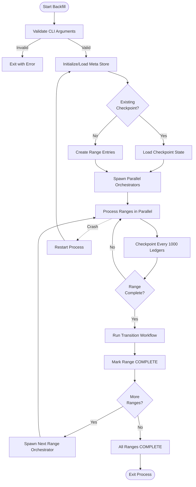

# Backfill Workflow

> **Purpose**: Detailed specification of backfill mode for ingesting historical ledger ranges  
> **Related**: [Meta Store Design](./02-meta-store-design.md), [Crash Recovery](./06-crash-recovery.md), [Configuration](./09-configuration.md)

>**_Prerequisite_**: This document contains code snippets that reference meta store keys (e.g., `range:{id}:state`, `range:{id}:ledger:last_committed_ledger`). 
> To follow along effectively, either:
> 1. **Have [Meta Store Design](./02-meta-store-design.md) open** in a separate tab for quick reference, or
> 2. **Read [Meta Store Design](./02-meta-store-design.md) first** to understand the key hierarchy and state machines

---

## Overview

Backfill mode ingests historical ledger ranges from a configurable data source (GCS or CaptiveStellarCore), creates immutable stores (LFS + RecSplit), and exits when complete. It does NOT serve queries and does NOT automatically transition to streaming mode.

**Key Characteristics**:
- Batch processing: 1000 ledgers per checkpoint
- Parallel execution: ~2 concurrent 10M range orchestrators
- Crash recovery: Resume from last checkpoint
- Exit behavior: Process terminates after all ranges complete

---

## Command Format

```bash
./stellar-rpc --backfill --start-ledger <START> --end-ledger <END>
```

### Validation Rules

**--start-ledger**: Must be a valid range first ledger
- Formula: `rangeFirstLedger(N) = (N × 10,000,000) + 2`
- Valid values: `2, 10000002, 20000002, 30000002, ...`
- Special case: Ledger 2 is the first ledger in the Stellar blockchain (range 0)

**--end-ledger**: Must be a valid range last ledger
- Formula: `rangeLastLedger(N) = ((N + 1) × 10,000,000) + 1`
- Valid values: `10000001, 20000001, 30000001, 40000001, ...`

**Examples**:
```bash
# Valid: Ingest first 3 ranges (30M ledgers)
./stellar-rpc --backfill --start-ledger 2 --end-ledger 30000001

# Valid: Ingest ranges 3-5
./stellar-rpc --backfill --start-ledger 30000002 --end-ledger 60000001

# Invalid: Start ledger not a range boundary
./stellar-rpc --backfill --start-ledger 100 --end-ledger 10000001
# ERROR: --start-ledger must be rangeFirstLedger(N) for some N

# Invalid: End ledger not a range boundary
./stellar-rpc --backfill --start-ledger 2 --end-ledger 10000000
# ERROR: --end-ledger must be rangeLastLedger(N) for some N
```

---

## Process Flow



---

## Initial Meta Store State

When backfill starts, the meta store is initialized with:

```
global:mode = "backfill"
global:backfill_start_ledger = <start-ledger>
global:backfill_end_ledger = <end-ledger>

# For each range in the backfill scope:
range:N:state = "PENDING"
range:N:start_ledger = <first ledger>
range:N:end_ledger = <last ledger>
```

**Key Point**: The `global:mode = "backfill"` setting persists for the lifetime of the backfill process. It is NOT automatically changed when backfill completes - the operator must restart the service without `--backfill` to enter streaming mode. (For complete mode lifecycle rules, see [Streaming Workflow - Startup Validation](./04-streaming-workflow.md#startup-validation).)

---

## Parallel Orchestrator Design

Backfill mode uses parallel orchestrators to process multiple 10M ranges concurrently.

**Configuration**:
- Default: 2 concurrent orchestrators
- Configurable via `[backfill] parallel_ranges` in TOML

**Architecture**:
```
┌─────────────────────────────────────────────────────────┐
│                   Backfill Coordinator                   │
│  - Validates CLI arguments                              │
│  - Initializes meta store                               │
│  - Spawns orchestrators                                 │
│  - Waits for all to complete                            │
└─────────────────────────────────────────────────────────┘
                          │
        ┌─────────────────┼─────────────────┐
        ▼                 ▼                 ▼
┌──────────────┐  ┌──────────────┐  ┌──────────────┐
│ Orchestrator │  │ Orchestrator │  │ Orchestrator │
│   Range 0    │  │   Range 1    │  │   Range 2    │
│              │  │              │  │              │
│ - LedgerBackend│ - LedgerBackend│ - LedgerBackend│
│ - Active Stores│ - Active Stores│ - Active Stores│
│ - Checkpoint   │ - Checkpoint   │ - Checkpoint   │
└──────────────┘  └──────────────┘  └──────────────┘
        │                 │                 │
        └─────────────────┼─────────────────┘
                          ▼
                ┌──────────────────┐
                │   Meta Store     │
                │   (Shared)       │
                └──────────────────┘
```

**Execution Pattern** (2 parallel):
- **Turn 1**: Range 0 + Range 1 (parallel)
- **Turn 2**: Range 2 (when Turn 1 completes)

**Isolation**:
- Each orchestrator has its own LedgerBackend instance
- Each orchestrator has its own Active Stores (separate RocksDB instances)
- Shared meta store for coordination and checkpointing

---

## Checkpoint Mechanism

**Frequency**: Every 1000 ledgers

**Atomic Update**:
```go
// Checkpoint updates multiple keys atomically via RocksDB WriteBatch
func checkpoint(metaStore *RocksDB, rangeID uint32, ledgerSeq uint32, counts map[string]uint64) error {
    batch := metaStore.NewWriteBatch()
    
    // Update ledger progress
    batch.Put(fmt.Sprintf("range:%d:ledger:last_committed_ledger", rangeID), uint32ToBytes(ledgerSeq))
    batch.Put(fmt.Sprintf("range:%d:ledger:count", rangeID), uint64ToBytes(counts["ledger"]))
    
    // Update txhash progress
    batch.Put(fmt.Sprintf("range:%d:txhash:last_committed_ledger", rangeID), uint32ToBytes(ledgerSeq))
    batch.Put(fmt.Sprintf("range:%d:txhash:cf_counts", rangeID), json.Marshal(counts["txhash_cfs"]))
    
    return batch.Commit()
}
```

**Keys Updated**:
- `range:{id}:ledger:last_committed_ledger`
- `range:{id}:ledger:count`
- `range:{id}:txhash:last_committed_ledger`
- `range:{id}:txhash:cf_counts`

**Crash Recovery**: On restart, read `last_committed_ledger` and resume from `last_committed_ledger + 1`.

[See Crash Recovery](./06-crash-recovery.md#scenario-2-crash-during-backfill) for detailed recovery scenarios.

---

## Data Source Configuration

Backfill mode supports two ledger data sources:

### Option 1: BufferedStorageBackend (GCS)

**Use Case**: Fast backfill from pre-downloaded ledger archives

**Configuration**:
```toml
[backfill]
ledger_backend = "buffered_storage"

[backfill.buffered_storage]
bucket_path = "gs://stellar-ledger-archives/pubnet"
buffer_size = 10000
num_workers = 200
```

**Characteristics**:
- High throughput: ~200 parallel downloads
- Requires network bandwidth
- No Stellar Core dependency

### Option 2: CaptiveStellarCore

**Use Case**: Backfill from local Stellar Core instance

**Configuration**:
```toml
[backfill]
ledger_backend = "captive_core"

[backfill.captive_core]
binary_path = "/usr/local/bin/stellar-core"
config_path = "/etc/stellar/captive-core.cfg"
```

**Characteristics**:
- Lower throughput than GCS
- Requires ~8GB RAM per instance
- Useful for private networks or when GCS unavailable

[See Configuration Reference](./09-configuration.md#backfill-settings) for complete options.

---

## Example: Processing Ledgers 2 to 30,000,001

**Command**:
```bash
./stellar-rpc --backfill --start-ledger 2 --end-ledger 30000001
```

**Ranges Created**:
- Range 0: ledgers 2 to 10,000,001 (10M ledgers)
- Range 1: ledgers 10,000,002 to 20,000,001 (10M ledgers)
- Range 2: ledgers 20,000,002 to 30,000,001 (10M ledgers)

**Execution Timeline** (2 parallel orchestrators):

| Time | Range 0 | Range 1 | Range 2 |
|------|---------|---------|---------|
| t=0 | Start ingestion | Start ingestion | Pending |
| t=30min | Ingesting (5M) | Ingesting (5M) | Pending |
| t=60min | Complete ingestion | Complete ingestion | Start ingestion |
| t=75min | Transitioning | Transitioning | Ingesting (2.5M) |
| t=90min | COMPLETE | COMPLETE | Ingesting (5M) |
| t=120min | COMPLETE | COMPLETE | Complete ingestion |
| t=135min | COMPLETE | COMPLETE | Transitioning |
| t=150min | COMPLETE | COMPLETE | COMPLETE |

**Final State**:
```
range:0:state = "COMPLETE"
range:1:state = "COMPLETE"
range:2:state = "COMPLETE"

# Immutable stores created:
/data/stellar-rpc/immutable/ledgers/chunks/0000/  # Range 0 chunks (0-999)
/data/stellar-rpc/immutable/ledgers/chunks/0001/  # Range 1 chunks (1000-1999)
/data/stellar-rpc/immutable/ledgers/chunks/0002/  # Range 2 chunks (2000-2999)
/data/stellar-rpc/immutable/txhash/0000/
/data/stellar-rpc/immutable/txhash/0001/
/data/stellar-rpc/immutable/txhash/0002/
```

**Process Exit**: Backfill process terminates with exit code 0.

---

## Exit Conditions

### Success Exit

**Condition**: All ranges reach `state = "COMPLETE"`

**Exit Code**: 0

**Log Output**:
```
[INFO] Backfill complete: 3 ranges processed (30,000,000 ledgers)
[INFO] Range 0: COMPLETE (2 to 10,000,001)
[INFO] Range 1: COMPLETE (10,000,002 to 20,000,001)
[INFO] Range 2: COMPLETE (20,000,002 to 30,000,001)
[INFO] Exiting backfill mode
```

### Failure Exit

**Condition**: Any range enters `state = "FAILED"` OR unrecoverable error

**Exit Code**: 1

**Log Output**:
```
[ERROR] Backfill failed: Range 1 encountered unrecoverable error
[ERROR] Error: Failed to read ledger 15000000 from LedgerBackend: connection timeout
[ERROR] Exiting with failure
```

**Recovery**: Operator must investigate error, fix issue, and restart backfill with same command.

---

## Transition to Streaming Mode

Backfill mode does **NOT** automatically transition to streaming mode.

**After backfill completes**:
1. Verify all ranges are COMPLETE: `grep "state.*COMPLETE" meta/rocksdb/LOG`
2. Stop backfill process (if not already exited)
3. Start streaming mode: `./stellar-rpc` (no --backfill flag)

[See Streaming Workflow](./04-streaming-workflow.md#startup-validation) for streaming mode startup.

---

## Performance Expectations

TBD: Performance benchmarks for backfill mode will be documented here once available. Expected throughput depends on:
- LedgerBackend choice (GCS vs CaptiveCore)
- Network bandwidth
- Disk I/O performance
- Number of parallel orchestrators configured
- System resources (CPU, RAM)
- Ledger size and complexity


---

## Related Documentation

- [Meta Store Design](./02-meta-store-design.md#scenario-1-fresh-backfill) - Scenario 1: Fresh Backfill
- [Crash Recovery](./06-crash-recovery.md#scenario-1-crash-during-backfill-ingestion) - Backfill crash recovery
- [Transition Workflow](./05-transition-workflow.md) - Active→Immutable conversion
- [Configuration](./09-configuration.md#backfill-settings) - Complete backfill configuration reference
