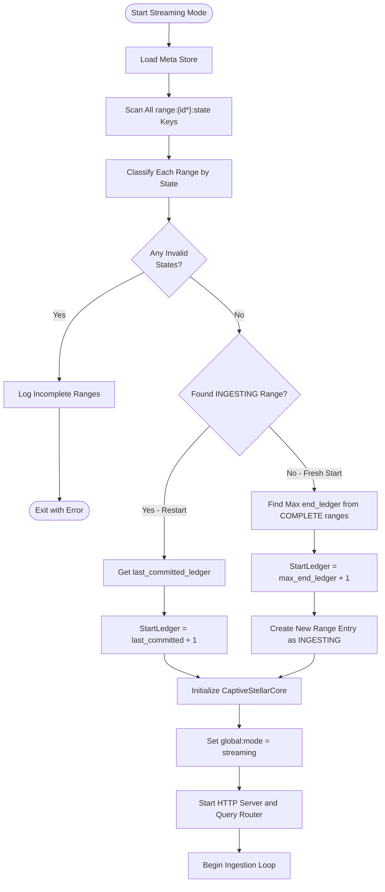
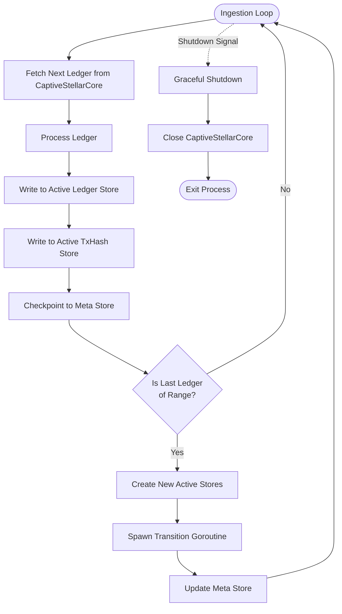
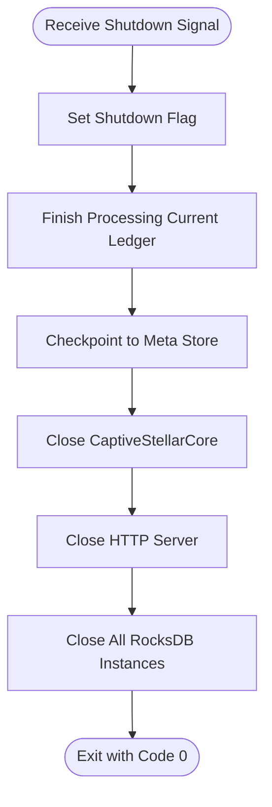

# Streaming Workflow

> **Purpose**: Detailed specification of streaming mode for real-time ledger ingestion and query serving  
> **Related**: [Meta Store Design](./02-meta-store-design.md), [Transition Workflow](./05-transition-workflow.md), [Query Routing](./07-query-routing.md)

> **_Prerequisite_**: This document contains code snippets that reference meta store keys (e.g., `range:{id}:state`, `range:{id}:ledger:last_committed_ledger`). 
> To follow along effectively, either:
> 1. **Have [Meta Store Design](./02-meta-store-design.md) open** in a separate tab for quick reference, or
> 2. **Read [Meta Store Design](./02-meta-store-design.md) first** to understand the key hierarchy and state machines

---

## Overview

Streaming mode ingests real-time ledgers via CaptiveStellarCore, serves queries, and automatically transitions data from Active Stores (RocksDB) to Immutable Stores (LFS + RecSplit) at 10M ledger boundaries.

**Key Characteristics**:
- Real-time ingestion: Batch size = 1 ledger
- Query serving: All endpoints available
- Automatic transition: Triggers at 10M boundaries
- Long-running: Daemon process, does not exit

---

## Startup Validation

Before ingestion begins, streaming mode performs gap detection to ensure data integrity.

### Startup Algorithm

The startup algorithm handles two distinct scenarios:
1. **Fresh start after backfill**: All ranges COMPLETE, need to find max `end_ledger` and create new INGESTING range
2. **Restart of streaming mode**: One range is INGESTING, resume from its `last_committed_ledger + 1`

```go
// StreamingStartupResult contains all info needed to start streaming
type StreamingStartupResult struct {
    StartLedger     uint32   // Ledger to start CaptiveStellarCore from
    CurrentRangeID  uint32   // Range ID for the INGESTING range
    IsNewRange      bool     // True if we need to create a new range entry
}

func initializeStreaming(metaStore *RocksDB) (*StreamingStartupResult, error) {
    ranges := metaStore.ScanPrefix("range:")
    
    var (
        maxEndLedger    uint32 = 0
        ingestingRange  *RangeInfo = nil
        incompleteCount int = 0
    )
    
    for _, key := range ranges {
        rangeID := extractRangeID(key)
        state := metaStore.Get(fmt.Sprintf("range:%d:state", rangeID))
        
        switch state {
        case "COMPLETE":
            // Track highest completed ledger
            endLedger := metaStore.GetUint32(fmt.Sprintf("range:%d:end_ledger", rangeID))
            if endLedger > maxEndLedger {
                maxEndLedger = endLedger
            }
            
        case "INGESTING":
            // Found an in-progress range (restart scenario)
            if ingestingRange != nil {
                return nil, fmt.Errorf("multiple INGESTING ranges found: %d and %d", 
                    ingestingRange.ID, rangeID)
            }
            lastCommitted := metaStore.GetUint32(
                fmt.Sprintf("range:%d:ledger:last_committed_ledger", rangeID))
            ingestingRange = &RangeInfo{
                ID:            rangeID,
                State:         state,
                LastCommitted: lastCommitted,
            }
            
        case "TRANSITIONING":
            // Transitioning ranges are OK - they'll complete in background
            // But we need to ensure the NEXT range exists
            endLedger := metaStore.GetUint32(fmt.Sprintf("range:%d:end_ledger", rangeID))
            if endLedger > maxEndLedger {
                maxEndLedger = endLedger
            }
            
        default:
            // Any other state (e.g., partial backfill) is not allowed
            incompleteCount++
        }
    }
    
    if incompleteCount > 0 {
        return nil, fmt.Errorf("cannot start streaming mode - %d incomplete ranges detected", 
            incompleteCount)
    }
    
    // Case A: Restart scenario - resume INGESTING range
    if ingestingRange != nil {
        return &StreamingStartupResult{
            StartLedger:    ingestingRange.LastCommitted + 1,
            CurrentRangeID: ingestingRange.ID,
            IsNewRange:     false,
        }, nil
    }
    
    if maxEndLedger == 0 {
        return nil, fmt.Errorf("no completed ranges found - run backfill first")
    }
	
    // Case B: Fresh start - create new range after last COMPLETE
    nextLedger := maxEndLedger + 1
    nextRangeID := ledgerToRangeID(nextLedger)
    
    return &StreamingStartupResult{
        StartLedger:    nextLedger,
        CurrentRangeID: nextRangeID,
        IsNewRange:     true,
    }, nil
}

// After startup, update global keys
func updateGlobalState(metaStore *RocksDB, result *StreamingStartupResult) {
    metaStore.Put("global:mode", "streaming")
    // global:last_processed_ledger is updated after each ledger in the ingestion loop,
    // initialized here to StartLedger - 1 (the last successfully processed ledger)
    metaStore.PutUint32("global:last_processed_ledger", result.StartLedger - 1)
}
```

**Key Design Decision**: The `global:last_processed_ledger` key is a convenience key that mirrors `range:{id}:ledger:last_committed_ledger`. 
Both are updated after every ledger in streaming mode. The per-range key is authoritative; the global key provides fast access without needing to know which range is active.
This is useful for returning the last successfully ingested ledger in `getHealth()/getStatus()` API.


### Startup Sequence



### Example A: Fresh Start After Backfill

```
# Meta store state after backfill completes:
global:mode = "backfill" # this would have seen set as part of a prior backfill run
range:0:state = "COMPLETE"
range:0:end_ledger = 10,000,001
range:1:state = "COMPLETE"
range:1:end_ledger = 20,000,001
range:2:state = "COMPLETE"
range:2:end_ledger = 30,000,001


# Startup decision:
1. Scan ranges. All ranges were found to be COMPLETE, no INGESTING found
2. Find max end_ledger: 30,000,001
3. Calculate: StartLedger = 30,000,001 + 1 = 30,000,002
4. Create range:3 entry (INGESTING)
5. Update global:mode = "streaming"
6. Start CaptiveStellarCore from ledger 30,000,002
```

### Example B: Restart After Graceful Shutdown

```
# Meta store state after graceful shutdown:
global:mode = "streaming" # was set during prior streaming run
range:0:state = "COMPLETE"
range:0:end_ledger = 10,000,001
...
range:5:state = "COMPLETE"
range:5:end_ledger = 60,000,001
range:6:state = "INGESTING"
range:6:ledger:last_committed_ledger = 65,000,123

# Startup decision:
1. Scan ranges: Found INGESTING range (range:6)
2. Get last_committed_ledger: 65,000,123
3. Calculate: StartLedger = 65,000,123 + 1 = 65,000,124
4. IsNewRange = false (range:6 already exists)
5. Start CaptiveStellarCore from ledger 65,000,124
6. Resume ingestion seamlessly
```

### Example C: Restart With Transitioning Range

```
# Meta store state (transition was in progress when shutdown):
global:mode = "streaming" # was set during prior streaming run
range:0:state = "COMPLETE"
range:0:end_ledger = 10,000,001
...
range:5:state = "TRANSITIONING"  # Background transition was running when process was stopped/killed/crashed
range:5:end_ledger = 60,000,001
range:6:state = "INGESTING"
range:6:ledger:last_committed_ledger = 62,500,456

# Startup decision:
1. Scan ranges.  TRANSITIONING (range:5) is OK, found INGESTING (range:6)
2. Get last_committed_ledger from range:6: 62,500,456
3. Calculate: StartLedger = 62,500,456 + 1 = 62,500,457
4. Resume ingestion to range:6
5. Resume transition goroutine for range:5 (handled separately)
```

---

## Ingestion Loop



### Batch Size

**Streaming mode uses batch size = 1**

Each ledger is:
1. Fetched from CaptiveStellarCore
2. Processed and written to Active Stores
3. Checkpointed to meta store
4. Checked for 10M boundary

This ensures:
- Low latency: Queries see new data within seconds
- Fine-grained crash recovery: Resume from exact ledger
- Immediate boundary detection: Transition triggers promptly

---

## 10M Boundary Detection

### Trigger Condition

Transition triggers when ingesting the **LAST ledger of a range**.

```go
func shouldTriggerTransition(ledgerSeq uint32) bool {
    rangeID := ledgerToRangeID(ledgerSeq)
    return ledgerSeq == rangeLastLedger(rangeID)
}

// Trigger ledgers: 10000001, 20000001, 30000001, 40000001, ...
```

### Transition Workflow

When `shouldTriggerTransition(ledgerSeq) == true`, do:

1. **Ingest the trigger ledger** (e.g., 40,000,001) to current Active Stores
2. **Checkpoint** the trigger ledger
3. **Create NEW Active Stores** for next range (i.e., range 4)
4. **Spawn transition goroutine** for current range (i.e., range 3)
5. **Next ledger** (i.e., 40,000,002) goes to NEW Active Stores

**Key Insight**: The trigger ledger (40,000,001) is the LAST ledger written to range 3's Active Stores. The next ledger (40,000,002) is the FIRST ledger written to range 4's Active Stores.

[See Transition Workflow](./05-transition-workflow.md) for detailed transition process.

---

## Multiple Rocksdb Stores During Transition

During transition, the service maintains multiple RocksDB instances:

```
┌─────────────────────────────────────────────────────────┐
│                   Active Stores                          │
│  Range 4 (INGESTING)                                    │
│  - Ledger RocksDB: /data/active/ledger/rocksdb         │
│  - TxHash RocksDB: /data/active/txhash/rocksdb         │
│  - Receiving new ledgers (40,000,002+)                  │
└─────────────────────────────────────────────────────────┘

┌─────────────────────────────────────────────────────────┐
│                Transitioning Stores                      │
│  Range 3 (TRANSITIONING)                                │
│  - Ledger RocksDB: /data/transitioning/ledger/rocksdb  │
│  - TxHash RocksDB: /data/transitioning/txhash/rocksdb  │
│  - Being converted to immutable (read-only for queries) │
│  - Transition goroutine running in background           │
└─────────────────────────────────────────────────────────┘

┌─────────────────────────────────────────────────────────┐
│                 Immutable Stores                         │
│  Ranges 0-2 (COMPLETE)                                  │
│  - LFS chunks: /data/immutable/ledgers/chunks/000{0,1,2}│
│  - RecSplit: /data/immutable/txhash/000{0,1,2}       │
│  - Serving queries                                      │
└─────────────────────────────────────────────────────────┘
```

**Query Routing**: Queries are routed to the appropriate store based on ledger sequence and range state.

[See Query Routing](./07-query-routing.md) for routing logic.

---

## Graceful Shutdown

Streaming mode supports graceful shutdown via SIGTERM or SIGINT.

### Shutdown Sequence



**Guarantees**:
- Current ledger completes processing
- Meta store is checkpointed
- No data loss
- Clean exit (code 0)

**Resume**: On restart, `initializeStreaming()` finds the INGESTING range and resumes from `last_committed_ledger + 1`.

### Meta Store State After Graceful Shutdown

After graceful shutdown completes:

```
global:mode = "streaming"

range:6:state = "INGESTING"
range:6:ledger:last_committed_ledger = 65000500
range:6:txhash:last_committed_ledger = 65000500
```

**Key Insight**: The meta store reflects the exact point where processing stopped. No data is lost because each ledger is checkpointed immediately after processing (batch size = 1).

### Restart After Graceful Shutdown

When the service restarts (e.g., after upgrade):

1. Load meta store
2. Call `initializeStreaming()`:
   - Scans ranges, finds `range:6:state = "INGESTING"`
   - Gets `range:6:ledger:last_committed_ledger = 65000500`
   - Returns `StartLedger = 65000501, CurrentRangeID = 6, IsNewRange = false`
3. Start CaptiveStellarCore from ledger 65000501
4. Continue ingestion seamlessly

**Gap detection is implicit**: The `initializeStreaming()` function rejects any invalid range states (not COMPLETE, INGESTING, or TRANSITIONING), effectively validating data integrity on every restart.

---

## Concrete Example: Starting from Ledger 60,000,002

**Pre-conditions**:
- Ranges 0-5 are COMPLETE (backfill finished through ledger 60,000,001)

**Startup**:
```
[INFO] Loading meta store...
[INFO] Scanning ranges for startup validation...
[INFO]   Range 0: COMPLETE (ledgers 2 to 10,000,001)
[INFO]   Range 1: COMPLETE (ledgers 10,000,002 to 20,000,001)
[INFO]   Range 2: COMPLETE (ledgers 20,000,002 to 30,000,001)
[INFO]   Range 3: COMPLETE (ledgers 30,000,002 to 40,000,001)
[INFO]   Range 4: COMPLETE (ledgers 40,000,002 to 50,000,001)
[INFO]   Range 5: COMPLETE (ledgers 50,000,002 to 60,000,001)
[INFO] Validation passed: 6 COMPLETE ranges, 0 TRANSITIONING, 0 INGESTING
[INFO] No existing INGESTING range found
[INFO] Max end_ledger from COMPLETE ranges: 60,000,001
[INFO] Calculated start ledger: 60,000,001 + 1 = 60,000,002
[INFO] Creating new range entry: range:6 (ledgers 60,000,002 to 70,000,001)
[INFO] Setting range:6:state = INGESTING
[INFO] Updating global:mode = streaming
[INFO] Initializing CaptiveStellarCore from ledger 60,000,002...
[INFO] CaptiveStellarCore ready
[INFO] Starting HTTP server on :8080
[INFO] Query router initialized with 6 immutable ranges + 1 active range
[INFO] Streaming mode active - ingesting to range 6
```

**Ingestion**:
```
[INFO] Ingested ledger 60,000,002 → range:6 (1 of 10,000,000)
[INFO] Ingested ledger 60,000,003 → range:6 (2 of 10,000,000)
...
[INFO] Ingested ledger 70,000,001 → range:6 (10,000,000 of 10,000,000) - BOUNDARY DETECTED
[INFO] Range 6 ingestion complete - triggering transition
[INFO] Creating new Active Stores for range 7 (ledgers 70,000,002 to 80,000,001)
[INFO] Moving range 6 stores to transitioning directory
[INFO] Setting range:6:state = TRANSITIONING
[INFO] Spawning background transition goroutine for range 6
[INFO] Setting range:7:state = INGESTING
[INFO] Ingested ledger 70,000,002 → range:7 (1 of 10,000,000)
...
```

**Transition Complete** (background goroutine logs):
```
[INFO] [Transition:Range6] Starting transition for range 6 (ledgers 60,000,002 to 70,000,001)
[INFO] [Transition:Range6] Phase 1: Compacting RocksDB stores...
[INFO] [Transition:Range6] Phase 2: Writing LFS chunks (1000 chunks)...
[INFO] [Transition:Range6] Phase 2: LFS complete → /data/immutable/ledgers/chunks/0006/
[INFO] [Transition:Range6] Phase 3: Building RecSplit indexes (16 column families)...
[INFO] [Transition:Range6] Phase 3: RecSplit complete → /data/immutable/txhash/0006/
[INFO] [Transition:Range6] Phase 4: Verifying immutable data integrity...
[INFO] [Transition:Range6] Phase 5: Deleting transitioning RocksDB stores...
[INFO] [Transition:Range6] Setting range:6:state = COMPLETE
[INFO] [Transition:Range6] Transition complete for range 6
[INFO] Query router updated: range 6 now served from immutable stores
```

---

## Error Handling and Recovery

> **See Also**: [Crash Recovery](./06-crash-recovery.md) provides detailed crash scenarios, checkpoint mechanisms, and recovery algorithms. This section focuses on the operational perspective: error categories, goroutine coordination, and post-failure investigation.

### Fail-Fast Philosophy

Streaming mode follows a **fail-fast** approach: when an error occurs that cannot be immediately resolved, the process logs the error and exits. This is intentional because:

1. **CaptiveStellarCore** is a subprocess streaming ledgers through a pipe - partial failures are not recoverable mid-stream
2. **RocksDB writes** are either successful or indicate a serious issue (disk full, corruption, hardware failure)
3. **Checkpoint atomicity** means we always have a consistent recovery point

### Error Categories

| Error Type | Behavior | Recovery |
|------------|----------|----------|
| CaptiveStellarCore crash/exit | Log error, exit with code 1 | Restart process; resumes from last checkpoint |
| RocksDB write failure | Log error, exit with code 1 | Check disk space/health, then restart |
| Meta store write failure | Log error, exit with code 1 | Check disk, verify meta store integrity |
| Out of memory | Process killed by OOM | Increase RAM or reduce buffer sizes, restart |
| Disk full | Log error, exit with code 1 | Free disk space, restart |

### Post-Failure Investigation

When the streaming process exits with an error:

1. **Check logs from the failed run**:
   ```bash
   # Find the error that caused the exit
   grep -i "error\|fatal\|panic" /var/log/stellar-rpc/streaming.log | tail -20
   
   # Check the last successfully processed ledger
   grep "last_committed_ledger" /var/log/stellar-rpc/streaming.log | tail -1
   ```

2. **Verify meta store state**:
   ```bash
   # The meta store contains the authoritative checkpoint
   # On restart, the service reads range:N:ledger:last_committed_ledger
   # and resumes from last_committed_ledger + 1
   ```

3. **Check system resources**:
   ```bash
   df -h /data/stellar-rpc          # Disk space
   free -h                           # Memory
   dmesg | tail -50                  # Kernel errors (OOM, disk errors)
   ```

4. **Restart the service**:
   ```bash
   # The service automatically resumes from the last checkpoint
   ./stellar-rpc
   ```

### What Gets Recovered Automatically

On restart after a crash or error:

- **Ingestion progress**: Resumes from `last_committed_ledger + 1` (at most 1 ledger of re-work since batch size = 1)
- **Transition progress**: TRANSITIONING ranges resume their conversion (phase tracked in meta store)
- **Query routing**: Reconstructed from meta store range states

### What Requires Manual Intervention

| Situation                               | Required Action                                                                           |
|-----------------------------------------|-------------------------------------------------------------------------------------------|
| Disk full                               | Free space, then restart                                                                  |
| RocksDB corruption                      | May require deleting Active Store and re-ingesting current range from last COMPLETE range |
| Meta store corruption                   | Serious issue - may require restoring from backup(?) or re-running backfill               |
| CaptiveStellarCore config issues        | Fix config, then restart                                                                  |


---

## Performance Expectations

TBD: To be populated with benchmark data once available.

---

## Configuration

**Minimal streaming configuration**:
```toml
[service]
mode = "streaming"
data_dir = "/data/stellar-rpc"

[streaming.captive_core]
binary_path = "/usr/local/bin/stellar-core"
config_path = "/etc/stellar/captive-core.cfg"
```

[See Configuration Reference](./09-configuration.md#streaming-settings) for complete options.

---

## Related Documentation

- [Meta Store Design](./02-meta-store-design.md#scenario-3-backfill-complete-start-streaming-mode) - Scenario 3: Start Streaming
- [Meta Store Design](./02-meta-store-design.md#scenario-4-streaming-mode-10m-boundary-transition) - Scenario 4: Boundary Transition
- [Transition Workflow](./05-transition-workflow.md) - Active→Immutable conversion
- [Query Routing](./07-query-routing.md) - How queries are routed during streaming
- [Crash Recovery](./06-crash-recovery.md#scenario-5-crash-during-streaming) - Streaming crash recovery
