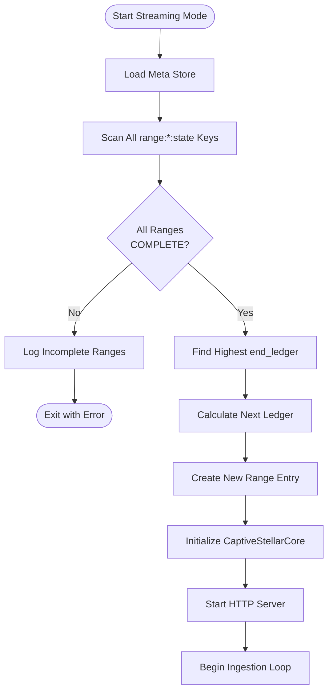

# Streaming Workflow

> **Purpose**: Detailed specification of streaming mode for real-time ledger ingestion and query serving  
> **Related**: [Meta Store Design](./02-meta-store-design.md), [Transition Workflow](./05-transition-workflow.md), [Query Routing](./07-query-routing.md)

---

## Overview

Streaming mode ingests real-time ledgers via CaptiveStellarCore, serves queries, and automatically transitions data from Active Stores (RocksDB) to Immutable Stores (LFS + RecSplit) at 10M ledger boundaries.

**Key Characteristics**:
- Real-time ingestion: Batch size = 1 ledger
- Query serving: All endpoints available
- Automatic transition: Triggers at 10M boundaries
- Long-running: Daemon process, does not exit

---

## Startup Validation

Before ingestion begins, streaming mode performs gap detection to ensure data integrity.

### Gap Detection Algorithm

```go
func validateNoGaps(metaStore *RocksDB) error {
    // Scan all range:*:state keys
    ranges := metaStore.ScanPrefix("range:")
    
    var incomplete []RangeInfo
    var maxLedger uint32 = 0
    
    for _, key := range ranges {
        rangeID := extractRangeID(key)
        state := metaStore.Get(fmt.Sprintf("range:%d:state", rangeID))
        
        if state != "COMPLETE" {
            lastCommitted := metaStore.Get(fmt.Sprintf("range:%d:ledger:last_committed_ledger", rangeID))
            incomplete = append(incomplete, RangeInfo{
                ID: rangeID,
                State: state,
                LastCommitted: lastCommitted,
            })
        } else {
            endLedger := metaStore.Get(fmt.Sprintf("range:%d:end_ledger", rangeID))
            if endLedger > maxLedger {
                maxLedger = endLedger
            }
        }
    }
    
    if len(incomplete) > 0 {
        return fmt.Errorf("Cannot start streaming mode - incomplete ranges detected:\n%v", incomplete)
    }
    
    return nil
}
```

### Startup Sequence



**Example**:
```
# Meta store state after backfill:
range:0:state = "COMPLETE"
range:0:end_ledger = 10000001
range:1:state = "COMPLETE"
range:1:end_ledger = 20000001
range:2:state = "COMPLETE"
range:2:end_ledger = 30000001

# Streaming startup:
1. Validate: All ranges COMPLETE ✓
2. Find max: 30000001
3. Next ledger: 30000002
4. Create range:3 entry (INGESTING)
5. Start CaptiveStellarCore from 30000002
```

---

## Mode Transition

When streaming mode starts successfully (after gap validation passes):

```
# Mode is set to streaming (whether fresh transition or restart)
global:mode = "streaming"

# Last processed ledger from backfill is recorded
global:last_processed_ledger = <highest end_ledger from COMPLETE ranges>
```

**Key Points**:
- If `--backfill` flag was NOT present AND all prior ranges are COMPLETE, mode is set to `"streaming"`
- If `global:mode = "streaming"` already exists (restart scenario), gap validation still runs to ensure all prior ranges are COMPLETE
- For complete mode lifecycle rules, see [Backfill Workflow - Initial Meta Store State](./03-backfill-workflow.md#initial-meta-store-state)

---

## Ingestion Loop


### Batch Size

**Streaming mode uses batch size = 1**

Each ledger is:
1. Fetched from CaptiveStellarCore
2. Processed and written to Active Stores
3. Checkpointed to meta store
4. Checked for 10M boundary

This ensures:
- Low latency: Queries see new data within seconds
- Fine-grained crash recovery: Resume from exact ledger
- Immediate boundary detection: Transition triggers promptly

---

## 10M Boundary Detection

### Trigger Condition

Transition triggers when ingesting the **LAST ledger of a range**.

```go
func shouldTriggerTransition(ledgerSeq uint32) bool {
    rangeID := ledgerToRangeID(ledgerSeq)
    return ledgerSeq == rangeLastLedger(rangeID)
}

// Trigger ledgers: 10000001, 20000001, 30000001, 40000001, ...
```

### Transition Workflow

When `shouldTriggerTransition(ledgerSeq) == true`:

1. **Ingest the trigger ledger** (e.g., 40,000,001) to current Active Stores
2. **Checkpoint** the trigger ledger
3. **Create NEW Active Stores** for next range (e.g., range 4)
4. **Spawn transition goroutine** for current range (e.g., range 3)
5. **Next ledger** (e.g., 40,000,002) goes to NEW Active Stores

**Key Insight**: The trigger ledger (40,000,001) is the LAST ledger written to range 3's Active Stores. The next ledger (40,000,002) is the FIRST ledger written to range 4's Active Stores.

[See Transition Workflow](./05-transition-workflow.md) for detailed transition process.

---

## Multiple Active Stores During Transition

During transition, the service maintains multiple RocksDB instances:

```
┌─────────────────────────────────────────────────────────┐
│                   Active Stores                          │
│  Range 4 (INGESTING)                                    │
│  - Ledger RocksDB: /data/active/ledger/rocksdb         │
│  - TxHash RocksDB: /data/active/txhash/rocksdb         │
│  - Receiving new ledgers (40,000,002+)                  │
└─────────────────────────────────────────────────────────┘

┌─────────────────────────────────────────────────────────┐
│                Transitioning Stores                      │
│  Range 3 (TRANSITIONING)                                │
│  - Ledger RocksDB: /data/transitioning/ledger/rocksdb  │
│  - TxHash RocksDB: /data/transitioning/txhash/rocksdb  │
│  - Being converted to immutable (read-only for queries) │
│  - Transition goroutine running in background           │
└─────────────────────────────────────────────────────────┘

┌─────────────────────────────────────────────────────────┐
│                 Immutable Stores                         │
│  Ranges 0-2 (COMPLETE)                                  │
│  - LFS chunks: /data/immutable/ledgers/range-{0,1,2}   │
│  - RecSplit: /data/immutable/txhash/range-{0,1,2}      │
│  - Serving queries                                      │
└─────────────────────────────────────────────────────────┘
```

**Query Routing**: Queries are routed to the appropriate store based on ledger sequence and range state.

[See Query Routing](./07-query-routing.md) for routing logic.

---

## Graceful Shutdown

Streaming mode supports graceful shutdown via SIGTERM or SIGINT.

### Shutdown Sequence


**Guarantees**:
- Current ledger completes processing
- Meta store is checkpointed
- No data loss
- Clean exit (code 0)

**Resume**: On restart, streaming mode resumes from `global:last_processed_ledger + 1`.

### Meta Store State After Graceful Shutdown

After graceful shutdown completes:

```
global:mode = "streaming"
global:last_processed_ledger = 65000500  # Last checkpointed ledger

range:6:state = "INGESTING"
range:6:ledger:last_committed_ledger = 65000500
range:6:txhash:last_committed_ledger = 65000500
```

**Key Insight**: The meta store reflects the exact point where processing stopped. No data is lost because each ledger is checkpointed immediately after processing.

### Restart After Graceful Shutdown

When the service restarts (e.g., after upgrade):

1. Load meta store
2. Find `global:mode = "streaming"` (already in streaming mode)
3. **Gap detection runs**: Validate all prior ranges are COMPLETE ✓
4. Find `global:last_processed_ledger = 65000500`
5. Resume CaptiveStellarCore from ledger 65000501
6. Continue ingestion seamlessly

**Gap detection still runs**: Even on restart, the service validates prior ranges are COMPLETE. This catches any data corruption or missing ranges that may have occurred. The check is fast (O(number of ranges)) and provides safety.

---

## Example: Starting from Ledger 60,000,002

**Pre-conditions**:
- Ranges 0-5 are COMPLETE (backfill finished through ledger 60,000,001)
- `global:last_processed_ledger = 60000001`

**Startup**:
```
[INFO] Loading meta store
[INFO] Validating ranges...
[INFO]   Range 0: COMPLETE (2 to 10,000,001)
[INFO]   Range 1: COMPLETE (10,000,002 to 20,000,001)
[INFO]   Range 2: COMPLETE (20,000,002 to 30,000,001)
[INFO]   Range 3: COMPLETE (30,000,002 to 40,000,001)
[INFO]   Range 4: COMPLETE (40,000,002 to 50,000,001)
[INFO]   Range 5: COMPLETE (50,000,002 to 60,000,001)
[INFO] Gap detection: PASSED
[INFO] Creating range 6 entry (60,000,002 to 70,000,001)
[INFO] Starting CaptiveStellarCore from ledger 60,000,002
[INFO] HTTP server listening on :8080
[INFO] Streaming mode active
```

**Ingestion**:
```
[INFO] Ingested ledger 60,000,002 (range 6)
[INFO] Ingested ledger 60,000,003 (range 6)
...
[INFO] Ingested ledger 70,000,001 (range 6) - BOUNDARY DETECTED
[INFO] Creating range 7 Active Stores
[INFO] Spawning transition goroutine for range 6
[INFO] Ingested ledger 70,000,002 (range 7)
...
```

**Transition Complete**:
```
[INFO] Range 6 transition complete
[INFO]   Ledger: IMMUTABLE (/data/immutable/ledgers/range-6)
[INFO]   TxHash: COMPLETE (/data/immutable/txhash/range-6)
[INFO] Range 6 state: COMPLETE
```

---

## Error Handling

### Recoverable Errors

**CaptiveStellarCore connection loss**:
- Retry with exponential backoff
- Log warning
- Continue when connection restored

**Temporary disk I/O errors**:
- Retry operation
- Log warning
- Continue if successful

### Unrecoverable Errors

**Meta store corruption**:
- Log error
- Exit with code 1
- Requires manual intervention

**Persistent CaptiveStellarCore failure**:
- Log error after max retries
- Exit with code 1
- Operator must investigate

---

## Performance Expectations

**Ingestion Latency**:
- Ledger fetch: ~100-500ms (CaptiveStellarCore)
- Processing: ~50-100ms
- Checkpoint: ~10-20ms
- **Total**: ~200-700ms per ledger

**Query Latency**:
- Active Store (RocksDB): ~1-5ms
- Immutable Store (LFS): ~5-10ms
- Immutable Store (RecSplit): ~1-3ms

**Memory Requirements**:
- CaptiveStellarCore: ~8GB
- Active Stores (2 RocksDB): ~16GB
- Transitioning Stores (2 RocksDB): ~16GB (during transition)
- Meta Store: ~1GB
- **Total**: ~25-40GB (depending on transition state)

---

## Configuration

**Minimal streaming configuration**:
```toml
[service]
mode = "streaming"
data_dir = "/data/stellar-rpc"

[streaming.captive_core]
binary_path = "/usr/local/bin/stellar-core"
config_path = "/etc/stellar/captive-core.cfg"
```

[See Configuration Reference](./09-configuration.md#streaming-settings) for complete options.

---

## Related Documentation

- [Meta Store Design](./02-meta-store-design.md#scenario-3-backfill-complete-start-streaming-mode) - Scenario 3: Start Streaming
- [Meta Store Design](./02-meta-store-design.md#scenario-4-streaming-mode-10m-boundary-transition) - Scenario 4: Boundary Transition
- [Transition Workflow](./05-transition-workflow.md) - Active→Immutable conversion
- [Query Routing](./07-query-routing.md) - How queries are routed during streaming
- [Crash Recovery](./06-crash-recovery.md#scenario-5-crash-during-streaming) - Streaming crash recovery
