# Transition Workflow

> **Purpose**: Detailed specification of the Active→Immutable transition process  
> **Related**: [Meta Store Design](./02-meta-store-design.md), [Streaming Workflow](./04-streaming-workflow.md)

---

## Overview

The transition workflow converts Active Stores (RocksDB) to Immutable Stores (LFS + RecSplit) when a 10M ledger range completes ingestion.

**Key Characteristics**:
- Triggered at 10M range boundary completion in both modes
- Same sub-workflow steps: RocksDB → LFS (ledgers), RocksDB → RecSplit (txhash)
- Runs in parallel: Ledger sub-flow + TxHash sub-flow
- **Streaming mode**: Non-blocking background goroutine, new Active Stores created, queries served during transition
- **Backfill mode**: Sequential/blocking per range, no new Active Stores, no queries served

---

## Trigger Conditions

Transition triggers when **the last ledger of a range** is ingested.

**Trigger Points**: 10,000,001, 20,000,001, 30,000,001, 40,000,001, ...

**Same trigger in both modes**: Whether in backfill or streaming, reaching the last ledger of a range initiates the transition sub-workflows.

See [Transition in Backfill vs Streaming Mode](#transition-in-backfill-vs-streaming-mode) for how the context differs.

---

## Transition in Backfill vs Streaming Mode

The transition sub-workflows (Ledger → LFS, TxHash → RecSplit) are **identical** in both modes.
The difference is in the surrounding context:

> **CRITICAL: RocksDB Deletion After Transition**
>
> **In BOTH modes (backfill AND streaming), once the transition sub-workflows complete and immutable files are created (LFS chunks + RecSplit indexes), the corresponding RocksDB stores for that 10-million ledger range are DELETED.**
>
> This is a **permanent, irreversible operation**. The immutable files become the sole source of truth for that range.

| Aspect | Backfill Mode | Streaming Mode |
|--------|---------------|----------------|
| **Trigger** | After range ingestion completes (last ledger written) | At 10M boundary (last ledger of range) |
| **New Active Stores** | NO - next range orchestrator creates fresh stores | YES - created immediately for continued ingestion |
| **Execution Model** | Sequential, blocking (range completes before next starts) | Background goroutine (ingestion continues to new stores) |
| **Query Serving** | NO - backfill mode doesn't serve queries | YES - transitioning stores remain queryable |
| **Parallelism** | Multiple ranges can transition in parallel (if 2+ orchestrators) | One transition at a time (single ingestion thread) |
| **After Completion** | Orchestrator picks up next PENDING range | Ingestion continues seamlessly to Range N+1 |
| **RocksDB Fate** | **DELETED after immutable files verified** | **DELETED after immutable files verified** |

### Why This Matters

**In Streaming Mode**, the system must:
1. Create new Active Stores BEFORE starting transition
2. Route new ledgers to the new stores immediately
3. Keep transitioning stores available for queries
4. Run transition as a background goroutine
5. **Delete transitioning RocksDB stores after immutable files are verified**

**In Backfill Mode**, none of this is needed because:
1. Each range orchestrator handles one range at a time
2. No queries are served during backfill
3. The next range doesn't start until transition completes (for that orchestrator)
4. Multiple orchestrators can work in parallel on different ranges
5. **Delete range RocksDB stores after immutable files are verified**

### The Transition Result (Same in Both Modes)

**Before Transition:**
```
Range N data lives in:
├── Ledger RocksDB: /data/.../ledger/rocksdb/  (mutable)
└── TxHash RocksDB: /data/.../txhash/rocksdb/  (mutable)
```

**After Transition:**
```
Range N data lives in:
├── LFS Chunks: /data/immutable/ledgers/range-N/  (read-only)
└── RecSplit: /data/immutable/txhash/range-N/    (read-only)

RocksDB stores: **DELETED** ← This is the key outcome!
```

### Flowchart: Backfill vs Streaming Context

```mermaid
flowchart TB
    subgraph Backfill["Backfill Mode"]
        B1[Ingest Range N] --> B2[Last Ledger Reached]
        B2 --> B3[Transition Sub-Workflows]
        B3 --> B4[Verify Immutable Files]
        B4 --> B5[DELETE RocksDB Stores]
        B5 --> B6[Range N → COMPLETE]
        B6 --> B7[Pick Next PENDING Range]
    end
    
    subgraph Streaming["Streaming Mode"]
        S1[Ingest Ledger] --> S2{Last Ledger of Range?}
        S2 -->|No| S1
        S2 -->|Yes| S3[Create NEW Active Stores for Range N+1]
        S3 --> S4[Spawn Transition Goroutine for Range N]
        S4 --> S5[Continue Ingesting to Range N+1]
        S4 --> S6[Transition Sub-Workflows - Background]
        S6 --> S7[Verify Immutable Files]
        S7 --> S8[DELETE RocksDB Stores]
        S8 --> S9[Range N → COMPLETE]
    end
```



**Key Insight**: The sub-workflow steps (Ledger Sub-Flow, TxHash Sub-Flow documented below) are IDENTICAL. Only the orchestration context differs. **The end result - RocksDB deletion and immutable file creation - is the same in both modes.**

---

## Transition Process


---

## Parallel Sub-Workflows

### Ledger Sub-Flow

| Phase | Description | Duration | Meta Store Key |
|-------|-------------|----------|----------------|
| INGESTING | Writing to Active RocksDB | Ongoing | `range:N:ledger:phase = "INGESTING"` |
| WRITING_LFS | Reading RocksDB, writing 1000 LFS chunks | ~30-60 min | `range:N:ledger:phase = "WRITING_LFS"` |
| IMMUTABLE | LFS complete, RocksDB deleted | - | `range:N:ledger:phase = "IMMUTABLE"` |

**Process**:
1. Read all ledgers from Active RocksDB (sequential scan)
2. Group into 10K ledger chunks
3. Compress each chunk with zstd
4. Write to LFS format: `immutable/ledgers/range-N/chunks/XXXX/YYYYYY.data`
5. Verify: Read back and decompress each chunk
6. Mark phase as IMMUTABLE

### TxHash Sub-Flow

| Phase | Description | Duration | Meta Store Key |
|-------|-------------|----------|----------------|
| INGESTING | Writing to Active RocksDB | Ongoing | `range:N:txhash:phase = "INGESTING"` |
| COMPACTING | Full compaction of 16 CFs (parallel) | ~5 min | `range:N:txhash:phase = "COMPACTING"` |
| BUILDING_RECSPLIT | Build 16 RecSplit indexes | ~15-20 min | `range:N:txhash:phase = "BUILDING_RECSPLIT"` |
| VERIFYING_RECSPLIT | Verify all keys in indexes | ~5 min | `range:N:txhash:phase = "VERIFYING_RECSPLIT"` |
| COMPLETE | RecSplit ready, RocksDB deleted | - | `range:N:txhash:phase = "COMPLETE"` |

**Process**:
1. **Compact**: Run full compaction on all 16 CFs in parallel
2. **Build**: For each CF, build RecSplit minimal perfect hash index
3. **Verify**: For each CF, verify all keys can be looked up in RecSplit
4. **Write**: Save indexes to `immutable/txhash/range-N/index/cf-{0..f}.idx`
5. Mark phase as COMPLETE

---

## Multiple Active Stores During Transition

During transition, up to 4 RocksDB instances may be open:

```
Current Active Stores (Range N+1):
├── Ledger RocksDB: /data/active/ledger/rocksdb
└── TxHash RocksDB: /data/active/txhash/rocksdb
    ↓ Receiving new ledgers

Transitioning Stores (Range N):
├── Ledger RocksDB: /data/transitioning/ledger/rocksdb
└── TxHash RocksDB: /data/transitioning/txhash/rocksdb
    ↓ Being converted (read-only for queries)
    ↓ Transition goroutine running
```

**Query Routing**: Queries for range N are routed to transitioning stores until transition completes.

[See Query Routing](./07-query-routing.md#during-transition) for details.

---

## Transition Failure Handling

**If transition fails** (e.g., disk full, corruption):
- Transitioning stores remain ALIVE
- Queries continue to work (served from transitioning RocksDB)
- Transition goroutine retries with exponential backoff
- Ingestion continues to new Active Stores (no data loss)

**Recovery**:
- Automatic retry until success
- Operator can investigate logs during retries
- No manual intervention required unless persistent failure

---

## Example: Transition at Ledger 70,000,001

**Before (ledger 70,000,000)**:
```
range:6:state = "INGESTING"
range:6:ledger:phase = "INGESTING"
range:6:ledger:last_committed_ledger = 70000000
range:6:txhash:phase = "INGESTING"
range:6:txhash:last_committed_ledger = 70000000
```

**Trigger (ledger 70,000,001 ingested)**:
```
# Detect: shouldTriggerTransition(70000001) == true
# This is the LAST ledger of range 6

# Ingest ledger 70,000,001 to range 6's Active Stores
range:6:ledger:last_committed_ledger = 70000001
range:6:txhash:last_committed_ledger = 70000001

# Create NEW Active Stores for range 7
range:7:state = "INGESTING"
range:7:start_ledger = 70000002
range:7:end_ledger = 80000001

# Mark range 6 as transitioning
range:6:state = "TRANSITIONING"
range:6:ledger:phase = "WRITING_LFS"
range:6:txhash:phase = "COMPACTING"
```

**Next Ledger (70,000,002)**:
```
# Ingestion continues to range 7's Active Stores
range:7:ledger:last_committed_ledger = 70000002
range:7:txhash:last_committed_ledger = 70000002
```

**During Transition (t=15 min)**:
```
range:6:state = "TRANSITIONING"
range:6:ledger:phase = "WRITING_LFS"  # Still writing chunks
range:6:txhash:phase = "BUILDING_RECSPLIT"  # Compaction done, building indexes
```

**Transition Complete (t=45 min)**:
```
range:6:state = "COMPLETE"
range:6:completed_at = "2026-01-29T15:30:00Z"
range:6:ledger:phase = "IMMUTABLE"
range:6:ledger:immutable_path = "/data/stellar-rpc/immutable/ledgers/range-6"
range:6:txhash:phase = "COMPLETE"
range:6:txhash:recsplit_path = "/data/stellar-rpc/immutable/txhash/range-6"

# Active RocksDB for range 6 deleted
# Queries now routed to immutable stores
```

---

## Performance Expectations

**Ledger Sub-Flow**:
- Read throughput: ~10,000 ledgers/sec from RocksDB
- Write throughput: ~5,000 ledgers/sec to LFS (zstd compression)
- Total time: ~30-60 minutes for 10M ledgers

**TxHash Sub-Flow**:
- Compaction: ~5 minutes (16 CFs parallel)
- RecSplit build: ~15-20 minutes (16 indexes)
- Verification: ~5 minutes
- Total time: ~25-30 minutes

**Overlap**: Both sub-flows run in parallel, so total transition time is ~30-60 minutes (dominated by ledger sub-flow).

---

## Memory Requirements

**During Transition**:
- Current Active Stores: ~16GB (2 RocksDB instances)
- Transitioning Stores: ~16GB (2 RocksDB instances)
- Transition goroutine: ~2GB (buffers)
- **Total**: ~34GB

**After Transition**:
- Current Active Stores: ~16GB
- Immutable Stores: Minimal (memory-mapped files)
- **Total**: ~16GB

**Disk Storage**: For detailed disk storage calculations per 10M range (Ledger LFS: ~1.5 TB, TxHash RecSplit: ~15 GB), see [Storage Size Reference](./01-architecture-overview.md#storage-size-reference-per-10m-ledger-range).

---

## Related Documentation

- [Meta Store Design](./02-meta-store-design.md#scenario-4-streaming-mode-10m-boundary-transition) - Scenario 4: Boundary Transition
- [Streaming Workflow](./04-streaming-workflow.md#10m-boundary-detection) - Boundary detection logic
- [Crash Recovery](./06-crash-recovery.md#scenario-6-crash-during-transition) - Transition crash recovery
- [Query Routing](./07-query-routing.md) - How queries are routed during transition
