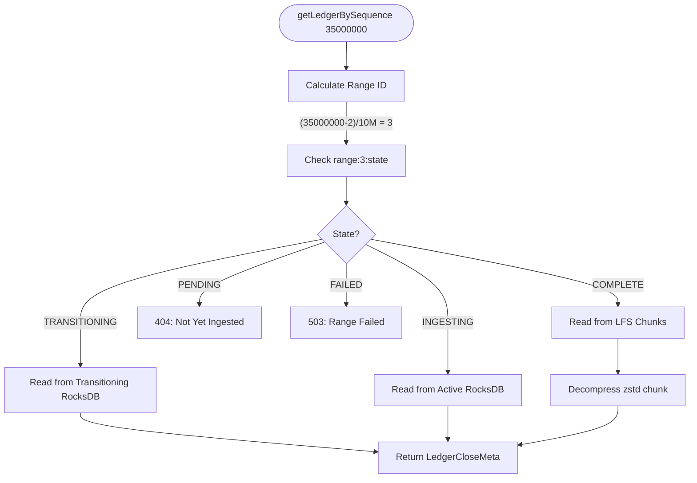
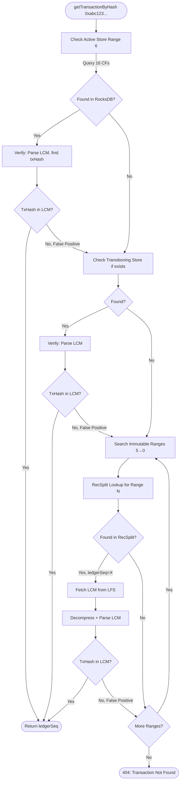

# Query Routing

> **Purpose**: Specification of query routing logic for getLedgerBySequence and getTransactionByHash  
> **Related**: [Architecture Overview](./01-architecture-overview.md), [Meta Store Design](./02-meta-store-design.md), [Transition Workflow](./05-transition-workflow.md)

---

## Overview

The Query Router directs requests to the correct data store based on ledger sequence and range state. It handles three store types: Active (RocksDB), Transitioning (RocksDB), and Immutable (LFS + RecSplit).

**Key Responsibilities**:
- Calculate range ID from ledger sequence
- Check range state in meta store
- Route to appropriate store
- Handle errors (range not found, not yet ingested, failed)

---

## System State Example

To understand query routing, consider this concrete system state:

**Current State**: Streaming mode, last processed ledger = 61,111,222

**Meta Store State**:
```
global:mode = "streaming"
global:last_processed_ledger = 61111222

# COMPLETE ranges (immutable - LFS + RecSplit)
range:0:state = "COMPLETE"   # Ledgers 2 - 10,000,001
range:1:state = "COMPLETE"   # Ledgers 10,000,002 - 20,000,001
range:2:state = "COMPLETE"   # Ledgers 20,000,002 - 30,000,001
range:3:state = "COMPLETE"   # Ledgers 30,000,002 - 40,000,001
range:4:state = "COMPLETE"   # Ledgers 40,000,002 - 50,000,001
range:5:state = "COMPLETE"   # Ledgers 50,000,002 - 60,000,001

# INGESTING range (active - RocksDB)
range:6:state = "INGESTING"  # Ledgers 60,000,002 - 70,000,001
range:6:ledger:last_committed_ledger = 61111222
```

**Store Layout**:
| Range | State | Ledger Store | TxHash Store |
|-------|-------|--------------|--------------|
| 0-5 | COMPLETE | LFS chunks | RecSplit indexes |
| 6 | INGESTING | Active RocksDB | Active RocksDB (16 CFs) |

We'll use this state for all examples below.

---

## QueryRouter Architecture

The QueryRouter is the central component that knows where all data lives. It maintains an internal registry of store locations and provides thread-safe access for query routing.

### QueryRouter Struct

> **Note**: The following Go code is **pseudocode** illustrating the design pattern. It shows the intended API contract and concurrency model. Actual implementation may differ in details.

```go
// PSEUDOCODE - illustrative design, not compilable
// QueryRouter manages routing queries to the correct data stores.
// It maintains a registry of all active, transitioning, and immutable stores.
// Thread-safe: uses RWMutex for concurrent read access during lookups.
type QueryRouter struct {
    mu sync.RWMutex

    // Active stores (currently ingesting) - at most one per store type
    activeLedgerStore   *rocksdb.DB   // Range N ledger RocksDB
    activeTxHashStore   *rocksdb.DB   // Range N txhash RocksDB (16 CFs)
    activeRangeID       uint32        // Which range is active

    // Transitioning stores (being converted to immutable) - at most one per store type
    transitioningLedgerStore *rocksdb.DB  // Range N-1 ledger RocksDB (read-only)
    transitioningTxHashStore *rocksdb.DB  // Range N-1 txhash RocksDB (read-only)
    transitioningRangeID     uint32       // Which range is transitioning

    // Immutable stores (COMPLETE ranges) - indexed by range ID
    immutableLedgerStores map[uint32]*LFSStore      // Range ID → LFS store
    immutableTxHashStores map[uint32]*RecSplitStore // Range ID → RecSplit store

    // Ordered list of complete range IDs for search order (newest first)
    completeRangeIDs []uint32  // [5, 4, 3, 2, 1, 0] - descending order

    // Meta store reference for state lookups
    metaStore *MetaStore
}
```

### Registry Update Interface

The transition workflow (see [Transition Workflow](./05-transition-workflow.md#queryrouter-integration)) calls these methods to update the registry:

```go
// AddActiveStore registers new active stores for a range.
// Called when: New range starts ingesting (at 10M boundary in streaming mode).
// Locking: Acquires WRITE lock.
func (qr *QueryRouter) AddActiveStore(rangeID uint32, ledgerDB, txHashDB *rocksdb.DB) {
    qr.mu.Lock()
    defer qr.mu.Unlock()

    qr.activeLedgerStore = ledgerDB
    qr.activeTxHashStore = txHashDB
    qr.activeRangeID = rangeID
}

// PromoteToTransitioning moves active stores to transitioning status.
// Called when: Range boundary reached, before spawning transition goroutine.
// Locking: Acquires WRITE lock.
func (qr *QueryRouter) PromoteToTransitioning(rangeID uint32) {
    qr.mu.Lock()
    defer qr.mu.Unlock()

    qr.transitioningLedgerStore = qr.activeLedgerStore
    qr.transitioningTxHashStore = qr.activeTxHashStore
    qr.transitioningRangeID = rangeID

    qr.activeLedgerStore = nil
    qr.activeTxHashStore = nil
}

// AddImmutableStores registers immutable stores after transition completes.
// Called when: Transition sub-workflows complete, LFS + RecSplit verified.
// Locking: Acquires WRITE lock.
func (qr *QueryRouter) AddImmutableStores(rangeID uint32, lfs *LFSStore, recsplit *RecSplitStore) {
    qr.mu.Lock()
    defer qr.mu.Unlock()

    qr.immutableLedgerStores[rangeID] = lfs
    qr.immutableTxHashStores[rangeID] = recsplit

    // Insert in descending order for newest-first search
    qr.completeRangeIDs = insertDescending(qr.completeRangeIDs, rangeID)
}

// RemoveTransitioningStores cleans up RocksDB stores after transition.
// Called when: Immutable stores verified, RocksDB no longer needed.
// Locking: Acquires WRITE lock.
// CRITICAL: This is when RocksDB stores are DELETED.
func (qr *QueryRouter) RemoveTransitioningStores(rangeID uint32) {
    qr.mu.Lock()
    defer qr.mu.Unlock()

    if qr.transitioningRangeID == rangeID {
        // Close and delete RocksDB stores
        qr.transitioningLedgerStore.Close()
        qr.transitioningTxHashStore.Close()
        
        qr.transitioningLedgerStore = nil
        qr.transitioningTxHashStore = nil
        qr.transitioningRangeID = 0
    }
}
```

### Concurrency Model

| Operation | Lock Type | Blocking Behavior |
|-----------|-----------|-------------------|
| **getLedgerBySequence** | Read Lock | Non-blocking (concurrent reads allowed) |
| **getTransactionByHash** | Read Lock | Non-blocking (concurrent reads allowed) |
| **AddActiveStore** | Write Lock | Blocks all reads and writes |
| **PromoteToTransitioning** | Write Lock | Blocks all reads and writes |
| **AddImmutableStores** | Write Lock | Blocks all reads and writes |
| **RemoveTransitioningStores** | Write Lock | Blocks all reads and writes |

**Key Insight**: Write operations are rare (only at 10M boundaries), so read locks are held most of the time. Queries experience minimal contention.

### Lookup Methods with Locking

```go
// GetLedgerBySequence routes a ledger query to the correct store.
// Locking: Acquires READ lock for the duration of store selection.
func (qr *QueryRouter) GetLedgerBySequence(ledgerSeq uint32) (*xdr.LedgerCloseMeta, error) {
    qr.mu.RLock()
    defer qr.mu.RUnlock()

    rangeID := (ledgerSeq - 2) / 10_000_000

    // Check active store first
    if rangeID == qr.activeRangeID && qr.activeLedgerStore != nil {
        return qr.getLedgerFromRocksDB(qr.activeLedgerStore, ledgerSeq)
    }

    // Check transitioning store
    if rangeID == qr.transitioningRangeID && qr.transitioningLedgerStore != nil {
        return qr.getLedgerFromRocksDB(qr.transitioningLedgerStore, ledgerSeq)
    }

    // Check immutable stores
    if lfs, ok := qr.immutableLedgerStores[rangeID]; ok {
        return lfs.GetLedger(ledgerSeq)
    }

    return nil, ErrLedgerNotFound
}

// GetTransactionByHash searches all stores for a transaction.
// Locking: Acquires READ lock for store selection, releases before I/O.
func (qr *QueryRouter) GetTransactionByHash(txHash []byte) (uint32, error) {
    // Snapshot the store references under read lock
    qr.mu.RLock()
    activeStore := qr.activeTxHashStore
    activeRange := qr.activeRangeID
    transStore := qr.transitioningTxHashStore
    transRange := qr.transitioningRangeID
    immutableStores := make(map[uint32]*RecSplitStore)
    for k, v := range qr.immutableTxHashStores {
        immutableStores[k] = v
    }
    rangeOrder := make([]uint32, len(qr.completeRangeIDs))
    copy(rangeOrder, qr.completeRangeIDs)
    qr.mu.RUnlock()

    // Search active store (no lock held during I/O)
    if activeStore != nil {
        if ledgerSeq, found := qr.searchRocksDB(activeStore, txHash); found {
            if qr.verifyTxInLedger(activeRange, ledgerSeq, txHash) {
                return ledgerSeq, nil
            }
            // False positive - continue searching
        }
    }

    // Search transitioning store
    if transStore != nil {
        if ledgerSeq, found := qr.searchRocksDB(transStore, txHash); found {
            if qr.verifyTxInLedger(transRange, ledgerSeq, txHash) {
                return ledgerSeq, nil
            }
        }
    }

    // Search immutable stores (newest first)
    for _, rangeID := range rangeOrder {
        recsplit := immutableStores[rangeID]
        if ledgerSeq, found := recsplit.Lookup(txHash); found {
            if qr.verifyTxInLedger(rangeID, ledgerSeq, txHash) {
                return ledgerSeq, nil
            }
            // False positive - continue to next range
        }
    }

    return 0, ErrTransactionNotFound
}
```

---

## getLedgerBySequence Workflow

This is the **simpler** of the two queries. Given a ledger sequence, we know exactly which range contains it.

### Workflow Steps

1. **Calculate Range ID**: `rangeID = (ledgerSeq - 2) / 10,000,000`
2. **Lookup Range State**: Query meta store for `range:N:state`
3. **Route to Correct Store**: Based on state (COMPLETE → LFS, INGESTING → RocksDB)
4. **Fetch and Return**: Read LedgerCloseMeta from store

### Flowchart: getLedgerBySequence



### LFS Chunk Lookup Details

For COMPLETE ranges, ledgers are stored in LFS chunks (10,000 ledgers per chunk):

> **Note on Path Formats**: The file paths shown below (e.g., `/data/immutable/ledgers/range-N/chunks/XXXX/YYYYYY.data`) are **illustrative examples** for documentation clarity. Actual path formats may differ based on implementation. These examples demonstrate the conceptual directory structure, not the canonical path specification.

```go
func (s *LFSStore) GetLedger(rangeID, ledgerSeq uint32) (*xdr.LedgerCloseMeta, error) {
    // Calculate chunk ID within range
    offsetInRange := ledgerSeq - rangeFirstLedger(rangeID)
    chunkID := offsetInRange / 10000
    offsetInChunk := offsetInRange % 10000
    
    // Path: /data/immutable/ledgers/range-N/chunks/XXXX/YYYYYY.data
    chunkPath := fmt.Sprintf("%s/range-%d/chunks/%04d/%06d.data", 
        s.basePath, rangeID, chunkID/100, chunkID)
    
    // Read and decompress chunk
    compressed, _ := os.ReadFile(chunkPath)
    data, _ := zstd.Decompress(nil, compressed)
    
    // Parse chunk index to find ledger offset
    // ... (chunk contains index + ledger data)
    
    return parseLedgerCloseMeta(data, offsetInChunk)
}
```

### Error Semantics

| Range State | HTTP Status | Error Message |
|-------------|-------------|---------------|
| COMPLETE | 200 | Success (data returned) |
| TRANSITIONING | 200 | Success (data returned from transitioning store) |
| INGESTING | 200 | Success (data returned from active store) |
| PENDING | 404 | "Ledger not yet ingested" |
| FAILED | 503 | "Range ingestion failed" |
| Not Found | 404 | "Ledger sequence out of range" |

---

## getTransactionByHash Workflow

This is the **complex** query. Given a transaction hash, we **don't know which range contains it**.

### Key Challenges

1. **Unknown Range**: Must search multiple ranges
2. **False Positives**: RecSplit can return incorrect ledger sequences
3. **Verification Required**: Must parse LCM to confirm transaction exists

### Search Order

Search from **newest to oldest** (most recent transactions are queried most often):

1. **Active Store** (Range 6 - INGESTING): RocksDB with 16 column families
2. **Transitioning Store** (if exists): RocksDB (still alive during transition)
3. **Immutable Stores** (Ranges 5, 4, 3, 2, 1, 0): RecSplit indexes

### False Positive Handling

**Why False Positives Occur**: RecSplit uses a Minimal Perfect Hash Function (MPHF). It guarantees O(1) lookup for keys that exist, but can return arbitrary values for keys that don't exist.

**Three False Positive Scenarios**:

| Type | Description | Example |
|------|-------------|---------|
| **FALSE_POSITIVE_NORMAL** | Single RecSplit returns wrong ledger | TxHash abc123 → RecSplit says ledger 555 → Parse ledger 555 → abc123 not found |
| **FALSE_POSITIVE_COMPOUND** | Multiple RecSplits return wrong ledgers | abc123 found in RecSplit files for ranges 2 and 4 → Both ledgers parsed → abc123 not in either |
| **FALSE_POSITIVE_PARTIAL** | Some RecSplits wrong, one correct | abc123 found in ranges 2 and 4 → Range 2 is false positive → Range 4 is correct → Success! |

**Critical Rule**: If RecSplit returns a ledger sequence, you MUST parse the LCM and verify the transaction hash exists. If not found, continue searching other ranges.

### Flowchart: getTransactionByHash



### LCM Parsing to Extract Transaction

When verifying a transaction exists in a ledger:

> **Note**: The following is **pseudocode** illustrating the pattern. It mirrors the approach used in the benchmarking code but is simplified for documentation clarity. See `benchmarking/recsplit-rocksdb/recsplit_rocksdb_query_benchmark.go:1277-1330` for the actual implementation.

```go
// PSEUDOCODE - illustrative pattern, not compilable
func verifyTransactionInLedger(lcmBytes []byte, targetTxHash []byte) (bool, error) {
    // 1. Decompress if needed
    decompressed, err := zstd.Decompress(nil, lcmBytes)
    if err != nil {
        return false, err
    }
    
    // 2. Unmarshal LedgerCloseMeta
    var lcm xdr.LedgerCloseMeta
    if err := lcm.UnmarshalBinary(decompressed); err != nil {
        return false, err
    }
    
    // 3. Get transaction reader
    txReader, err := ingest.NewLedgerTransactionReaderFromLedgerCloseMeta(
        network.PublicNetworkPassphrase, lcm)
    if err != nil {
        return false, err
    }
    defer txReader.Close()
    
    // 4. Iterate transactions, compute hash, compare
    for {
        tx, err := txReader.Read()
        if err == io.EOF {
            break
        }
        if err != nil {
            return false, err
        }
        
        // Compute transaction hash
        txHash, _ := network.HashTransactionInEnvelope(
            tx.Envelope, network.PublicNetworkPassphrase)
        
        if bytes.Equal(txHash[:], targetTxHash) {
            return true, nil  // Found!
        }
    }
    
    return false, nil  // Not found - false positive
}
```

### Complete Query Flow Example

**Query**: `getTransactionByHash(0xabcd1234...)`

**System State**: As shown above (ranges 0-5 COMPLETE, range 6 INGESTING at ledger 61,111,222)

**Execution**:

1. **Active Store (Range 6)**:
   - Hash first byte: `0xab` → CF "a"
   - Query RocksDB CF "a" for key `0xabcd1234...`
   - Result: Not found
   - Continue to immutable ranges...

2. **Immutable Ranges (5 → 0)**:
   - **Range 5**: RecSplit lookup → Not found, continue
   - **Range 4**: RecSplit lookup → Not found, continue
   - **Range 3**: RecSplit lookup → **Returns ledgerSeq = 35,123,456**
     - Fetch LCM from LFS: `/data/immutable/ledgers/range-3/chunks/0512/005123.data`
     - Decompress with zstd
     - Parse LedgerCloseMeta
     - Iterate transactions, compute hashes
     - **Found!** Transaction `0xabcd1234...` exists in ledger 35,123,456

3. **Return**: `200 OK, {"ledger_sequence": 35123456}`

### False Positive Example

**Query**: `getTransactionByHash(0xdead0000...)` (transaction doesn't exist)

**Execution**:

1. **Active Store (Range 6)**: Not found
2. **Range 5**: RecSplit → **Returns ledgerSeq = 55,000,100** (FALSE_POSITIVE_NORMAL)
   - Fetch LCM, parse, iterate all transactions
   - `0xdead0000...` not found in ledger 55,000,100
   - **Continue searching** (this was a false positive)
3. **Range 4**: RecSplit → Not found
4. **Range 3**: RecSplit → **Returns ledgerSeq = 38,500,200** (ANOTHER FALSE_POSITIVE_NORMAL)
   - Fetch LCM, parse, iterate all transactions
   - `0xdead0000...` not found in ledger 38,500,200
   - **Continue searching**
5. **Ranges 2, 1, 0**: RecSplit → Not found
6. **Return**: `404 Not Found` (after checking all ranges and handling 2 false positives)

**Performance Impact**: This query took ~2x longer due to compound false positives (2 LCM fetches + parses for non-existent transaction).

---

## Examples

### Example 1: getLedgerBySequence(5000000) - Immutable Range

**Request**: `GET /ledger/5000000`

**Routing**:
1. Calculate range: `(5000000 - 2) / 10000000 = 0`
2. Check state: `range:0:state = "COMPLETE"`
3. Route to: Immutable LFS store
4. Path: `/data/immutable/ledgers/range-0/chunks/0500/005000.data`
5. Return: LedgerCloseMeta

**Response**: 200 OK

---

### Example 2: getLedgerBySequence(65000000) - Active Range

**Request**: `GET /ledger/65000000`

**Routing**:
1. Calculate range: `(65000000 - 2) / 10000000 = 6`
2. Check state: `range:6:state = "INGESTING"`
3. Route to: Active Ledger RocksDB
4. Key: `ledger:65000000`
5. Return: LedgerCloseMeta

**Response**: 200 OK

---

### Example 3: getLedgerBySequence(35000000) - Transitioning Range

**Request**: `GET /ledger/35000000`

**Routing**:
1. Calculate range: `(35000000 - 2) / 10000000 = 3`
2. Check state: `range:3:state = "TRANSITIONING"`
3. Route to: Transitioning Ledger RocksDB
4. Path: `/data/transitioning/ledger/rocksdb`
5. Key: `ledger:35000000`
6. Return: LedgerCloseMeta

**Response**: 200 OK

**Key Insight**: Transitioning stores remain alive and queryable until transition completes.

---

### Example 4: getTransactionByHash(0xabcd...) - Search All Ranges

**Request**: `GET /transaction/abcd1234...`

**Routing**:
1. Get all ranges: [0, 1, 2, 3, 4, 5, 6]
2. Sort newest first: [6, 5, 4, 3, 2, 1, 0]
3. For each range:
   - Range 6 (INGESTING): Query Active TxHash RocksDB → Not found
   - Range 5 (COMPLETE): Query RecSplit index → Not found
   - Range 4 (COMPLETE): Query RecSplit index → Not found
   - Range 3 (COMPLETE): Query RecSplit index → **Found! ledgerSeq = 35123456**
4. Return: 35123456

**Response**: 200 OK, body: `{"ledger_sequence": 35123456}`

---

### Example 5: getLedgerBySequence(100000000) - Not Yet Ingested

**Request**: `GET /ledger/100000000`

**Routing**:
1. Calculate range: `(100000000 - 2) / 10000000 = 9`
2. Check state: `range:9:state = "PENDING"` (or not found)
3. Return error: Ledger not yet ingested

**Response**: 404 Not Found
```json
{
  "error": "Ledger not yet ingested",
  "ledger_sequence": 100000000,
  "range_id": 9,
  "range_state": "PENDING"
}
```

---

### Example 6: getLedgerBySequence(15000000) - Failed Range

**Request**: `GET /ledger/15000000`

**Routing**:
1. Calculate range: `(15000000 - 2) / 10000000 = 1`
2. Check state: `range:1:state = "FAILED"`
3. Return error: Range ingestion failed

**Response**: 503 Service Unavailable
```json
{
  "error": "Range ingestion failed",
  "ledger_sequence": 15000000,
  "range_id": 1,
  "range_state": "FAILED",
  "action": "Contact operator to re-run backfill"
}
```

---

## Performance Characteristics

### getLedgerBySequence

| Store Type | Latency | Notes |
|------------|---------|-------|
| Active RocksDB | 1-5ms | In-memory block cache |
| Transitioning RocksDB | 1-5ms | Same as active |
| Immutable LFS | 5-10ms | Decompression overhead |

### getTransactionByHash

| Store Type | Latency | Notes |
|------------|---------|-------|
| Active RocksDB | 1-5ms | 16 CFs, hash-based lookup |
| Transitioning RocksDB | 1-5ms | Same as active |
| Immutable RecSplit | 1-3ms | Minimal perfect hash, very fast |

**Worst Case**: getTransactionByHash must check all ranges if txHash is in oldest range or not found.

---

## Caching Strategy

**Meta Store Cache**: Cache range states in memory, refresh every 1 second.

```go
type RangeStateCache struct {
    states map[uint32]string
    mu     sync.RWMutex
    ttl    time.Duration
}

func (c *RangeStateCache) Get(rangeID uint32) string {
    c.mu.RLock()
    defer c.mu.RUnlock()
    return c.states[rangeID]
}

func (c *RangeStateCache) Refresh() {
    // Reload from meta store every 1 second
    ticker := time.NewTicker(c.ttl)
    for range ticker.C {
        c.mu.Lock()
        c.states = loadAllRangeStates(metaStore)
        c.mu.Unlock()
    }
}
```

**Benefit**: Avoid meta store lookup on every query (reduces latency by ~0.5ms).

---

## Related Documentation

- [Architecture Overview](./01-architecture-overview.md#query-router) - Router component overview
- [Meta Store Design](./02-meta-store-design.md#range-state-enum) - Range state definitions
- [Transition Workflow](./05-transition-workflow.md#multiple-active-stores-during-transition) - Why transitioning stores remain queryable
- [Streaming Workflow](./04-streaming-workflow.md#multiple-active-stores-during-transition) - Store lifecycle
