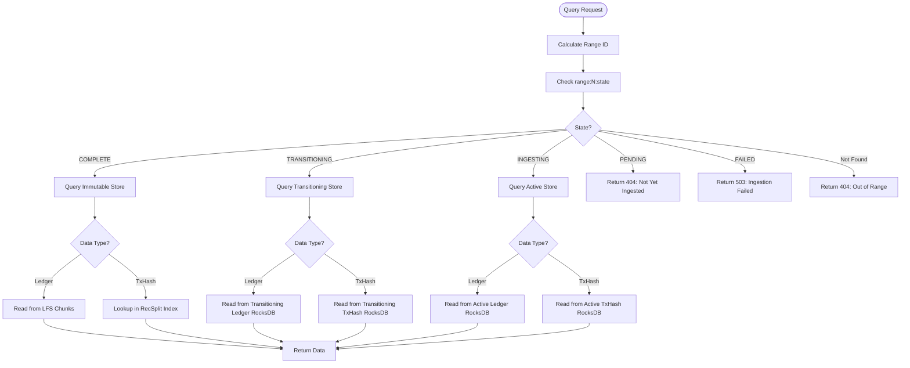

# Query Routing

> **Purpose**: Specification of query routing logic for getLedgerBySequence and getTransactionByHash  
> **Related**: [Architecture Overview](./01-architecture-overview.md), [Meta Store Design](./02-meta-store-design.md), [Transition Workflow](./05-transition-workflow.md)

---

## Overview

The Query Router directs requests to the correct data store based on ledger sequence and range state. It handles three store types: Active (RocksDB), Transitioning (RocksDB), and Immutable (LFS + RecSplit).

**Key Responsibilities**:
- Calculate range ID from ledger sequence
- Check range state in meta store
- Route to appropriate store
- Handle errors (range not found, not yet ingested, failed)

---

## getLedgerBySequence Routing

### Router Logic

```go
func (r *QueryRouter) GetLedgerBySequence(ledgerSeq uint32) (*xdr.LedgerCloseMeta, error) {
    // Calculate range ID
    rangeID := ledgerToRangeID(ledgerSeq)
    
    // Check range state
    rangeState, err := r.metaStore.GetRangeState(rangeID)
    if err != nil {
        return nil, fmt.Errorf("range %d not found", rangeID)
    }
    
    // Route based on state
    switch rangeState {
    case "COMPLETE":
        // Query immutable LFS store
        return r.immutableLedgerStore.Get(rangeID, ledgerSeq)
        
    case "TRANSITIONING":
        // Query transitioning RocksDB (still alive for queries)
        return r.transitioningStores.GetLedger(rangeID, ledgerSeq)
        
    case "INGESTING":
        // Query current active RocksDB
        return r.activeStores.GetLedger(ledgerSeq)
        
    case "PENDING":
        return nil, ErrLedgerNotYetIngested
        
    case "FAILED":
        return nil, ErrRangeIngestionFailed
        
    default:
        return nil, ErrUnknownRangeState
    }
}
```

### Error Semantics

| Range State | HTTP Status | Error Message |
|-------------|-------------|---------------|
| COMPLETE | 200 | Success (data returned) |
| TRANSITIONING | 200 | Success (data returned from transitioning store) |
| INGESTING | 200 | Success (data returned from active store) |
| PENDING | 404 | "Ledger not yet ingested" |
| FAILED | 503 | "Range ingestion failed" |
| Not Found | 404 | "Ledger sequence out of range" |

---

## getTransactionByHash Routing

### Router Logic

```go
func (r *QueryRouter) GetTransactionByHash(txHash []byte) (uint32, error) {
    // TxHash lookup requires checking ALL ranges
    // Start from newest (most likely) to oldest
    
    ranges := r.metaStore.GetAllRanges()
    sort.Sort(sort.Reverse(ranges))  // Newest first
    
    for _, rangeID := range ranges {
        rangeState := r.metaStore.GetRangeState(rangeID)
        
        var ledgerSeq uint32
        var err error
        
        switch rangeState {
        case "COMPLETE":
            ledgerSeq, err = r.immutableTxHashStore.Get(rangeID, txHash)
            
        case "TRANSITIONING":
            ledgerSeq, err = r.transitioningStores.GetTxHash(rangeID, txHash)
            
        case "INGESTING":
            ledgerSeq, err = r.activeStores.GetTxHash(txHash)
            
        default:
            continue  // Skip PENDING/FAILED ranges
        }
        
        if err == nil {
            return ledgerSeq, nil  // Found!
        }
    }
    
    return 0, ErrTransactionNotFound
}
```

### Optimization: Bloom Filters

**Future Enhancement**: Use bloom filters to skip ranges that definitely don't contain the txHash.

```go
// Check bloom filter before querying store
if !r.bloomFilters[rangeID].MayContain(txHash) {
    continue  // Definitely not in this range
}
```

---

## Decision Tree



---

## Examples

### Example 1: getLedgerBySequence(5000000) - Immutable Range

**Request**: `GET /ledger/5000000`

**Routing**:
1. Calculate range: `(5000000 - 2) / 10000000 = 0`
2. Check state: `range:0:state = "COMPLETE"`
3. Route to: Immutable LFS store
4. Path: `/data/immutable/ledgers/range-0/chunks/0500/005000.data`
5. Return: LedgerCloseMeta

**Response**: 200 OK

---

### Example 2: getLedgerBySequence(65000000) - Active Range

**Request**: `GET /ledger/65000000`

**Routing**:
1. Calculate range: `(65000000 - 2) / 10000000 = 6`
2. Check state: `range:6:state = "INGESTING"`
3. Route to: Active Ledger RocksDB
4. Key: `ledger:65000000`
5. Return: LedgerCloseMeta

**Response**: 200 OK

---

### Example 3: getLedgerBySequence(35000000) - Transitioning Range

**Request**: `GET /ledger/35000000`

**Routing**:
1. Calculate range: `(35000000 - 2) / 10000000 = 3`
2. Check state: `range:3:state = "TRANSITIONING"`
3. Route to: Transitioning Ledger RocksDB
4. Path: `/data/transitioning/ledger/rocksdb`
5. Key: `ledger:35000000`
6. Return: LedgerCloseMeta

**Response**: 200 OK

**Key Insight**: Transitioning stores remain alive and queryable until transition completes.

---

### Example 4: getTransactionByHash(0xabcd...) - Search All Ranges

**Request**: `GET /transaction/abcd1234...`

**Routing**:
1. Get all ranges: [0, 1, 2, 3, 4, 5, 6]
2. Sort newest first: [6, 5, 4, 3, 2, 1, 0]
3. For each range:
   - Range 6 (INGESTING): Query Active TxHash RocksDB → Not found
   - Range 5 (COMPLETE): Query RecSplit index → Not found
   - Range 4 (COMPLETE): Query RecSplit index → Not found
   - Range 3 (COMPLETE): Query RecSplit index → **Found! ledgerSeq = 35123456**
4. Return: 35123456

**Response**: 200 OK, body: `{"ledger_sequence": 35123456}`

---

### Example 5: getLedgerBySequence(100000000) - Not Yet Ingested

**Request**: `GET /ledger/100000000`

**Routing**:
1. Calculate range: `(100000000 - 2) / 10000000 = 9`
2. Check state: `range:9:state = "PENDING"` (or not found)
3. Return error: Ledger not yet ingested

**Response**: 404 Not Found
```json
{
  "error": "Ledger not yet ingested",
  "ledger_sequence": 100000000,
  "range_id": 9,
  "range_state": "PENDING"
}
```

---

### Example 6: getLedgerBySequence(15000000) - Failed Range

**Request**: `GET /ledger/15000000`

**Routing**:
1. Calculate range: `(15000000 - 2) / 10000000 = 1`
2. Check state: `range:1:state = "FAILED"`
3. Return error: Range ingestion failed

**Response**: 503 Service Unavailable
```json
{
  "error": "Range ingestion failed",
  "ledger_sequence": 15000000,
  "range_id": 1,
  "range_state": "FAILED",
  "action": "Contact operator to re-run backfill"
}
```

---

## Performance Characteristics

### getLedgerBySequence

| Store Type | Latency | Notes |
|------------|---------|-------|
| Active RocksDB | 1-5ms | In-memory block cache |
| Transitioning RocksDB | 1-5ms | Same as active |
| Immutable LFS | 5-10ms | Decompression overhead |

### getTransactionByHash

| Store Type | Latency | Notes |
|------------|---------|-------|
| Active RocksDB | 1-5ms | 16 CFs, hash-based lookup |
| Transitioning RocksDB | 1-5ms | Same as active |
| Immutable RecSplit | 1-3ms | Minimal perfect hash, very fast |

**Worst Case**: getTransactionByHash must check all ranges if txHash is in oldest range or not found.

---

## Caching Strategy

**Meta Store Cache**: Cache range states in memory, refresh every 1 second.

```go
type RangeStateCache struct {
    states map[uint32]string
    mu     sync.RWMutex
    ttl    time.Duration
}

func (c *RangeStateCache) Get(rangeID uint32) string {
    c.mu.RLock()
    defer c.mu.RUnlock()
    return c.states[rangeID]
}

func (c *RangeStateCache) Refresh() {
    // Reload from meta store every 1 second
    ticker := time.NewTicker(c.ttl)
    for range ticker.C {
        c.mu.Lock()
        c.states = loadAllRangeStates(metaStore)
        c.mu.Unlock()
    }
}
```

**Benefit**: Avoid meta store lookup on every query (reduces latency by ~0.5ms).

---

## Related Documentation

- [Architecture Overview](./01-architecture-overview.md#query-router) - Router component overview
- [Meta Store Design](./02-meta-store-design.md#range-state-enum) - Range state definitions
- [Transition Workflow](./05-transition-workflow.md#multiple-active-stores-during-transition) - Why transitioning stores remain queryable
- [Streaming Workflow](./04-streaming-workflow.md#multiple-active-stores-during-transition) - Store lifecycle
