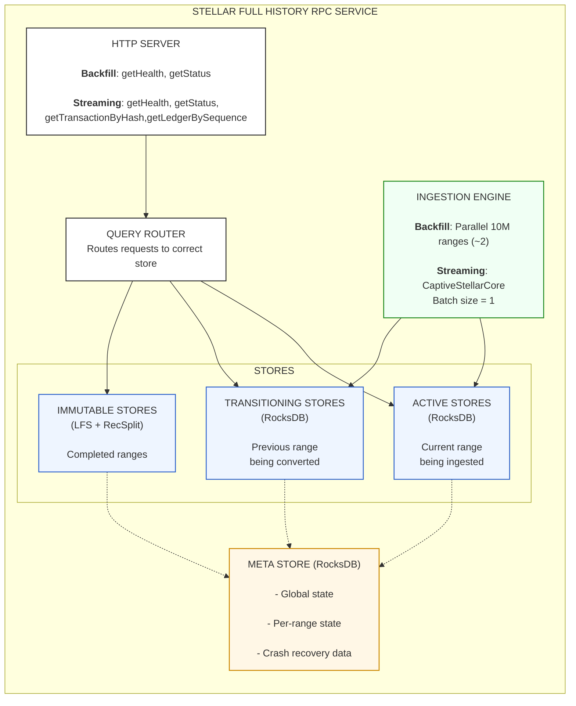

# Stellar Full History RPC Service - Design Documentation

> **Purpose**: Comprehensive design documentation for the Stellar Full History RPC Service  
> **Status**: Ready for Review


---

## Overview

The Stellar Full History RPC Service provides query access to the complete Stellar blockchain history through two primary operations:

- **`getTransactionByHash(txHash)`**: Returns the ledger sequence containing a specific transaction
- **`getLedgerBySequence(ledgerSeq)`**: Returns the full LedgerCloseMeta for a given ledger

The service operates in **_two mutually exclusive_** modes:

1. **Backfill Mode**:
   - Ingests historical ledger ranges (e.g., ledgers 2 to 60,000,000) from GCS or CaptiveStellarCore, creates immutable stores, then exits. 
   - _**No query capability while running in backfill mode**_.

2. **Streaming Mode**:
   - Ingests real-time ledgers via CaptiveStellarCore.
   - Serves queries.
   - Periodically transitions data from active (RocksDB) to immutable (LFS + RecSplit) stores at 10M ledger boundaries.

The architecture supports efficient storage and retrieval across millions of ledgers and billions of transactions, by partitioning data into 10-million ledger ranges, with separate handling for active (mutable) and immutable (read-only) data.

---

## Document Index

| Document | Description                                                                                                                     |
|----------|---------------------------------------------------------------------------------------------------------------------------------|
| [01-architecture-overview.md](./01-architecture-overview.md) | High-level system architecture, components, hardware requirements, recommendation on the order in which to read the design docs |
| [02-meta-store-design.md](./02-meta-store-design.md) | Meta store key hierarchy, enums, range ID calculation, scenario walkthroughs                                                    |
| [03-backfill-workflow.md](./03-backfill-workflow.md) | Backfill mode detailed workflow, parallel orchestrators, checkpoint mechanism                                                   |
| [04-streaming-workflow.md](./04-streaming-workflow.md) | Streaming mode workflow, startup validation, ingestion loop, boundary detection                                                 |
| [05-transition-workflow.md](./05-transition-workflow.md) | Active→Immutable transition process, parallel sub-workflows, dual store management                                              |
| [06-crash-recovery.md](./06-crash-recovery.md) | Crash recovery scenarios, checkpoint mechanism, count accuracy guarantees                                                       |
| [07-query-routing.md](./07-query-routing.md) | Query routing logic for getLedgerBySequence and getTransactionByHash                                                            |
| [08-directory-structure.md](./08-directory-structure.md) | File system layout, LFS chunk paths, RecSplit paths, multi-disk configuration                                                   |
| [09-configuration.md](./09-configuration.md) | TOML configuration reference, validation rules, example configurations                                                          |
| [10-checkpointing-and-transitions.md](./10-checkpointing-and-transitions.md) | Checkpoint math, range boundaries, transition triggers, immutable store ranges, FAQ                                             |
| [FAQ.md](./FAQ.md) | Consolidated FAQ index with quick answers and links to detailed explanations                                                    |

---

## Quick Reference

### Operating Modes

| Mode | Purpose | Data Source | Queries | Lifecycle |
|------|---------|-------------|---------|-----------|
| **Backfill** | Ingest historical ranges | Configurable: GCS or CaptiveStellarCore | getHealth, getStatus only | Start-to-end, exits when complete |
| **Streaming** | Real-time ingestion | CaptiveStellarCore only | All endpoints available | Long-running daemon |

### Key Design Decisions

| Decision | Choice |
|----------|--------|
| Ledger range unit | 10 million ledgers (**Note: everywhere in these docs, "Range" refers to a range of 10 million ledgers**) |
| Backfill parallelism | ~2 concurrent 10M range orchestrators |
| Data stores | Separate RocksDB instances per data type (ledger, txhash) |
| Immutable ledger format | LFS chunks (10K ledgers per chunk, zstd compressed) |
| Immutable txhash format | RecSplit minimal perfect hash indexes (16 files) |
| Transition trigger | Automatic at 10M boundary (both modes, different context) |
| Crash recovery | Per-range checkpointing, never deleted |
| Batch size | 1000 ledgers (backfill), 1 ledger (streaming) |

### API Endpoints (Canonical Names)

| Endpoint | Signature | Availability |
|----------|-----------|--------------|
| `getTransactionByHash` | `(txHash: bytes) → LedgerSeq` | Streaming mode only |
| `getLedgerBySequence` | `(ledgerSeq: uint32) → LedgerCloseMeta` | Streaming mode only |
| `getHealth` | `() → HealthStatus` | Both modes |
| `getStatus` | `() → ServiceStatus` | Both modes |

---

## Architecture Diagram

```
┌─────────────────────────────────────────────────────────────────────────────────┐
│                         STELLAR FULL HISTORY RPC SERVICE                         │
├─────────────────────────────────────────────────────────────────────────────────┤
│                                                                                  │
│  ┌──────────────────────────────────────────────────────────────────────────┐   │
│  │                           HTTP SERVER                                     │   │
│  │  Backfill Mode: getHealth, getStatus                                      │   │
│  │  Streaming Mode: + getTransactionByHash, getLedgerBySequence             │   │
│  └──────────────────────────────────────────────────────────────────────────┘   │
│                                      │                                           │
│                                      ▼                                           │
│  ┌──────────────────────────────────────────────────────────────────────────┐   │
│  │                          QUERY ROUTER                                    │   │
   │  │               Routes requests to correct store                        │   │
│  └──────────────────────────────────────────────────────────────────────────┘   │
│                                      │                                           │
│          ┌───────────────────────────┼───────────────────────────┐              │
│          ▼                           ▼                           ▼              │
│  ┌───────────────┐         ┌─────────────────┐         ┌─────────────────┐      │
│  │ ACTIVE STORES │         │ TRANSITIONING   │         │ IMMUTABLE       │      │
│  │ (RocksDB)     │         │ STORES          │         │ STORES          │      │
│  │               │         │ (RocksDB)       │         │ (LFS + RecSplit)│      │
│  │ Current range │         │ Previous range  │         │ Completed ranges│      │
│  │ being ingested│         │ being converted │         │                 │      │
│  └───────────────┘         └─────────────────┘         └─────────────────┘      │
│                                                                                  │
│  ┌──────────────────────────────────────────────────────────────────────────┐   │
│  │                           META STORE (RocksDB)                            │   │
│  │  - Global state (mode, last processed ledger)                            │   │
│  │  - Per-range state (phase, checkpoints, paths)                           │   │
│  │  - Crash recovery data (never deleted)                                   │   │
│  └──────────────────────────────────────────────────────────────────────────┘   │
│                                                                                  │
│  ┌──────────────────────────────────────────────────────────────────────────┐   │
│  │                           INGESTION ENGINE                                │   │
│  │  Backfill: Multiple parallel 10M range orchestrators (~2 concurrent)    │   │
│  │  Streaming: Single CaptiveStellarCore, batch size = 1                    │   │
│  └──────────────────────────────────────────────────────────────────────────┘   │
│                                                                                  │
└─────────────────────────────────────────────────────────────────────────────────┘
```



---

## Recommended Reading Order

For first-time readers, we recommend the following sequence.  

1. **Start here**: [01-architecture-overview.md](./01-architecture-overview.md)  
   Get the big picture of system components, data flow, and store types.

2. **Physical layout**: Ground yourself in concrete details before diving into workflows.
   - [08-directory-structure.md](./08-directory-structure.md) — Where data lives on disk (file tree, chunk paths, RecSplit paths)
   - [09-configuration.md](./09-configuration.md) — TOML configuration reference (what's configurable and how)

3. **Workflows**: Now that you know the physical layout and configuration, understand how the system behaves.
   - [03-backfill-workflow.md](./03-backfill-workflow.md) — Historical data ingestion
   - [04-streaming-workflow.md](./04-streaming-workflow.md) — Real-time data ingestion
   - [05-transition-workflow.md](./05-transition-workflow.md) — Active → Immutable conversion
   - [06-crash-recovery.md](./06-crash-recovery.md) — How the system recovers from failures

   These documents **cross-reference [02-meta-store-design.md](./02-meta-store-design.md) wherever relevant**, so you'll pick up state tracking concepts naturally as you go.

4. **Query handling**:
   - [07-query-routing.md](./07-query-routing.md) — How queries find the right data

5. **Deep dives** (optional):
   - [02-meta-store-design.md](./02-meta-store-design.md) — Complete meta store key hierarchy and state machines
   - [10-checkpointing-and-transitions.md](./10-checkpointing-and-transitions.md) — Optional but recommended for concretizing what you've read. Covers the minutiae of checkpoint timing, range boundaries, transition triggers, and crash recovery invariants. Serves as the canonical reference for implementation details.

---

## Existing Code to Reuse

The following components from the codebase provide proven patterns and implementations:

| Component | Location | What It Does | Reuse For |
|-----------|----------|--------------|-----------|
| LFS Ledger Store | `local-fs/ingestion/lfs-ledger-ingestion.go` | Chunk-based storage (10K ledgers), zstd compression | Immutable ledger stores |
| RocksDB Ingestion | `rocksdb/ingestion-v2/` | LedgerBackend usage, batch processing | Active store ingestion patterns |
| TxHash Workflow | `txhash-ingestion-workflow/workflow.go` | Phase state machine, RecSplit, crash recovery | Transition workflow patterns |
| BufferedStorageBackend | `rocksdb/ingestion-v2/main.go` | GCS ledger source configuration | Backfill data source |

---

## Key Invariants

These invariants are fundamental to the system's correctness and MUST be maintained:

1. **Range boundaries**: First ledger = (N × 10M) + 2, Last ledger = ((N+1) × 10M) + 1
   - Range 0: ledgers 2 to 10,000,001
   - Range 1: ledgers 10,000,002 to 20,000,001
   - Range N: ledgers (N × 10,000,000) + 2 to ((N+1) × 10,000,000) + 1

2. **Checkpoint info is NEVER deleted** (persists forever in meta store)
   - Enables crash recovery at any point
   - Provides audit trail of ingestion history

3. **Transition sub-workflows are identical in both modes**
   - Backfill: Transition runs sequentially after each range completes ingestion
   - Streaming: Transition runs in background goroutine while new range ingests
   - Both modes: RocksDB stores are deleted after immutable files verified

4. **No gaps allowed**: streaming mode validates all prior ranges are COMPLETE
   - Startup validation checks all ranges before current
   - Service exits with error if gaps detected

5. **Batch size**: 1000 ledgers (backfill), 1 ledger (streaming)
   - Backfill optimizes for throughput
   - Streaming optimizes for low latency and crash recovery granularity

---

## Hardware Requirements

- **CPU**: 32 cores
- **RAM**: 128 GB
- **CaptiveStellarCore**: ~8GB RAM per instance. Prefer to run backfill with GCS source to avoid multiple stellar-core instances on the same machine.
- **Disk**: SSD recommended for active stores and immutable stores, HDD acceptable for immutable stores
- **Network**: High bandwidth for GCS access (backfill mode)

---
